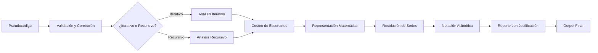

# 1. VISIÓN GENERAL DEL SISTEMA

Desarrollar un sistema inteligente que, dado un algoritmo en pseudocódigo, determine automáticamente su complejidad computacional en notación:
- **O** (peor caso)
- **Ω** (mejor caso)
- **Θ** (caso promedio)

Incluyendo cotas fuertes y justificación detallada del proceso de análisis.

### 1.2 Flujo de Alto Nivel

### 1.3 Decisiones Arquitectónicas Clave

| Decisión      | Opción Elegida       | Justificación                                   |
|--------------|----------------------|-------------------------------------------------|
| **Orquestación** | LangGraph | Control determinista del flujo, estado tipado, rollback |
| **LLM Principal** | Anthropic Claude 4.5 | Mejor razonamiento matemático, context window grande |
| **Parser** | Lark (si necesario AST) | Gramática BNF directa, ligero, suficiente |
| **Resolución Matemática** | SymPy | Álgebra simbólica nativa Python, gratuito |
| **Persistencia** | SQLite | Ligero, fácil integración FastAPI, suficiente |
| **Monitoring** | LangSmith | Decisión previa del usuario |
| **Validación** | Pydantic | Schemas tipados, integración nativa FastAPI |
