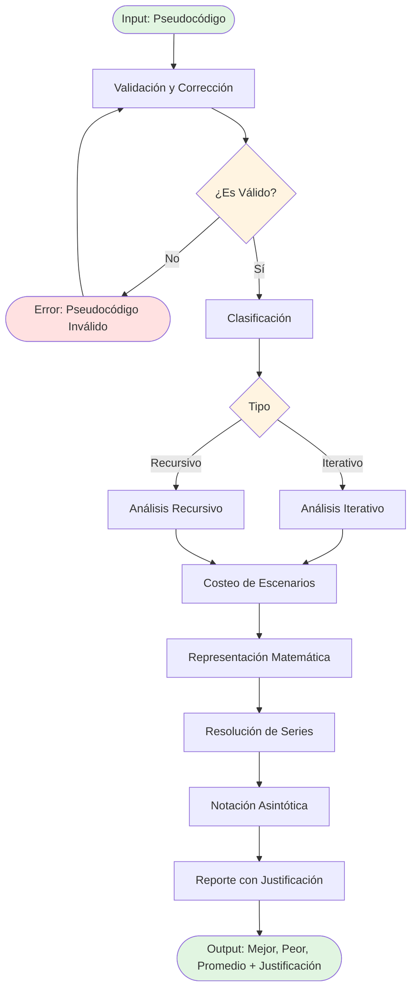

# 3. FLUJO PRINCIPAL DE PROCESAMIENTO

### 3.1 Diagrama de Flujo de Datos

### 3.2 Descripción de Cada Fase

| Fase | Input | Output | Propósito |
|------|-------|--------|-----------|
| **Validación** | Pseudocódigo raw | Pseudocódigo validado/corregido + flag iterativo/recursivo | Asegurar que el código cumple la gramática |
| **Clasificación** | Pseudocódigo validado | Tipo (iterativo/recursivo) + metadata | Determinar estrategia de análisis |
| **Análisis** | Pseudocódigo + tipo | Costeo de instrucciones | Calcular costo computacional |
| **Costeo Escenarios** | Análisis | Costos mejor/peor/promedio | Diferenciar casos |
| **Representación Matemática** | Costos | Ecuaciones/series matemáticas | Formalizar el análisis |
| **Resolución** | Ecuaciones/series | Soluciones cerradas | Resolver matemáticamente |
| **Notación Asintótica** | Soluciones | O, Ω, Θ con cotas | Expresar complejidad |
| **Reporte** | Todo lo anterior | Documento justificado | Comunicar resultados |
