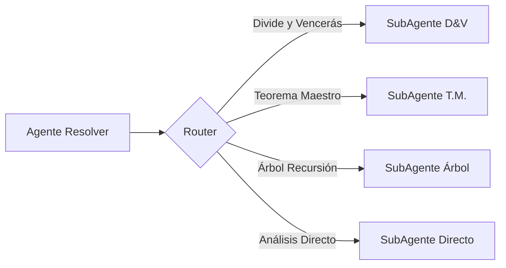

# 9. PUNTOS DE DECISIÓN ARQUITECTÓNICA

## 9.1 ¿Validador Corrige Automáticamente?

**Opciones:**
- **Opción A**: Solo valida y reporta errores
  - Ventaja: Más simple, menos riesgo de introducir bugs
  - Desventaja: Usuario debe corregir manualmente
- **Opción B**: Intenta corregir automáticamente
  - Ventaja: Mejor UX, más automático
  - Desventaja: Riesgo de correcciones incorrectas

**Decisión Recomendada:**
Opción A inicialmente, Opción B como mejora futura.

---

## 9.2 ¿Es Necesario el AST Completo?

**Opciones:**
- **Opción A**: Usar Lark para generar AST completo
  - Ventaja: Análisis estructurado más preciso
  - Desventaja: Más complejo, requiere transformers
- **Opción B**: Validación textual + razonamiento LLM
  - Ventaja: Más simple, aprovecha capacidad del LLM
  - Desventaja: Menos determinista

**Decisión Recomendada:**
Opción B inicialmente. Usar AST solo si validación textual no es suficiente.

**Decisión Recomendada Over:**
Es posible intentar hacer una simplificacion del AST y llevarlo a mermaid sino directamente la opcion B.

---

## 9.3 ¿Cómo Representar los 3 Escenarios?

**Opciones:**
- **Opción A**: Tres campos separados en estado (worst, best, average)
  - Ventaja: Claro, fácil acceder
  - Desventaja: Redundancia si comparten mucha lógica
- **Opción B**: Un objeto con los 3 casos
  - Ventaja: Más estructurado
  - Desventaja: Más verboso al acceder

**Decisión Recomendada:**
Opción A para simplicidad.
**Decisión Recomendada Over:**
Por el principio de encapsulamiento utilizaría la opción B de forma que enviando los 3 objetos de los escenarios durante todo el proceso según los necesiten.

---

## 9.4 ¿Agente Resolver: Uno Solo o Sub-Agentes?

**Opciones:**
- **Opción A**: Un agente que consulta los .md y decide qué técnica aplicar
  - Ventaja: Más flexible, el LLM decide
  - Desventaja: Menos determinista, puede equivocarse en la elección
- **Opción B**: Sub-agentes especializados (DivideVencerasAgent, TeoremaMaestroAgent, etc.)
  - Ventaja: Más determinista, cada técnica bien implementada
  - Desventaja: Más complejo, necesita router

**Decisión Recomendada:**
**OPCIÓN B** - Sub-agentes especializados con un router que decide cuál invocar.
**Decisión Recomendada Over:**
A nivel de implementación es más fácil hacer primero la opción A, ya si ven que no es capaz de resolver, sí partan a múltiples agentes.

**Justificación:**
- Las técnicas son suficientemente complejas que merecen especialización
- Mejor separación de responsabilidades
- Más fácil testear y mejorar cada técnica
- LangGraph maneja bien el routing

**Implementación:**

---

## 9.5 ¿Nivel de Detalle en la Justificación?

**Opciones:**
- **Opción A**: Justificación detallada paso a paso
  - Ventaja: Educativo, transparente
  - Desventaja: Verboso, más lento
- **Opción B**: Justificación resumida con puntos clave
  - Ventaja: Más conciso
  - Desventaja: Menos educativo

**Decisión Recomendada:**
Opción A. El objetivo académico requiere transparencia.
