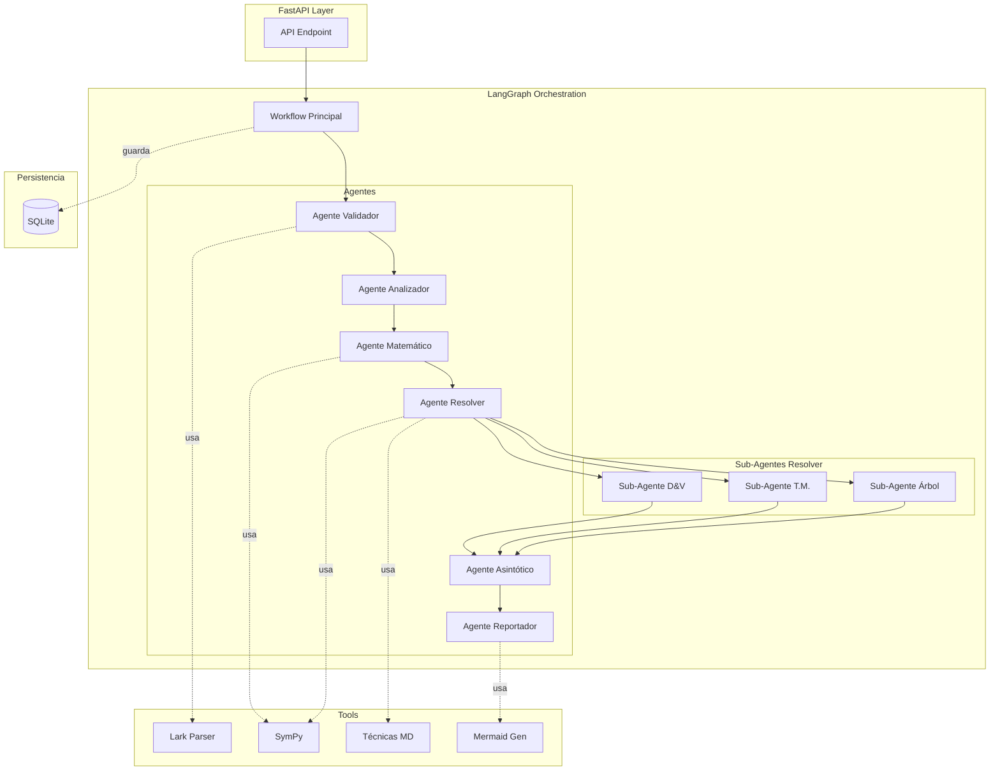
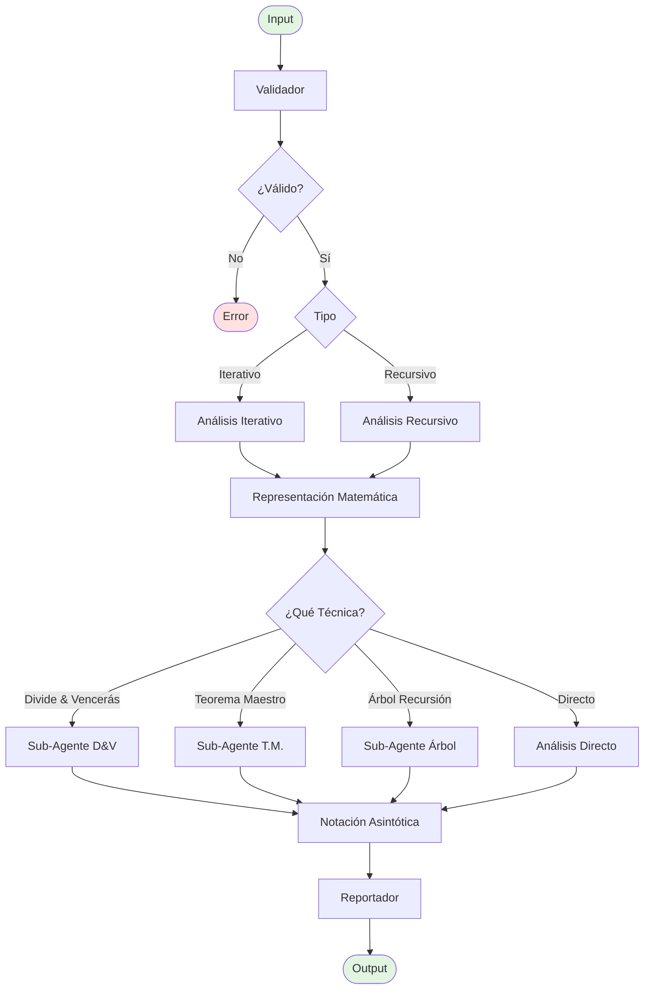
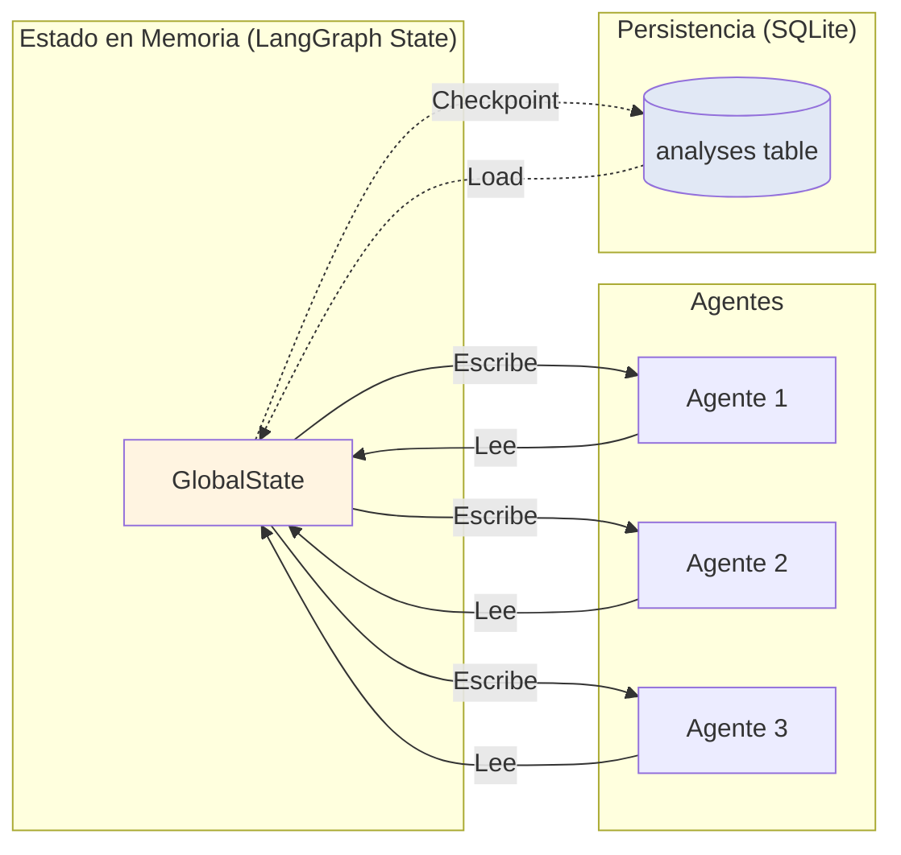
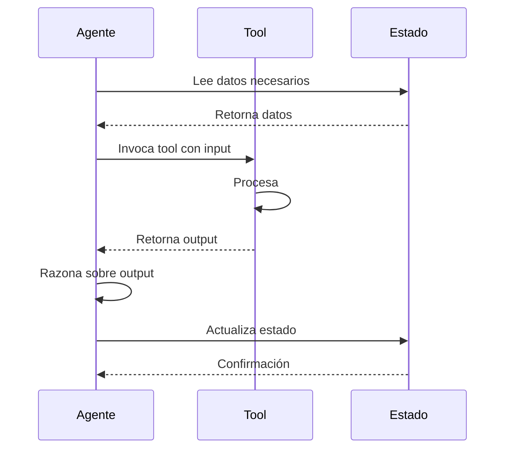

# 12. DIAGRAMAS CLAVE

## 12.1 Arquitectura de Agentes y Workflows

```mermaid
graph TB
    subgraph "FastAPI Layer"
        API[API Endpoint]
    end
    subgraph "LangGraph Orchestration"
        WF[Workflow Principal]
        subgraph "Agentes"
            A1[Agente Validador]
            A2[Agente Analizador]
            A3[Agente Matemático]
            A4[Agente Resolver]
            A5[Agente Asintótico]
            A6[Agente Reportador]
        end
        subgraph "Sub-Agentes Resolver"
            S1[Sub-Agente D&V]
            S2[Sub-Agente T.M.]
            S3[Sub-Agente Árbol]
        end
    end
    subgraph "Tools"
        T1[Lark Parser]
        T2[SymPy]
        T3[Técnicas MD]
        T4[Mermaid Gen]
    end
    subgraph "Persistencia"
        DB[(SQLite)]
    end
    API --> WF
    WF --> A1
    A1 --> A2
    A2 --> A3
    A3 --> A4
    A4 --> S1 & S2 & S3
    S1 & S2 & S3 --> A5
    A5 --> A6
    A1 -.usa.-> T1
    A3 -.usa.-> T2
    A4 -.usa.-> T2 & T3
    A6 -.usa.-> T4
    WF -.guarda.-> DB
```

## 12.2 Flujo de Decisiones (Routing)

```mermaid
graph TD
    Start([Input]) --> V[Validador]
    V --> Check{¿Válido?}
    Check -->|No| Error([Error])
    Check -->|Sí| Classify{Tipo}
    Classify -->|Iterativo| AI[Análisis Iterativo]
    Classify -->|Recursivo| AR[Análisis Recursivo]
    AI --> Math[Representación Matemática]
    AR --> Math
    Math --> Router{¿Qué Técnica?}
    Router -->|Divide & Vencerás| DV[Sub-Agente D&V]
    Router -->|Teorema Maestro| TM[Sub-Agente T.M.]
    Router -->|Árbol Recursión| Tree[Sub-Agente Árbol]
    Router -->|Directo| Direct[Análisis Directo]
    DV --> Asymp[Notación Asintótica]
    TM --> Asymp
    Tree --> Asymp
    Direct --> Asymp
    Asymp --> Report[Reportador]
    Report --> End([Output])
    style Start fill:#e1f5e1
    style End fill:#e1f5e1
    style Error fill:#ffe1e1
```

## 12.3 Estado y Persistencia

```mermaid
graph LR
    subgraph "Estado en Memoria (LangGraph State)"
        S[GlobalState]
    end
    subgraph "Agentes"
        A1[Agente 1] -->|Lee| S
        S -->|Escribe| A1
        A2[Agente 2] -->|Lee| S
        S -->|Escribe| A2
        A3[Agente 3] -->|Lee| S
        S -->|Escribe| A3
    end
    subgraph "Persistencia (SQLite)"
        DB[(analyses table)]
    end
    S -.Checkpoint.-> DB
    DB -.Load.-> S
    style S fill:#fff4e1
    style DB fill:#e1e8f5
```

## 12.4 Interacción con Tools

```mermaid
sequenceDiagram
    participant A as Agente
    participant T as Tool
    participant S as Estado
    A->>S: Lee datos necesarios
    S-->>A: Retorna datos
    A->>T: Invoca tool con input
    T->>T: Procesa
    T-->>A: Retorna output
    A->>A: Razona sobre output
    A->>S: Actualiza estado
    S-->>A: Confirmación
```
