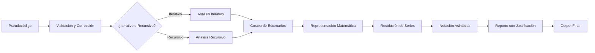
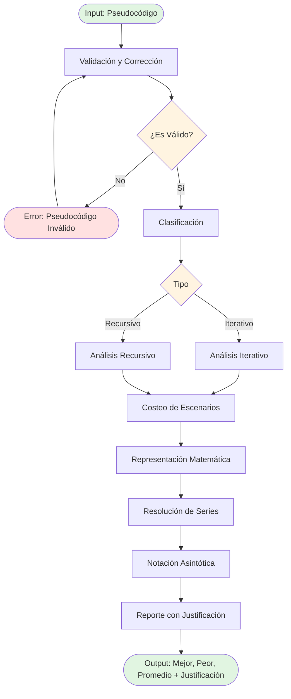
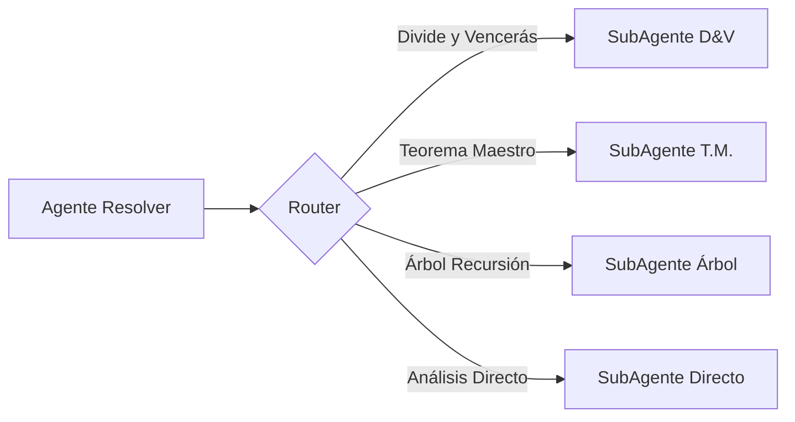
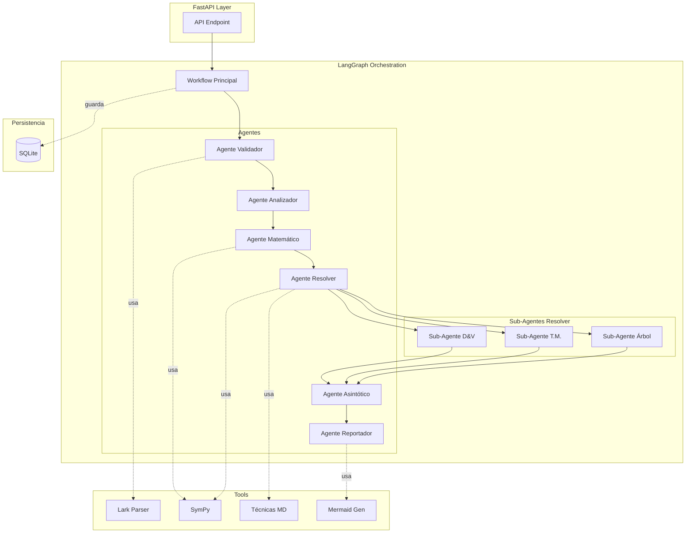
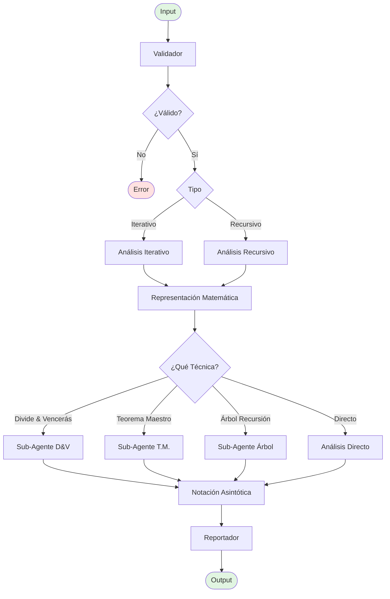
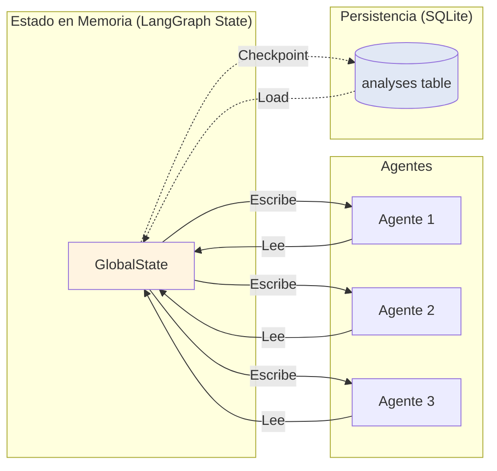
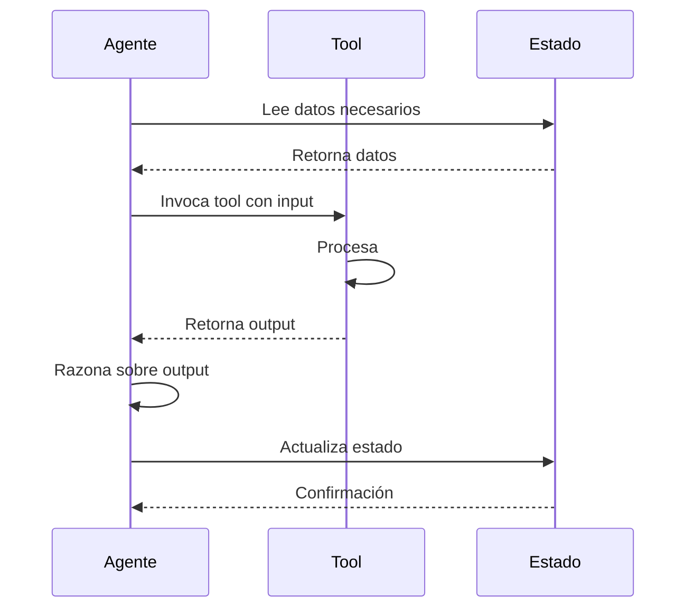

# 🏗️ GUÍA DE ARQUITECTURA: SISTEMA MULTI-AGENTE
## Analizador de Complejidad Computacional

**Versión:** 1.0
**Fecha:** Enero 2025
**Estado:** Documento de Planeación

---

## 📋 Tabla de Contenidos

1. [Visión General del Sistema](#1-visión-general-del-sistema)
2. [Conceptos Fundamentales](#2-conceptos-fundamentales)
3. [Flujo Principal de Procesamiento](#3-flujo-principal-de-procesamiento)
4. [Agentes Especializados](#4-agentes-especializados)
5. [Workflows](#5-workflows)
6. [Tools y Utilidades](#6-tools-y-utilidades)
7. [Gestión de Estado](#7-gestión-de-estado)
8. [Técnicas de Análisis](#8-técnicas-de-análisis)
9. [Puntos de Decisión Arquitectónica](#9-puntos-de-decisión-arquitectónica)
10. [Criterios de Éxito](#10-criterios-de-éxito)
11. [Stack Tecnológico](#11-stack-tecnológico)
12. [Diagramas Clave](#12-diagramas-clave)

---

## 1. VISIÓN GENERAL DEL SISTEMA

### 1.1 Objetivo

Desarrollar un sistema inteligente que, dado un algoritmo en pseudocódigo, determine automáticamente su complejidad computacional en notación:
- **O** (peor caso)
- **Ω** (mejor caso)
- **Θ** (caso promedio)

Incluyendo cotas fuertes y justificación detallada del proceso de análisis.

### 1.2 Flujo de Alto Nivel



### 1.3 Decisiones Arquitectónicas Clave

| Decisión | Opción Elegida | Justificación |
|----------|----------------|---------------|
| **Orquestación** | LangGraph | Control determinista del flujo, estado tipado, rollback |
| **LLM Principal** | Anthropic Claude 4.5 | Mejor razonamiento matemático, context window grande |
| **Parser** | Lark (si necesario AST) | Gramática BNF directa, ligero, suficiente |
| **Resolución Matemática** | SymPy | Álgebra simbólica nativa Python, gratuito |
| **Persistencia** | SQLite | Ligero, fácil integración FastAPI, suficiente |
| **Monitoring** | LangSmith | Decisión previa del usuario |
| **Validación** | Pydantic | Schemas tipados, integración nativa FastAPI |

---

## 2. CONCEPTOS FUNDAMENTALES

### 2.1 Definiciones

#### 🤖 Agente
**¿Qué es?**
Un LLM equipado con tools que busca cumplir un objetivo específico.

**Características:**
- **NO** tiene pasos procedurales en sus instrucciones
- **SÍ** tiene un objetivo claro
- **SÍ** tiene acceso a tools que simplifican su razonamiento
- Toma decisiones basándose en el contexto y su capacidad de razonamiento

**Ejemplo:**
*Agente Validador* tiene como objetivo validar el pseudocódigo según la gramática. No tiene instrucciones de "primero haz X, luego Y", sino "valida este código y corrígelo si es necesario".

---

#### 🔄 Workflow
**¿Qué es?**
Orquestador determinista que guía a los agentes por una secuencia de pasos.

**Características:**
- Define la secuencia de ejecución
- Maneja decisiones condicionales (branching)
- Pasa estado entre agentes
- **ES** determinista (mismo input → mismo flujo)

**Ejemplo:**
*Workflow de Análisis* define: Validar → Clasificar → Analizar → Resolver → Reportar

---

#### 🛠️ Tool
**¿Qué es?**
Función o librería que simplifica el trabajo del agente.

**Características:**
- Tiene input y output bien definidos
- Resuelve un problema específico
- Reduce la carga cognitiva del agente
- Puede ser una librería externa (SymPy, Lark) o función custom

**Ejemplo:**
*Lark Parser* es una tool que convierte pseudocódigo en AST, liberando al agente de hacer parsing manual.

---

#### 📊 Estado
**¿Qué es?**
Información compartida entre todos los pasos del workflow.

**Características:**
- Tipado con Pydantic/TypedDict
- Mutable (se actualiza en cada paso)
- Persiste en memoria durante ejecución
- Opcionalmente se guarda en SQLite

---

## 3. FLUJO PRINCIPAL DE PROCESAMIENTO

### 3.1 Diagrama de Flujo de Datos



### 3.2 Descripción de Cada Fase

| Fase | Input | Output | Propósito |
|------|-------|--------|-----------|
| **Validación** | Pseudocódigo raw | Pseudocódigo validado/corregido + flag iterativo/recursivo | Asegurar que el código cumple la gramática |
| **Clasificación** | Pseudocódigo validado | Tipo (iterativo/recursivo) + metadata | Determinar estrategia de análisis |
| **Análisis** | Pseudocódigo + tipo | Costeo de instrucciones | Calcular costo computacional |
| **Costeo Escenarios** | Análisis | Costos mejor/peor/promedio | Diferenciar casos |
| **Representación Matemática** | Costos | Ecuaciones/series matemáticas | Formalizar el análisis |
| **Resolución** | Ecuaciones/series | Soluciones cerradas | Resolver matemáticamente |
| **Notación Asintótica** | Soluciones | O, Ω, Θ con cotas | Expresar complejidad |
| **Reporte** | Todo lo anterior | Documento justificado | Comunicar resultados |

---

## 4. AGENTES ESPECIALIZADOS

### 4.1 Agente Validador

**Propósito:**
Validar que el pseudocódigo cumple con la gramática formal definida. Corregir errores si es posible. Identificar si el algoritmo es iterativo o recursivo.

**Entrada (del estado):**
- `pseudocode`: string con el pseudocódigo raw
- `grammar_rules`: referencia a los archivos de gramática

**Salida (actualiza en estado):**
- `is_valid`: booleano
- `errors`: lista de errores encontrados
- `corrected_pseudocode`: versión corregida (si aplica)
- `is_iterative`: booleano (true si solo tiene ciclos, false si tiene recursión)
- `validation_metadata`: información adicional

**Tools Disponibles:**
1. **Lark Parser** (si se necesita AST)
   - Input: pseudocódigo
   - Output: parse tree o errores de sintaxis
2. **Grammar Validator** (custom)
   - Input: pseudocódigo + reglas gramática
   - Output: lista de violaciones
3. **Code Corrector** (LLM-based)
   - Input: pseudocódigo + errores
   - Output: versión corregida

**Criterio de Terminado:**

- [ ] El pseudocódigo es sintácticamente válido según gramática
- [ ] Se identificó correctamente si es iterativo o recursivo
- [ ] Si hay errores, están documentados O se corrigieron

**Pregunta Abierta:**
¿El agente debe intentar corregir automáticamente o solo reportar errores?

El agente debe reportar los errores, pues debe validar por cada una de las reglas de la gramatica. El pseudocodigo se corrige despues de pasar cada regla

---

### 4.2 Agente Analizador de Complejidad

**Propósito:**
Analizar el algoritmo y costear cada instrucción en los 3 escenarios: mejor caso, peor caso, caso promedio.

**Entrada (del estado):**
- `corrected_pseudocode`: pseudocódigo validado
- `is_iterative`: tipo de algoritmo
- `ast`: árbol sintáctico (si disponible)

**Salida (actualiza en estado):**
- `worst_case_cost`: costeo del peor caso
- `best_case_cost`: costeo del mejor caso
- `average_case_cost`: costeo del caso promedio
- `cost_breakdown`: desglose por instrucción/bloque // Revisar necesidad IMPORTANTE
- `analysis_reasoning`: justificación del análisis

**Tools Disponibles:**
1. **Loop Counter** (custom)
   - Input: nodo de loop del AST
   - Output: expresión de iteraciones (e.g., "n", "log n", "n²")
2. **Recursion Analyzer** (custom)
   - Input: llamada recursiva
   - Output: relación de recurrencia (e.g., "T(n) = 2T(n/2) + O(n)")
3. **Cost Calculator** (custom)
   - Input: instrucción individual
   - Output: costo unitario (e.g., "O(1)", "O(n)")
4. **Scenario Differentiator** (LLM-based)
   - Input: algoritmo + estructura
   - Output: condiciones que definen mejor/peor/promedio caso

**Criterio de Terminado:**
- [ ] Se identificó el costo para los 3 escenarios
- [ ] Cada costo está justificado
- [ ] Se identificaron las condiciones que definen cada escenario

**Diferencia Iterativo vs Recursivo:**
- **Iterativo**: Suma costos de ciclos anidados
- **Recursivo**: Identifica relación de recurrencia

---

### 4.3 Agente de Representación Matemática

**Propósito:**
Convertir el costeo en ecuaciones o series matemáticas formales.

**Entrada (del estado):**
- `worst_case_cost`: costeo del peor caso
- `best_case_cost`: costeo del mejor caso
- `average_case_cost`: costeo del caso promedio

**Salida (actualiza en estado):**
- `worst_case_equation`: ecuación matemática (e.g., "T(n) = 3n² + 2n + 5")
- `best_case_equation`: ecuación matemática
- `average_case_equation`: ecuación matemática

  <!-- Revisar si se realizan para los 3 casos --> 
- `series_representation`: representación como serie (e.g., "∑(i=1 to n) i²") 

**Tools Disponibles:**
1. **SymPy Expression Builder** (SymPy)
   - Input: expresión textual
   - Output: objeto SymPy
2. **Series Generator** (custom + SymPy)
   - Input: patrón de suma
   - Output: notación de serie

**Criterio de Terminado:**
- [ ] Cada escenario tiene una ecuación matemática formal
- [ ] Las ecuaciones son válidas en SymPy
- [ ] Si aplica, hay representación como serie

---

### 4.4 Agente Resolver

**Propósito:**
Resolver las ecuaciones/series matemáticas usando técnicas apropiadas.

**Entrada (del estado):**
- `worst_case_equation`
- `best_case_equation`
- `average_case_equation`
- `series_representation`
- `is_iterative`: para saber si aplicar técnicas de recurrencia

**Salida (actualiza en estado):**
- `worst_case_solution`: solución cerrada
- `best_case_solution`: solución cerrada
- `average_case_solution`: solución cerrada
- `technique_used`: qué técnica se aplicó (divide-venceras, teorema-maestro, etc.)
- `resolution_steps`: pasos de la resolución

**Tools Disponibles:**
1. **SymPy Solver** (SymPy)
   - Input: ecuación
   - Output: solución
2. **Series Solver** (SymPy)
   - Input: serie
   - Output: forma cerrada
3. **Divide y Vencerás** (técnica desde divide-venceras.md)
4. **Teorema Maestro** (técnica desde teorema-maestro.md)
5. **Árbol de Recursión** (técnica desde arbol-recursion.md)

**Criterio de Terminado:**
- [ ] Las 3 ecuaciones están resueltas
- [ ] Se identificó la técnica usada
- [ ] Hay justificación de los pasos

**Decisión Crítica:**
¿Es un solo agente que consulta los .md y decide qué técnica aplicar, O son sub-agentes especializados?

---

### 4.5 Agente de Notación Asintótica

**Propósito:**
Aplicar notación O, Ω, Θ a cada solución con cotas fuertes o debiles.

**Entrada (del estado):**
- `worst_case_solution`
- `best_case_solution`
- `average_case_solution`

**Salida (actualiza en estado):**
- `big_o`: notación O (peor caso) con cota fuerte
- `big_omega`: notación Ω (mejor caso) con cota fuerte
- `big_theta`: notación Θ (caso promedio) con cota fuerte
- `asymptotic_analysis`: justificación de las cotas

**Tools Disponibles:**
1. **SymPy Limit** (SymPy)
   - Input: función
   - Output: límite cuando n → ∞
2. **Dominant Term Finder** (custom)
   - Input: expresión polinómica
   - Output: término dominante
3. **Asymptotic Classifier** (custom)
   - Input: término dominante
   - Output: clase de complejidad (O(n²), O(n log n), etc.)

**Criterio de Terminado:**
- [ ] Cada escenario tiene su notación asintótica
- [ ] Las cotas son fuertes (no sobrestimadas)
- [ ] Hay justificación formal

---

### 4.6 Agente Reportador

**Propósito:**
Generar reporte final con justificación detallada de todo el proceso.

**Entrada (del estado):**
- Todo el estado completo (todo el análisis previo)

**Salida (actualiza en estado):**
- `final_report`: documento estructurado
- `latex_report`: versión LaTeX
- `markdown_report`: versión Markdown
- `diagrams`: diagramas generados (árboles de recursión, grafos, etc.)

**Tools Disponibles:**
1. **Mermaid Generator** (custom)
   - Input: estructura de datos
   - Output: código Mermaid
2. **LaTeX Generator** (custom)
   - Input: ecuaciones y texto
   - Output: documento LaTeX
3. **Markdown Generator** (custom)
   - Input: estructura del reporte
   - Output: Markdown formateado

**Criterio de Terminado:**
- [ ] Reporte incluye todas las secciones requeridas
- [ ] Hay justificación clara de cada paso
- [ ] Los diagramas son claros y correctos
- [ ] El formato es legible (LaTeX, Markdown, o ambos)

---

## 5. WORKFLOWS

### 5.1 Workflow Principal: Análisis Completo

**Propósito:**
Orquestar todo el proceso desde input hasta output final.

**Pasos:**
1. Recibir pseudocódigo
2. Ejecutar Agente Validador
3. Si no válido → terminar con error
4. Si válido → continuar
5. Ejecutar Agente Analizador de Complejidad
6. Ejecutar Agente de Representación Matemática
7. Ejecutar Agente Resolver
8. Ejecutar Agente de Notación Asintótica
9. Ejecutar Agente Reportador
10. Retornar reporte final

**Decisiones (branching):**
- Después de validación: ¿Es válido? Sí/No
- Durante análisis: ¿Es iterativo o recursivo? (afecta estrategia)

**Criterio de Terminado:**
- [ ] Todos los agentes completaron exitosamente
- [ ] El reporte final está generado
- [ ] No hay errores pendientes

---

### 5.2 Workflow de Validación y Corrección

**Propósito:**
Asegurar que el pseudocódigo es válido antes de analizar.

**Pasos:**
1. Parsear pseudocódigo con Lark (si necesario)
2. Validar contra gramática
3. Si hay errores → intentar corrección (decisión pendiente)
4. Clasificar como iterativo/recursivo
5. Retornar resultado

**Decisiones:**
- ¿Intentar corrección automática o solo reportar?

**Criterio de Terminado:**
- [ ] Pseudocódigo validado o errores documentados
- [ ] Clasificación iterativo/recursivo completada

---

### 5.3 Workflow de Análisis de Complejidad

**Propósito:**
Costear el algoritmo en los 3 escenarios.

**Pasos:**
1. Recibir pseudocódigo validado + clasificación
2. Si iterativo → analizar ciclos
3. Si recursivo → identificar relación de recurrencia
4. Diferenciar escenarios (mejor/peor/promedio)
5. Costear cada escenario
6. Retornar costos

**Decisiones:**
- Branch: iterativo vs recursivo
- ¿Qué condiciones definen cada escenario?

**Criterio de Terminado:**
- [ ] Costos identificados para los 3 escenarios
- [ ] Justificación clara de cada costo

---

### 5.4 Workflow de Resolución Matemática

**Propósito:**
Convertir costos en ecuaciones y resolverlas.

**Pasos:**
1. Convertir costos a ecuaciones formales
2. Representar como series (si aplica)
3. Resolver con técnicas apropiadas
4. Aplicar notación asintótica
5. Retornar soluciones

**Decisiones:**
- ¿Qué técnica usar? (divide-venceras, teorema-maestro, etc.)
- Un agente debe actuar como router para decidir que metodología o técnica utilizar.

**Criterio de Terminado:**
- [ ] Ecuaciones resueltas
- [ ] Notación asintótica aplicada
- [ ] Cotas fuertes identificadas

---

### 5.5 Workflow de Reporte Final

**Propósito:**
Generar documentación del análisis.

**Pasos:**
1. Recopilar toda la información del estado
2. Estructurar reporte
3. Generar diagramas (si aplican)
4. Formatear en LaTeX/Markdown
5. Retornar reporte

**Criterio de Terminado:**
- [ ] Reporte completo generado
- [ ] Todos los diagramas incluidos
- [ ] Formato correcto

---

## 6. TOOLS Y UTILIDADES

### 6.1 Lark Parser

**Propósito:**
Validar sintaxis del pseudocódigo según gramática BNF.

**Input:**
- Pseudocódigo (string)
- Gramática (archivo .lark)

**Output:**
- Parse tree O errores de sintaxis

**Cuándo usar:**
- En Agente Validador, si se necesita AST estructurado
- Si validación textual no es suficiente

**Decisión Pendiente:**
¿Es realmente necesario el AST completo o basta con validación textual?

---

### 6.2 SymPy

**Propósito:**
Resolver ecuaciones, series, límites asintóticos.

**Funcionalidades usadas:**
- `sympy.symbols`: definir variables simbólicas
- `sympy.summation`: resolver series
- `sympy.limit`: calcular límites
- `sympy.simplify`: simplificar expresiones
- `sympy.solve`: resolver ecuaciones

**Cuándo usar:**
- Agente de Representación Matemática
- Agente Resolver
- Agente de Notación Asintótica

---

### 6.3 Técnicas de Análisis (Archivos .md)

#### 6.3.1 divide-venceras.md

**Qué resuelve:**
Relaciones de recurrencia de la forma `T(n) = aT(n/b) + f(n)`

**Cuándo aplicar:**
Algoritmos que dividen el problema en sub-problemas de tamaño reducido (merge sort, quick sort, búsqueda binaria)

**Output esperado:**
Solución usando teorema maestro o análisis de árbol de recursión

---

#### 6.3.2 teorema-maestro.md

**Qué resuelve:**
Relaciones de recurrencia específicas del teorema maestro

**Cuándo aplicar:**
Cuando la recurrencia tiene la forma exacta `T(n) = aT(n/b) + Θ(n^k)`

**Output esperado:**
Clasificación en Caso 1, 2, o 3 del teorema + solución directa

---

#### 6.3.3 arbol-recursion.md

**Qué resuelve:**
Relaciones de recurrencia complejas mediante visualización de árbol

**Cuándo aplicar:**
Cuando teorema maestro no aplica o se necesita análisis más detallado

**Output esperado:**
Representación del árbol en mermaid + suma de costos por nivel

---

### 6.4 Generadores de Diagramas

**Mermaid:**
- Diagramas de flujo
- Grafos dirigidos
- Árboles de decisión

**Graphviz (opcional):**
- Árboles de recursión más complejos

**Cuándo usar:**
En Agente Reportador para visualizaciones

---

## 7. GESTIÓN DE ESTADO

### 7.1 Esquema del Estado Global

```python
from typing import TypedDict, Optional, List, Dict, Any, Literal

class GlobalState(TypedDict):
    # ===== INPUT =====
    request_id: str
    pseudocode: str

    # ===== VALIDACIÓN =====
    is_valid: Optional[bool]
    errors: List[str]
    corrected_pseudocode: Optional[str]
    is_iterative: Optional[bool]
    validation_metadata: Optional[Dict[str, Any]]

    # ===== ANÁLISIS =====
    worst_case_cost: Optional[str]
    best_case_cost: Optional[str]
    average_case_cost: Optional[str]
    cost_breakdown: Optional[Dict[str, Any]]
    analysis_reasoning: Optional[str]

    # ===== REPRESENTACIÓN MATEMÁTICA =====
    worst_case_equation: Optional[str]
    best_case_equation: Optional[str]
    average_case_equation: Optional[str]
    series_representation: Optional[str]

    # ===== RESOLUCIÓN =====
    worst_case_solution: Optional[str]
    best_case_solution: Optional[str]
    average_case_solution: Optional[str]
    technique_used: Optional[str]
    resolution_steps: Optional[List[str]]

    # ===== NOTACIÓN ASINTÓTICA =====
    big_o: Optional[str]
    big_omega: Optional[str]
    big_theta: Optional[str]
    asymptotic_analysis: Optional[str]

    # ===== REPORTE =====
    final_report: Optional[str]
    latex_report: Optional[str]
    markdown_report: Optional[str]
    diagrams: Optional[List[str]]

    # ===== METADATA =====
    current_step: Optional[str]
    execution_log: List[str]
```

### 7.2 ¿Qué se comparte?

Toda la información del análisis fluye a través del estado. Cada agente:
- **Lee** lo que necesita del estado
- **Actualiza** los campos de su responsabilidad
- **NO modifica** campos de otros agentes

### 7.3 ¿Cuándo se actualiza?

Después de cada agente, el workflow actualiza el estado con el output del agente.

### 7.4 Persistencia con SQLite

**¿Qué se guarda?**
- Request ID + timestamp
- Pseudocódigo original
- Resultado final (O, Ω, Θ)
- Reporte completo
- Metadata (tiempo de ejecución, tokens usados)

**¿Cuándo se guarda?**
- Al inicio: crear registro con pseudocódigo
- Al final: actualizar con resultados
- (Opcional) Checkpoints intermedios para debugging

**Schema de tabla:**
```sql
CREATE TABLE analyses (
    id TEXT PRIMARY KEY,
    pseudocode TEXT NOT NULL,
    is_valid BOOLEAN,
    big_o TEXT,
    big_omega TEXT,
    big_theta TEXT,
    final_report TEXT,
    created_at TIMESTAMP,
    completed_at TIMESTAMP,
    metadata JSON
);
```

---

## 8. TÉCNICAS DE ANÁLISIS

El agente resolvedor revisara los .md de tecnicas para saber como resolver los problemas


## 9. PUNTOS DE DECISIÓN ARQUITECTÓNICA

### 9.1 ¿Validador Corrige Automáticamente?

**Opciones:**
- **Opción A**: Solo valida y reporta errores
  - Ventaja: Más simple, menos riesgo de introducir bugs
  - Desventaja: Usuario debe corregir manualmente

- **Opción B**: Intenta corregir automáticamente
  - Ventaja: Mejor UX, más automático
  - Desventaja: Riesgo de correcciones incorrectas

**Decisión Recomendada:**
Opción A inicialmente, Opción B como mejora futura.

---

### 9.2 ¿Es Necesario el AST Completo?

**Opciones:**
- **Opción A**: Usar Lark para generar AST completo
  - Ventaja: Análisis estructurado más preciso
  - Desventaja: Más complejo, requiere transformers

- **Opción B**: Validación textual + razonamiento LLM
  - Ventaja: Más simple, aprovecha capacidad del LLM
  - Desventaja: Menos determinista

**Decisión Recomendada:**
Opción B inicialmente. Usar AST solo si validación textual no es suficiente.

**Decisión Recomendada Over:**
Es posible intentar hacer uan simplificacion del AST y llevarlo a mermaid sino directamente la opcion B.

---

### 9.3 ¿Cómo Representar los 3 Escenarios?

**Opciones:**
- **Opción A**: Tres campos separados en estado (worst, best, average)
  - Ventaja: Claro, fácil acceder
  - Desventaja: Redundancia si comparten mucha lógica

- **Opción B**: Un objeto con los 3 casos
  - Ventaja: Más estructurado
  - Desventaja: Más verboso al acceder

**Decisión Recomendada:**
Opción A para simplicidad.

**Decisión Recomendada Over:**
Por el principio de encapsulamiento utilizaria la opcion B de forma que enviand los 3 objetos de los escenarios durante todo el proceso según los necesiten.

---

### 9.4 ¿Agente Resolver: Uno Solo o Sub-Agentes?

**Opciones:**
- **Opción A**: Un agente que consulta los .md y decide qué técnica aplicar
  - Ventaja: Más flexible, el LLM decide
  - Desventaja: Menos determinista, puede equivocarse en la elección

- **Opción B**: Sub-agentes especializados (DivideVencerasAgent, TeoremaМaestroAgent, etc.)
  - Ventaja: Más determinista, cada técnica bien implementada
  - Desventaja: Más complejo, necesita router

**Decisión Recomendada:**
**OPCIÓN B** - Sub-agentes especializados con un router que decide cuál invocar.

**Decisión Recomendada Over:**
A nivel de implementacion es mas facil hacer primero la opcion A, ya si ven que no es capaz de resolver, si partan a multiples agentes.

**Justificación:**
- Las técnicas son suficientemente complejas que merecen especialización
- Mejor separación de responsabilidades
- Más fácil testear y mejorar cada técnica
- LangGraph maneja bien el routing

**Implementación:**


---

### 9.5 ¿Nivel de Detalle en la Justificación?

**Opciones:**
- **Opción A**: Justificación detallada paso a paso
  - Ventaja: Educativo, transparente
  - Desventaja: Verboso, más lento

- **Opción B**: Justificación resumida con puntos clave
  - Ventaja: Más conciso
  - Desventaja: Menos educativo

**Decisión Recomendada:**
Opción A. El objetivo académico requiere transparencia.

---

## 10. CRITERIOS DE ÉXITO

### 10.1 Para el Sistema Completo

**Entrada Válida:**
- [ ] Pseudocódigo cumple 100% con gramática definida
- [ ] Sintaxis correcta según archivos en `Backend/data/gramatica/`

**Salida Esperada:**
- [ ] Notación (peor caso) con cota fuerte
- [ ] Notación (mejor caso) con cota fuerte
- [ ] Notación (caso promedio) con cota fuerte
- [ ] Justificación detallada de cada paso
- [ ] Diagramas claros (cuando aplique)

**Precisión:**
- [ ] Concordancia con análisis manual en casos conocidos
- [ ] Correcto en al menos 9 de 10 algoritmos de prueba

**Performance:**
- [ ] Análisis completo en < 2 minutos por algoritmo
- [ ] Uso de tokens LLM optimizado

---

### 10.2 Casos de Prueba Obligatorios

Mínimo 10 algoritmos conocidos:

1. **Búsqueda Lineal** → O(n), Ω(1), Θ(n)
2. **Búsqueda Binaria** → O(log n), Ω(1), Θ(log n)
3. **Bubble Sort** → O(n²), Ω(n), Θ(n²)
4. **Merge Sort** → O(n log n), Ω(n log n), Θ(n log n)
5. **Quick Sort** → O(n²), Ω(n log n), Θ(n log n)
6. **Fibonacci Recursivo** → O(2^n), Ω(2^n), Θ(2^n)
7. **Factorial Recursivo** → O(n), Ω(n), Θ(n)
8. **Torres de Hanoi** → O(2^n), Ω(2^n), Θ(2^n)
9. **Binary Search Tree Insert** → O(n), Ω(1), Θ(log n)
10. **Matrix Multiplication** → O(n³), Ω(n³), Θ(n³)

---

### 10.3 Métricas de Éxito

| Métrica | Objetivo | Medición |
|---------|----------|----------|
| **Precisión** | 90% | Concordancia con análisis manual |
| **Completitud** | 100% | Todos los campos del reporte llenos |
| **Claridad** | Subjetivo | Revisión manual del reporte |
| **Velocidad** | < 2 min | Tiempo total de ejecución |
| **Tokens LLM** | < 50k | Por análisis completo |

---

## 11. STACK TECNOLÓGICO

### 11.1 Decisiones Justificadas

| Componente | Tecnología | Justificación | Alternativas Descartadas |
|------------|------------|---------------|--------------------------|
| **Orquestación** | LangGraph | Control determinista, estado tipado, rollback | AutoGen (menos maduro), CrewAI (menos control) |
| **LLM Principal** | Anthropic Claude 4.5 | Mejor razonamiento matemático, 200k context | GPT-4 (más caro), Llama (menos preciso) |
| **API Framework** | FastAPI | Async nativo, docs auto, typing | Flask (sin async), Django (overkill) |
| **Validación** | Pydantic | Typing nativo, integración FastAPI | Marshmallow (menos integrado) |
| **Parser** | Lark (si necesario) | BNF directo, ligero | ANTLR (overkill), PLY (bajo nivel) |
| **Álgebra Simbólica** | SymPy | Nativo Python, gratis, completo | SageMath (pesado), Wolfram (pago) |
| **Persistencia** | SQLite | Ligero, sin servidor, suficiente | PostgreSQL (overkill), Redis (no relacional) |
| **Monitoring** | LangSmith | Decisión previa del usuario | Prometheus (innecesario según usuario) |
| **Diagramas** | Mermaid | Texto plano, fácil generar | PlantUML (requiere Java), Graphviz (más complejo) |

### 11.2 Requirements Core

```
# Core Framework
langgraph>=0.2.28
langchain>=0.3.0
langchain-anthropic>=0.2.0
pydantic>=2.9.0

# API
fastapi>=0.115.0
uvicorn[standard]>=0.32.0

# Parsing (opcional, si se usa)
lark>=1.2.0

# Matemáticas
sympy>=1.13.0

# Base de datos
sqlalchemy>=2.0.0
aiosqlite>=0.20.0

# Utilidades
python-dotenv>=1.0.0
httpx>=0.27.0
```

---

## 12. DIAGRAMAS CLAVE

### 12.1 Arquitectura de Agentes y Workflows



### 12.2 Flujo de Decisiones (Routing)



### 12.3 Estado y Persistencia



### 12.4 Interacción con Tools



---

## 📊 RESUMEN EJECUTIVO

### [ ] Decisiones Tomadas

1. **Arquitectura**: LangGraph con workflows determinísticos + agentes especializados
2. **Agentes Principales**: 6 agentes (Validador, Analizador, Matemático, Resolver, Asintótico, Reportador)
3. **Sub-Agentes**: 3 especializados en técnicas de resolución
4. **Tools**: Lark (opcional), SymPy (core), Técnicas MD, Mermaid
5. **Persistencia**: SQLite para análisis persistentes
6. **Estado**: TypedDict manejado por LangGraph
7. **Stack**: FastAPI + LangGraph + Claude 4.5 + SymPy

### ⏳ Decisiones Pendientes

1. ¿Validador corrige automáticamente? → **Recomendación**: No inicialmente
2. ¿Usar AST completo (Lark)? → **Recomendación**: Solo si es necesario
3. ¿Cómo implementar archivos .md de técnicas? → **Ver durante implementación**

### 🎯 Próximos Pasos

1. Validar este documento con el equipo
2. Definir schemas Pydantic detallados
3. Implementar Workflow Principal (esqueleto)
4. Implementar Agente Validador (MVP)
5. Iterar progresivamente con otros agentes

---

**Documento de Planeación - v1.0**
**Próxima Revisión**: Después de implementar MVP

