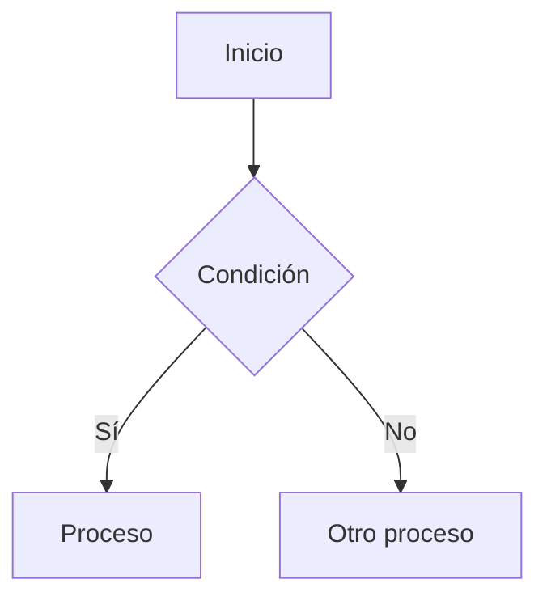
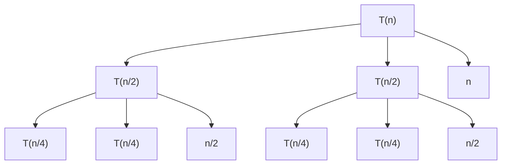

# Guía de Uso: Generación de Reportes con Árboles de Recursión

Este sistema genera automáticamente reportes completos en formato Markdown (`.md`) que incluyen:

1. **Diagramas de flujo** (Flowcharts) del algoritmo
2. **Árboles de recursión** visualizados con Mermaid
3. **Paso a paso** de la resolución de ecuaciones de recurrencia
4. **Análisis de complejidad** en los tres casos (mejor, promedio, peor)

## 🚀 Cómo usar

### Opción 1: Desde el API (FastAPI)

```python
import requests

# Ejemplo con pseudocódigo
response = requests.post(
    "http://localhost:8000/analisis/analizar",
    json={
        "entrada": """
fibonacci(n)
begin
    if (n <= 1) then
        return n
    end
    return fibonacci(n-1) + fibonacci(n-2)
end
        """,
        "tipo_entrada": "pseudocodigo",
        "auto_corregir": True
    }
)

resultado = response.json()

# El reporte está en resultado['reporte_markdown']
print(f"Reporte guardado en: {resultado['ruta_reporte_guardado']}")

# Guardar el reporte localmente si lo deseas
with open('mi_reporte.md', 'w', encoding='utf-8') as f:
    f.write(resultado['reporte_markdown'])
```

### Opción 2: Desde Python directamente

```python
from tests.flujo_analisis import FlujoAnalisis

# Crear el flujo
flujo = FlujoAnalisis(modo_verbose=True)

# Analizar
resultado = flujo.analizar(
    entrada="tu_pseudocodigo_aquí",
    tipo_entrada="pseudocodigo",
    auto_corregir=True
)

# El reporte se guarda automáticamente
print(f"Reporte guardado en: {resultado['ruta_reporte_guardado']}")
```

### Opción 3: Usar el script de prueba

```bash
cd Backend
python test_reporte_md.py
```

## 📊 Contenido del Reporte

El reporte `.md` generado incluye:

### 1. Resumen Ejecutivo
- Estado del análisis
- Tipo de algoritmo
- Complejidades finales

### 2. Diagrama de Flujo


### 3. Proceso de Análisis
- Clasificación del algoritmo
- Validación paso a paso
- Correcciones aplicadas (si hubo)

### 4. Resolución de Ecuaciones

Para cada caso (mejor, promedio, peor):
- Ecuación de recurrencia
- Método utilizado (Teorema Maestro, Sustitución, etc.)
- Pasos detallados de resolución
- **Árbol de recursión visualizado**

Ejemplo de árbol de recursión para `T(n) = 2T(n/2) + n`:



### 5. Pseudocódigo Final
El código validado y corregido

### 6. Conclusiones
Resumen del análisis y observaciones

## 📁 Ubicación de los Reportes

Los reportes se guardan automáticamente en:
```
Backend/reportes/reporte_analisis_YYYYMMDD_HHMMSS.md
```

Donde `YYYYMMDD_HHMMSS` es la fecha y hora de generación.

## 🎨 Visualización de los Diagramas

Los diagramas Mermaid se pueden visualizar en:
- **GitHub**: Los archivos `.md` muestran los diagramas automáticamente
- **VS Code**: Instalar extensión "Markdown Preview Mermaid Support"
- **Navegadores**: Usar extensiones como "Markdown Viewer" con soporte Mermaid
- **Editores online**: https://mermaid.live/

## 🔍 Tipos de Árboles Generados

El sistema detecta automáticamente el tipo de recurrencia y genera el árbol apropiado:

1. **Divide y Conquista**: `T(n) = aT(n/b) + f(n)`
   - Ejemplo: Merge Sort, Binary Search

2. **División Múltiple**: `T(n) = T(n/3) + T(2n/3) + n`
   - Ejemplo: Quicksort con particiones asimétricas

3. **Decrementación**: `T(n) = T(n-k) + f(n)`
   - Ejemplo: Fibonacci, Factorial

## 💡 Ejemplos Incluidos

Ejecuta los siguientes tests para ver ejemplos:

```bash
# Árbol binario simple
python tests/test_arbol_diagrama.py

# Árbol con tres hijos
python tests/test_arbol_tres_hijos.py

# Árbol desbalanceado
python tests/test_arbol_desbalanceado.py

# Con clasificador ML
python tests/test_clasificador_integrado.py
```

Todos estos tests generan archivos `.md` en la carpeta `tests/` con el reporte completo incluyendo árboles de recursión.

## 🛠️ Personalización

Si necesitas modificar el formato del reporte, edita:
```
Backend/agentes/agenteReportador.py
```

Las funciones clave son:
- `_generar_arbol_recursion()`: Genera los árboles Mermaid
- `generar_markdown()`: Estructura el reporte completo
- `_seccion_resolucion_recurrencia()`: Detalla la resolución paso a paso
