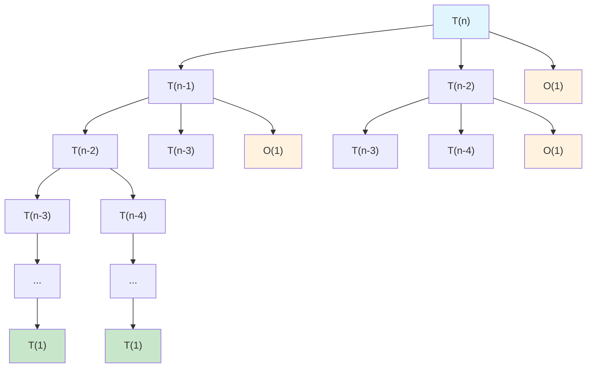
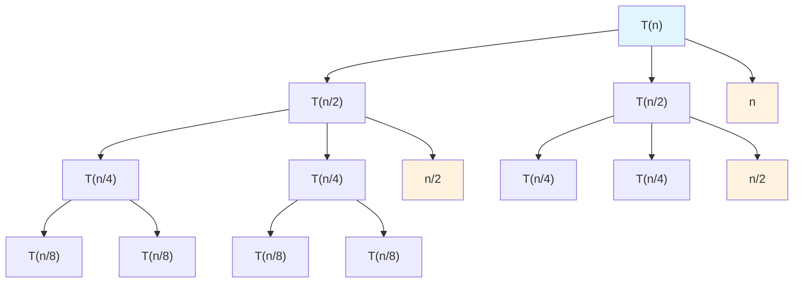
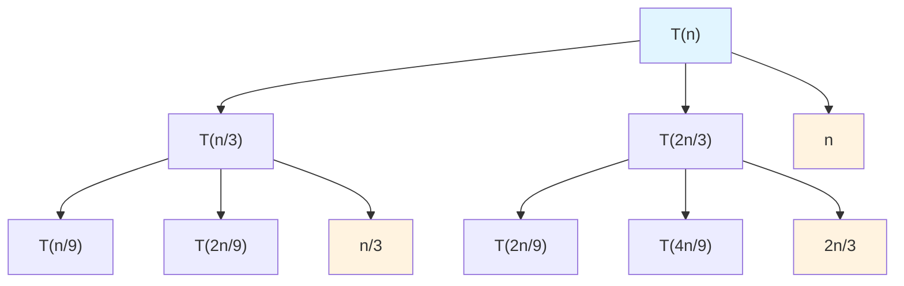
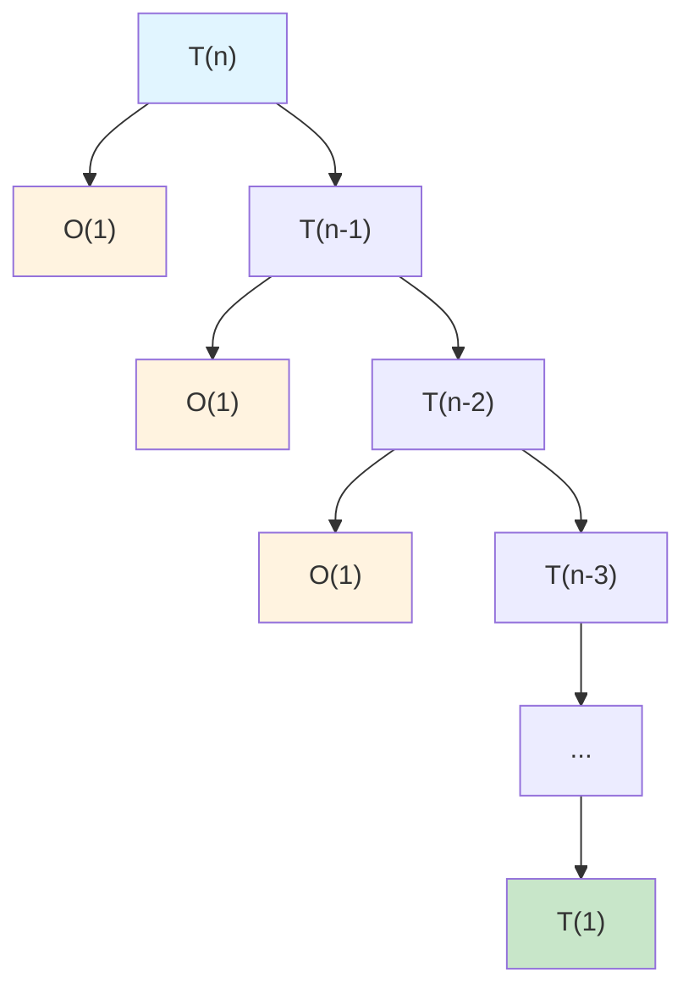
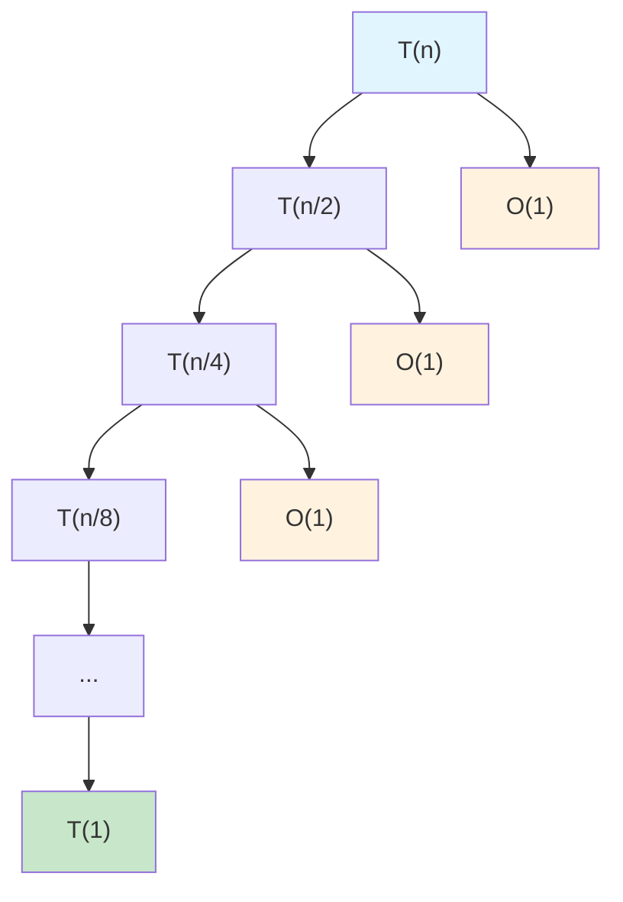
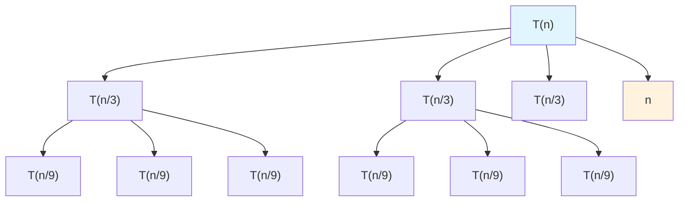
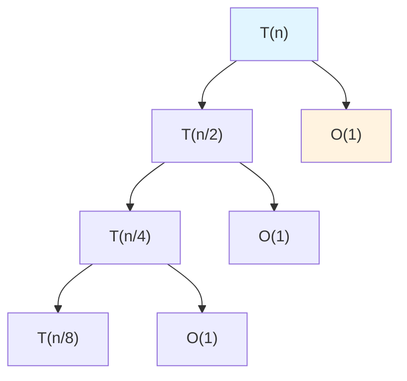

# 🌳 Ejemplos de Árboles de Recursión

Este documento muestra diferentes tipos de árboles de recursión que el sistema genera automáticamente.

## 1. Fibonacci (División Binaria Asimétrica)

**Ecuación:** `T(n) = T(n-1) + T(n-2) + O(1)`

**Árbol generado:**

**Complejidad:** O(2^n)

---

## 2. Merge Sort (Divide y Conquista)

**Ecuación:** `T(n) = 2T(n/2) + n`

**Árbol generado:**

**Complejidad:** O(n log n)

**Explicación:**
- Cada nivel tiene trabajo total = n
- Altura del árbol = log₂(n)
- Total = n × log₂(n) = O(n log n)

---

## 3. Quicksort Asimétrico

**Ecuación:** `T(n) = T(n/3) + T(2n/3) + n`

**Árbol generado:**

**Complejidad:** O(n log n)

---

## 4. Factorial Recursivo (Decrementación)

**Ecuación:** `T(n) = T(n-1) + O(1)`

**Árbol generado:**

**Complejidad:** O(n)

**Explicación:**
- Árbol lineal (no hay ramificación)
- n niveles de recursión
- Trabajo constante en cada nivel
- Total = O(1) × n = O(n)

---

## 5. Binary Search (División por 2)

**Ecuación:** `T(n) = T(n/2) + O(1)`

**Árbol generado:**

**Complejidad:** O(log n)

---

## 6. Árbol Ternario (3 hijos)

**Ecuación:** `T(n) = 3T(n/3) + n`

**Árbol generado:**

**Complejidad:** O(n log n)

---

## 7. Potencias (División exponencial)

**Ecuación:** `T(n) = T(n/2) + O(1)`

**Para calcular:** x^n = (x^(n/2))^2

**Complejidad:** O(log n)

---

## 📊 Tabla Comparativa

| Algoritmo | Ecuación | Árbol | Complejidad |
|-----------|----------|-------|-------------|
| Fibonacci | T(n) = T(n-1) + T(n-2) + 1 | Binario asimétrico | O(2^n) |
| Merge Sort | T(n) = 2T(n/2) + n | Binario balanceado | O(n log n) |
| Quick Sort | T(n) = T(n/3) + T(2n/3) + n | Binario desbalanceado | O(n log n) |
| Factorial | T(n) = T(n-1) + 1 | Lineal | O(n) |
| Binary Search | T(n) = T(n/2) + 1 | Lineal con división | O(log n) |
| Árbol 3-vías | T(n) = 3T(n/3) + n | Ternario | O(n log n) |

---

## 🎨 Leyenda de Colores

En los diagramas generados:
- 🔵 **Azul claro** (`#e1f5ff`): Nodo raíz / llamada principal
- 🟢 **Verde claro** (`#c8e6c9`): Casos base / hojas del árbol
- 🟡 **Naranja claro** (`#fff3e0`): Trabajo no recursivo / costos

---

## 🔍 Cómo Interpretar los Árboles

1. **Nodos cuadrados** `["T(...)"]`: Llamadas recursivas
2. **Nodos cuadrados de costo** `["O(...)"]` o `["n"]`: Trabajo no recursivo
3. **Flechas**: Indican el flujo de las llamadas recursivas
4. **Altura del árbol**: Número de niveles = profundidad de recursión
5. **Ancho en cada nivel**: Número de llamadas en ese nivel
6. **Total de nodos**: Aproximadamente igual al número de operaciones

---

## 💡 Tips para Análisis

### Divide y Conquista (División balanceada)
- Si cada nodo se divide en **a** subproblemas de tamaño **n/b**
- Complejidad depende de la relación entre **a** y **b^d** (donde d es el exponente del trabajo no recursivo)
- Usar **Teorema Maestro** para resolver

### Decrementación (Resta constante)
- Árbol lineal → O(n) o O(n²) dependiendo del trabajo en cada nivel
- Fácil de resolver por sustitución

### División Asimétrica
- Analizar la rama más profunda para cota superior
- Considerar balance promedio para caso promedio

---

**Estos árboles se generan AUTOMÁTICAMENTE** cuando analizas un algoritmo con el sistema.
