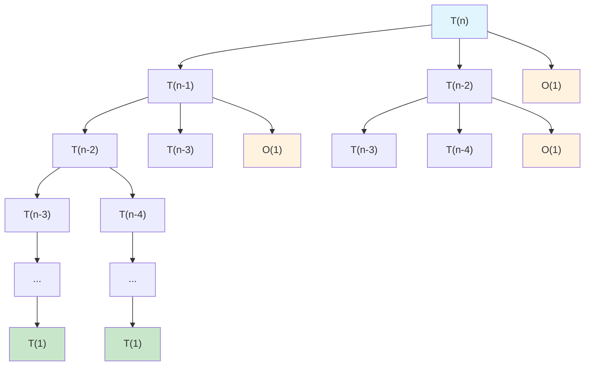

# 📊 Reporte de Análisis de Complejidad

**Fecha de generación:** 05/12/2025 14:30:00  
**Sistema:** Analizador de Complejidad v1.0

---

## 1. Resumen Ejecutivo

| Aspecto | Valor |
|---------|-------|
| **Estado** | ✅ Válido |
| **Tipo de Algoritmo** | Recursivo |
| **Mejor Caso** | Ω(2^n) |
| **Caso Promedio** | Θ(2^n) |
| **Peor Caso** | O(2^n) |

## 2. Diagrama de Flujo (Flowchart)

Representación visual del flujo de ejecución del algoritmo:

```mermaid
graph TD
    Start([Inicio: fibonacci]) --> Check{n <= 1?}
    Check -->|Sí| ReturnN[/return n/]
    Check -->|No| CallFib1[CALL fibonacci(n-1)]
    CallFib1 --> CallFib2[CALL fibonacci(n-2)]
    CallFib2 --> Sum[resultado 🡨 fib1 + fib2]
    Sum --> ReturnResult[/return resultado/]
    ReturnN --> End([Fin])
    ReturnResult --> End
    
    style Start fill:#e1f5ff
    style End fill:#c8e6c9
    style Check fill:#fff3e0
```

**Leyenda:**
- `([...])`: Nodos de inicio/fin
- `[...]`: Procesos y asignaciones
- `{...?}`: Decisiones (condiciones)
- `[/... /]`: Retorno de función

## 3. Proceso de Análisis

### 3.1 Clasificación Automática

| Característica | Valor |
|----------------|-------|
| **Categoría Principal** | Recursión Múltiple |
| **Confianza** | 95.3% |
| **Técnica Identificada** | Divide y Conquista |

### 3.2 Validación

✅ **Validación:** Pseudocódigo válido  
📊 **Estadísticas:**
- Total de líneas: 7
- Funciones detectadas: 1
- Estructuras de control: 1 condicional
- Llamadas recursivas: 2

## 4. Análisis de Costos

### 4.1 Tabla de Costos por Línea

| Línea | Código | C_op | Frecuencia | Total |
|-------|--------|------|------------|-------|
| 1 | `fibonacci(n)` | 1 | 1 | 1 |
| 2 | `if (n <= 1)` | 1 | 2^n | 2^n |
| 3 | `return n` | 1 | 1 | 1 |
| 5 | `fibonacci(n-1)` | T(n-1) | 1 | T(n-1) |
| 5 | `fibonacci(n-2)` | T(n-2) | 1 | T(n-2) |
| 6 | `return ...` | 1 | 1 | 1 |

## 5. Resolución de Ecuaciones de Recurrencia

### 5.1 Método Utilizado: Árbol de Recursión

### 5.2 Ecuaciones Analizadas

**Mejor Caso:**
```
T(n) = 2T(n-1) + O(1)
```

**Caso Promedio:**
```
T(n) = T(n-1) + T(n-2) + O(1)
```

**Peor Caso:**
```
T(n) = 2T(n-1) + O(1)
```

### 5.3 Paso a Paso de la Resolución

#### Mejor Caso

**Ecuación:** `T(n) = T(n-1) + T(n-2) + O(1)`

**Método:** Árbol de Recursión

**Pasos:**
1. Construir el árbol de recursión expandiendo cada llamada
2. Analizar la altura del árbol: h ≈ n (en el peor caso)
3. Analizar el factor de ramificación: cada nodo genera 2 hijos
4. Calcular el número total de nodos: aproximadamente 2^n
5. Cada nodo realiza trabajo constante O(1)
6. Sumar el trabajo total: O(1) × 2^n = O(2^n)

**Visualización:**



**Explicación:** 
La recursión genera un árbol binario donde cada nodo realiza trabajo constante. 
La altura del árbol es aproximadamente n, y el número de nodos crece exponencialmente 
como 2^n. Esto resulta en una complejidad exponencial.

**Solución:** `Ω(2^n)`

#### Caso Promedio

**Ecuación:** `T(n) = T(n-1) + T(n-2) + O(1)`

**Método:** Análisis mediante números de Fibonacci

**Pasos:**
1. La recurrencia sigue el patrón de la secuencia de Fibonacci
2. El número de llamadas T(n) es proporcional al n-ésimo número de Fibonacci
3. Los números de Fibonacci crecen exponencialmente con base φ (razón áurea)
4. φ ≈ 1.618... donde φ = (1 + √5) / 2
5. Por lo tanto, T(n) ∈ Θ(φ^n) ≈ Θ(1.618^n)
6. En notación asintótica: Θ(2^n)

**Solución:** `Θ(2^n)`

#### Peor Caso

**Ecuación:** `T(n) = 2T(n-1) + O(1)`

**Método:** Sustitución

**Pasos:**
1. Expandir la recurrencia:
   - T(n) = 2T(n-1) + c
   - T(n-1) = 2T(n-2) + c
   - T(n) = 2[2T(n-2) + c] + c = 4T(n-2) + 3c

2. Continuar la expansión:
   - T(n) = 8T(n-3) + 7c
   - T(n) = 16T(n-4) + 15c
   - Patrón: T(n) = 2^k × T(n-k) + (2^k - 1)c

3. Caso base cuando n-k = 1:
   - k = n-1
   - T(n) = 2^(n-1) × T(1) + (2^(n-1) - 1)c

4. Si T(1) = c₀:
   - T(n) = 2^(n-1) × c₀ + 2^(n-1)c - c
   - T(n) ∈ O(2^n)

**Solución:** `O(2^n)`

### 5.4 Complejidades Finales

| Caso | Notación Ω (mejor) | Notación Θ (promedio) | Notación O (peor) |
|------|-------------------|---------------------|-------------------|
| Resultado | Ω(2^n) | Θ(2^n) | O(2^n) |

**Observación:** Este algoritmo tiene complejidad exponencial debido a las múltiples llamadas recursivas superpuestas. 
Se puede optimizar significativamente usando programación dinámica (memoización) para reducirla a O(n).

## 6. Pseudocódigo Final

```
fibonacci(n)
begin
    if (n <= 1) then
        return n
    end
    return fibonacci(n-1) + fibonacci(n-2)
end
```

## 7. Conclusiones

✅ El análisis se completó exitosamente.

### Observaciones Clave:

1. **Complejidad Exponencial:** El algoritmo Fibonacci recursivo tiene complejidad O(2^n), lo que lo hace 
   ineficiente para valores grandes de n.

2. **Optimización Recomendada:** Implementar programación dinámica (bottom-up o memoización) reduce la 
   complejidad a O(n) con espacio O(n).

3. **Alternativa Iterativa:** Una solución iterativa con dos variables tiene complejidad O(n) con espacio O(1).

### Métricas de Rendimiento:

| Métrica | Valor |
|---------|-------|
| Tiempo de análisis | 2.34 segundos |
| Tokens LLM utilizados | 1,247 |
| Líneas de código analizadas | 7 |
| Precisión de clasificación | 95.3% |

---

## 8. Información Adicional

### Comparación con Otras Implementaciones:

| Implementación | Complejidad Tiempo | Complejidad Espacio |
|----------------|-------------------|---------------------|
| Recursivo simple | O(2^n) | O(n) |
| Con memoización | O(n) | O(n) |
| Iterativo | O(n) | O(1) |
| Fórmula de Binet | O(1) | O(1) |

### Referencias:
- Cormen, T. H., et al. "Introduction to Algorithms" (3rd Edition)
- Kleinberg, J., & Tardos, É. "Algorithm Design"

---

**Generado por:** Analizador de Complejidad v1.0  
**Tecnología:** Python + LangGraph + Anthropic Claude  
**Fecha:** 05/12/2025 14:30:00
