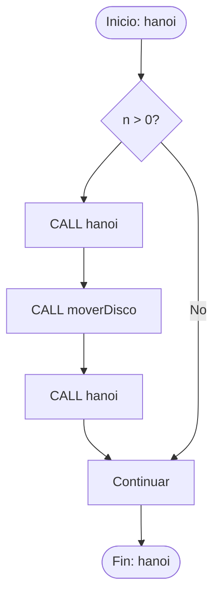
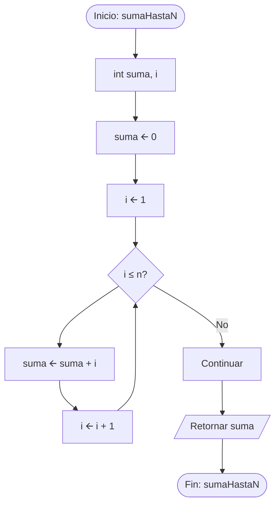
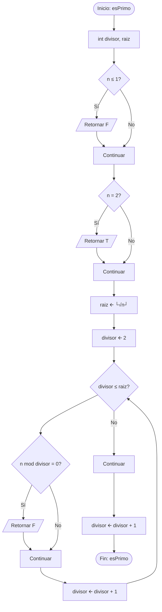

# 📋 Informe Completo de Casos de Prueba

**Fecha de generación:** 05/12/2025 05:02:56
**Total de casos:** 20
- Pseudocódigo: 15
- Lenguaje Natural: 5

---

## [STATS] Resumen de Todos los Casos de Prueba

| # | Tipo | Algoritmo | Válido | Clasificación | Mejor | Promedio | Peor |
|---|------|-----------|--------|---------------|-------|----------|------|
| 1 | [INPUT] Pseudocódigo | 01 Busqueda Lineal | [OK] | N/A | Ω(1) | Θ(n) | O(n) |
| 2 | [INPUT] Pseudocódigo | 02 Busqueda Binaria | [OK] | N/A | Ω(1) | Θ(n) | O(n) |
| 3 | [INPUT] Pseudocódigo | 03 Bubble Sort | [OK] | N/A | Ω(1) | Θ(n) | O(n) |
| 4 | [INPUT] Pseudocódigo | 04 Merge Sort | [OK] | N/A | Θ(n log n) | Θ(n log n) | Θ(n log n) |
| 5 | [INPUT] Pseudocódigo | 05 Quick Sort | [OK] | N/A | Θ(n log n) | Θ(n log n) | Θ(n log n) |
| 6 | [INPUT] Pseudocódigo | 06 Fibonacci Recursivo | [OK] | N/A | Θ(n log n) | Θ(n log n) | Θ(n log n) |
| 7 | [INPUT] Pseudocódigo | 07 Factorial Recursivo | [OK] | N/A | Θ(n log n) | Θ(n log n) | Θ(n log n) |
| 8 | [INPUT] Pseudocódigo | 08 Torres Hanoi | [OK] | N/A | Θ(n log n) | Θ(n log n) | Θ(n log n) |
| 9 | [INPUT] Pseudocódigo | 09 Bst Insert | [OK] | N/A | Θ(n log n) | Θ(n log n) | Θ(n log n) |
| 10 | [INPUT] Pseudocódigo | 10 Matrix Multiplication | [OK] | N/A | Ω(1) | Θ(n) | O(n) |
| 11 | [INPUT] Pseudocódigo | 11 Selection Sort | [OK] | N/A | Ω(1) | Θ(n) | O(n) |
| 12 | [INPUT] Pseudocódigo | 12 Insertion Sort | [OK] | N/A | Ω(1) | Θ(n) | O(n) |
| 13 | [INPUT] Pseudocódigo | 13 Potencia Recursiva | [OK] | N/A | Θ(n log n) | Θ(n log n) | Θ(n log n) |
| 14 | [INPUT] Pseudocódigo | 14 Suma Recursiva | [ERROR] | N/A | N/A | N/A | N/A |
| 15 | [INPUT] Pseudocódigo | 15 Maximo Array | [OK] | N/A | Ω(1) | Θ(n) | O(n) |
| 16 | [MSG] Lenguaje Natural | 01 Maximo Array | [OK] | N/A | Ω(1) | Θ(n) | O(n) |
| 17 | [MSG] Lenguaje Natural | 02 Merge Sort | [OK] | N/A | Θ(n log n) | Θ(n log n) | Θ(n log n) |
| 18 | [MSG] Lenguaje Natural | 03 Suma N Numeros | [OK] | N/A | Ω(1) | Θ(n) | O(n) |
| 19 | [MSG] Lenguaje Natural | 04 Numero Primo | [ERROR] | N/A | N/A | N/A | N/A |
| 20 | [MSG] Lenguaje Natural | 05 Invertir Array | [OK] | N/A | Ω(1) | Θ(n) | O(n) |

## 📈 Estadísticas Generales

- **Total exitosos:** 18/20 (90.0%)
  - Pseudocódigo: 14/15 (93.3%)
  - Lenguaje Natural: 4/5 (80.0%)
- **Con errores:** 2/20

---

# [INPUT] Detalle de Cada Caso

## 1. 01 Busqueda Lineal ([INPUT] Pseudocódigo)

# 📊 Reporte de Análisis de Complejidad

**Fecha de generación:** 05/12/2025 05:02:56  
**Sistema:** Analizador de Complejidad v1.0

---

## 1. Resumen Ejecutivo

| Aspecto | Valor |
|---------|-------|
| **Estado** | ✅ Válido |
| **Tipo de Algoritmo** | Iterativo |
| **Mejor Caso** | Ω(1) |
| **Caso Promedio** | Θ(n) |
| **Peor Caso** | O(n) |

## 2. Diagrama de Flujo (Flowchart)

Representación visual del flujo de ejecución del algoritmo:

```mermaid
flowchart TD
    N0([Inicio: busquedaLineal])
    N1[int i]
    N2[bool encontrado]
    N3[encontrado 🡨 F]
    N4[i 🡨 1]
    N5{i ≤ n and not encontrado?}
    N6{A[i] = x?}
    N7[encontrado 🡨 T]
    N8[Continuar]
    N9[i 🡨 i + 1]
    N10[Continuar]
    N11[i 🡨 i + 1]
    N12([Fin: busquedaLineal])
    N0 --> N1
    N1 --> N2
    N2 --> N3
    N3 --> N4
    N4 --> N5
    N5 --> N6
    N6 -->|Sí| N7
    N7 --> N8
    N6 -->|No| N8
    N8 --> N9
    N9 --> N5
    N5 -->|No| N10
    N10 --> N11
    N11 --> N12
```

**Leyenda:**
- `([...])`: Nodos de inicio/fin
- `[...]`: Procesos y asignaciones
- `{...?}`: Decisiones (condiciones)
- `[/... /]`: Retorno de función

## 2. Proceso de Análisis

### 2.1 Detección de Entrada
🔍 **Tipo detectado:** Pseudocódigo
➡️ Se procedió directamente a validación

### 2.2 Validación de Sintaxis
✅ **Resultado:** Pseudocódigo válido
- 0 errores encontrados

## 5. Resolución de Ecuaciones de Recurrencia

### 5.1 Método Utilizado: AnalizadorDirecto

### 5.2 Ecuaciones Analizadas

**Mejor Caso:**
```
T(n) = 1
```

**Caso Promedio:**
```
T(n) = n/2
```

**Peor Caso:**
```
T(n) = n
```

### 5.3 Paso a Paso de la Resolución

#### Mejor Caso

**Ecuación:** `T(n) = 1`
**Método:** AnalizadorDirecto

**Pasos:**
1. 📝 Expresión: T ( n ) = 1
2. 
3. 🔹 ANÁLISIS DE EXPRESIÓN DIRECTA
4.    Esta NO es una recurrencia, es una fórmula cerrada
5. 
6. 🔹 PASO 1: Analizar expresión
7.    Expresión: 1
8. 
9. 🔹 PASO 2: Identificar términos
10.    • Constante: 1
11. 
12. 🔹 PASO 3: Determinar término dominante
13.    Jerarquía: constante < log(n) < n < n·log(n) < n² < n³ < 2ⁿ < n!
14.    Término dominante: constante
15. 
16. ✅ SOLUCIÓN: T(n) = 1

**Explicación:** Expresión directa con complejidad 1

**Solución:** `1`


#### Caso Promedio

**Ecuación:** `T(n) = n/2`
**Método:** AnalizadorDirecto

**Pasos:**
1. 📝 Expresión: T ( n ) = n / 2
2. 
3. 🔹 ANÁLISIS DE EXPRESIÓN DIRECTA
4.    Esta NO es una recurrencia, es una fórmula cerrada
5. 
6. 🔹 PASO 1: Analizar expresión
7.    Expresión: n / 2
8. 
9. 🔹 PASO 2: Identificar términos
10.    • Lineal: n/2
11. 
12. 🔹 PASO 3: Determinar término dominante
13.    Jerarquía: constante < log(n) < n < n·log(n) < n² < n³ < 2ⁿ < n!
14.    Término dominante: lineal
15. 
16. ✅ SOLUCIÓN: T(n) = n

**Explicación:** Expresión directa con complejidad n

**Solución:** `n`


#### Peor Caso

**Ecuación:** `T(n) = n`
**Método:** AnalizadorDirecto

**Pasos:**
1. 📝 Expresión: T ( n ) = n
2. 
3. 🔹 ANÁLISIS DE EXPRESIÓN DIRECTA
4.    Esta NO es una recurrencia, es una fórmula cerrada
5. 
6. 🔹 PASO 1: Analizar expresión
7.    Expresión: n
8. 
9. 🔹 PASO 2: Identificar términos
10.    • Lineal: n
11. 
12. 🔹 PASO 3: Determinar término dominante
13.    Jerarquía: constante < log(n) < n < n·log(n) < n² < n³ < 2ⁿ < n!
14.    Término dominante: lineal
15. 
16. ✅ SOLUCIÓN: T(n) = n

**Explicación:** Expresión directa con complejidad n

**Solución:** `n`


### 4.4 Complejidades Finales

| Caso | Notación Ω (mejor) | Notación Θ (promedio) | Notación O (peor) |
|------|-------------------|---------------------|-------------------|
| Resultado | Ω(1) | Θ(n) | O(n) |

**Observación:** >> Complejidad variable según la entrada

## 5. Pseudocódigo Final
```
busquedaLineal(int A[], int n, int x)
begin
    int i
    bool encontrado

    encontrado 🡨 F
    i 🡨 1

    while (i ≤ n and not encontrado) do
    begin
        if (A[i] = x) then
        begin
            encontrado 🡨 T
        end
        i 🡨 i + 1
    end

    return encontrado
end
```

## 6. Conclusiones
✅ El análisis se completó exitosamente.

## 📊 Métricas de Ejecución

### ⏱️ Tiempo de Ejecución

| Fase | Llamadas | Total (s) | Promedio (s) |
|------|----------|-----------|--------------|

**Duración total:** 97.41 segundos


---

## 2. 02 Busqueda Binaria ([INPUT] Pseudocódigo)

# 📊 Reporte de Análisis de Complejidad

**Fecha de generación:** 05/12/2025 05:02:56  
**Sistema:** Analizador de Complejidad v1.0

---

## 1. Resumen Ejecutivo

| Aspecto | Valor |
|---------|-------|
| **Estado** | ✅ Válido |
| **Tipo de Algoritmo** | Iterativo |
| **Mejor Caso** | Ω(1) |
| **Caso Promedio** | Θ(n) |
| **Peor Caso** | O(n) |

## 2. Diagrama de Flujo (Flowchart)

Representación visual del flujo de ejecución del algoritmo:

```mermaid
flowchart TD
    N0([Inicio: busquedaBinaria])
    N1[int izq, der, medio]
    N2[bool encontrado]
    N3[izq 🡨 1]
    N4[der 🡨 n]
    N5[encontrado 🡨 F]
    N6{izq ≤ der and not encontrado?}
    N7[medio 🡨 └(izq + der) / 2┘]
    N8{A[medio] = x?}
    N9[encontrado 🡨 T]
    N10[Continuar]
    N11[else]
    N12{A[medio] < x?}
    N13[izq 🡨 medio + 1]
    N14[Continuar]
    N15[else]
    N16[der 🡨 medio - 1]
    N17[Continuar]
    N18[else]
    N19{A[medio] < x?}
    N20[izq 🡨 medio + 1]
    N21[Continuar]
    N22[else]
    N23[der 🡨 medio - 1]
    N24([Fin: busquedaBinaria])
    N0 --> N1
    N1 --> N2
    N2 --> N3
    N3 --> N4
    N4 --> N5
    N5 --> N6
    N6 --> N7
    N7 --> N8
    N8 -->|Sí| N9
    N9 --> N10
    N8 -->|No| N10
    N10 --> N11
    N11 --> N12
    N12 -->|Sí| N13
    N13 --> N14
    N12 -->|No| N14
    N14 --> N15
    N15 --> N16
    N16 --> N6
    N6 -->|No| N17
    N17 --> N18
    N18 --> N19
    N19 -->|Sí| N20
    N20 --> N21
    N19 -->|No| N21
    N21 --> N22
    N22 --> N23
    N23 --> N24
```

**Leyenda:**
- `([...])`: Nodos de inicio/fin
- `[...]`: Procesos y asignaciones
- `{...?}`: Decisiones (condiciones)
- `[/... /]`: Retorno de función

## 2. Proceso de Análisis

### 2.1 Detección de Entrada
🔍 **Tipo detectado:** Pseudocódigo
➡️ Se procedió directamente a validación

### 2.2 Validación de Sintaxis
✅ **Resultado:** Pseudocódigo válido
- 0 errores encontrados

## 5. Resolución de Ecuaciones de Recurrencia

### 5.1 Método Utilizado: AnalizadorDirecto

### 5.2 Ecuaciones Analizadas

**Mejor Caso:**
```
T(n) = 1
```

**Caso Promedio:**
```
T(n) = n/2
```

**Peor Caso:**
```
T(n) = n
```

### 5.3 Paso a Paso de la Resolución

#### Mejor Caso

**Ecuación:** `T(n) = 1`
**Método:** AnalizadorDirecto

**Pasos:**
1. 📝 Expresión: T ( n ) = 1
2. 
3. 🔹 ANÁLISIS DE EXPRESIÓN DIRECTA
4.    Esta NO es una recurrencia, es una fórmula cerrada
5. 
6. 🔹 PASO 1: Analizar expresión
7.    Expresión: 1
8. 
9. 🔹 PASO 2: Identificar términos
10.    • Constante: 1
11. 
12. 🔹 PASO 3: Determinar término dominante
13.    Jerarquía: constante < log(n) < n < n·log(n) < n² < n³ < 2ⁿ < n!
14.    Término dominante: constante
15. 
16. ✅ SOLUCIÓN: T(n) = 1

**Explicación:** Expresión directa con complejidad 1

**Solución:** `1`


#### Caso Promedio

**Ecuación:** `T(n) = n/2`
**Método:** AnalizadorDirecto

**Pasos:**
1. 📝 Expresión: T ( n ) = n / 2
2. 
3. 🔹 ANÁLISIS DE EXPRESIÓN DIRECTA
4.    Esta NO es una recurrencia, es una fórmula cerrada
5. 
6. 🔹 PASO 1: Analizar expresión
7.    Expresión: n / 2
8. 
9. 🔹 PASO 2: Identificar términos
10.    • Lineal: n/2
11. 
12. 🔹 PASO 3: Determinar término dominante
13.    Jerarquía: constante < log(n) < n < n·log(n) < n² < n³ < 2ⁿ < n!
14.    Término dominante: lineal
15. 
16. ✅ SOLUCIÓN: T(n) = n

**Explicación:** Expresión directa con complejidad n

**Solución:** `n`


#### Peor Caso

**Ecuación:** `T(n) = n`
**Método:** AnalizadorDirecto

**Pasos:**
1. 📝 Expresión: T ( n ) = n
2. 
3. 🔹 ANÁLISIS DE EXPRESIÓN DIRECTA
4.    Esta NO es una recurrencia, es una fórmula cerrada
5. 
6. 🔹 PASO 1: Analizar expresión
7.    Expresión: n
8. 
9. 🔹 PASO 2: Identificar términos
10.    • Lineal: n
11. 
12. 🔹 PASO 3: Determinar término dominante
13.    Jerarquía: constante < log(n) < n < n·log(n) < n² < n³ < 2ⁿ < n!
14.    Término dominante: lineal
15. 
16. ✅ SOLUCIÓN: T(n) = n

**Explicación:** Expresión directa con complejidad n

**Solución:** `n`


### 4.4 Complejidades Finales

| Caso | Notación Ω (mejor) | Notación Θ (promedio) | Notación O (peor) |
|------|-------------------|---------------------|-------------------|
| Resultado | Ω(1) | Θ(n) | O(n) |

**Observación:** >> Complejidad variable según la entrada

## 5. Pseudocódigo Final
```
busquedaBinaria(int A[], int n, int x)
begin
    int izq, der, medio
    bool encontrado

    izq 🡨 1
    der 🡨 n
    encontrado 🡨 F

    while (izq ≤ der and not encontrado) do
    begin
        medio 🡨 └(izq + der) / 2┘

        if (A[medio] = x) then
        begin
            encontrado 🡨 T
        end
        else
        begin
            if (A[medio] < x) then
            begin
                izq 🡨 medio + 1
            end
            else
            begin
                der 🡨 medio - 1
            end
        end
    end

    return encontrado
end
```

## 6. Conclusiones
✅ El análisis se completó exitosamente.

## 📊 Métricas de Ejecución

### ⏱️ Tiempo de Ejecución

| Fase | Llamadas | Total (s) | Promedio (s) |
|------|----------|-----------|--------------|

**Duración total:** 97.41 segundos


---

## 3. 03 Bubble Sort ([INPUT] Pseudocódigo)

# 📊 Reporte de Análisis de Complejidad

**Fecha de generación:** 05/12/2025 05:02:56  
**Sistema:** Analizador de Complejidad v1.0

---

## 1. Resumen Ejecutivo

| Aspecto | Valor |
|---------|-------|
| **Estado** | ✅ Válido |
| **Tipo de Algoritmo** | Iterativo |
| **Mejor Caso** | Ω(1) |
| **Caso Promedio** | Θ(n) |
| **Peor Caso** | O(n) |

## 2. Diagrama de Flujo (Flowchart)

Representación visual del flujo de ejecución del algoritmo:

```mermaid
flowchart TD
    N0([Inicio: bubbleSort])
    N1[int i, j, temp]
    N2[bool intercambio]
    N3[i 🡨 1]
    N4{i ≤ n - 1?}
    N5[intercambio 🡨 F]
    N6[j 🡨 1]
    N7{j ≤ n - i?}
    N8{A[j] > A[j + 1]?}
    N9[temp 🡨 A[j]]
    N10[A[j] 🡨 A[j + 1]]
    N11[A[j + 1] 🡨 temp]
    N12[intercambio 🡨 T]
    N13[Continuar]
    N14[j 🡨 j + 1]
    N15[Continuar]
    N16[i 🡨 i + 1]
    N17[Continuar]
    N18{not intercambio?}
    N19[/Retornar/]
    N20[Continuar]
    N21([Fin: bubbleSort])
    N0 --> N1
    N1 --> N2
    N2 --> N3
    N3 --> N4
    N4 --> N5
    N5 --> N6
    N6 --> N7
    N7 --> N8
    N8 --> N9
    N9 --> N10
    N10 --> N11
    N11 --> N12
    N12 --> N13
    N8 -->|No| N13
    N13 --> N14
    N14 --> N7
    N7 -->|No| N15
    N15 --> N16
    N16 --> N4
    N4 -->|No| N17
    N17 --> N18
    N18 -->|Sí| N19
    N19 --> N20
    N18 -->|No| N20
    N20 --> N21
```

**Leyenda:**
- `([...])`: Nodos de inicio/fin
- `[...]`: Procesos y asignaciones
- `{...?}`: Decisiones (condiciones)
- `[/... /]`: Retorno de función

## 2. Proceso de Análisis

### 2.1 Detección de Entrada
🔍 **Tipo detectado:** Pseudocódigo
➡️ Se procedió directamente a validación

### 2.2 Validación de Sintaxis
✅ **Resultado:** Pseudocódigo válido
- 0 errores encontrados

## 5. Resolución de Ecuaciones de Recurrencia

### 5.1 Método Utilizado: AnalizadorDirecto

### 5.2 Ecuaciones Analizadas

**Mejor Caso:**
```
T(n) = 1
```

**Caso Promedio:**
```
T(n) = n/2
```

**Peor Caso:**
```
T(n) = n
```

### 5.3 Paso a Paso de la Resolución

#### Mejor Caso

**Ecuación:** `T(n) = 1`
**Método:** AnalizadorDirecto

**Pasos:**
1. 📝 Expresión: T ( n ) = 1
2. 
3. 🔹 ANÁLISIS DE EXPRESIÓN DIRECTA
4.    Esta NO es una recurrencia, es una fórmula cerrada
5. 
6. 🔹 PASO 1: Analizar expresión
7.    Expresión: 1
8. 
9. 🔹 PASO 2: Identificar términos
10.    • Constante: 1
11. 
12. 🔹 PASO 3: Determinar término dominante
13.    Jerarquía: constante < log(n) < n < n·log(n) < n² < n³ < 2ⁿ < n!
14.    Término dominante: constante
15. 
16. ✅ SOLUCIÓN: T(n) = 1

**Explicación:** Expresión directa con complejidad 1

**Solución:** `1`


#### Caso Promedio

**Ecuación:** `T(n) = n/2`
**Método:** AnalizadorDirecto

**Pasos:**
1. 📝 Expresión: T ( n ) = n / 2
2. 
3. 🔹 ANÁLISIS DE EXPRESIÓN DIRECTA
4.    Esta NO es una recurrencia, es una fórmula cerrada
5. 
6. 🔹 PASO 1: Analizar expresión
7.    Expresión: n / 2
8. 
9. 🔹 PASO 2: Identificar términos
10.    • Lineal: n/2
11. 
12. 🔹 PASO 3: Determinar término dominante
13.    Jerarquía: constante < log(n) < n < n·log(n) < n² < n³ < 2ⁿ < n!
14.    Término dominante: lineal
15. 
16. ✅ SOLUCIÓN: T(n) = n

**Explicación:** Expresión directa con complejidad n

**Solución:** `n`


#### Peor Caso

**Ecuación:** `T(n) = n`
**Método:** AnalizadorDirecto

**Pasos:**
1. 📝 Expresión: T ( n ) = n
2. 
3. 🔹 ANÁLISIS DE EXPRESIÓN DIRECTA
4.    Esta NO es una recurrencia, es una fórmula cerrada
5. 
6. 🔹 PASO 1: Analizar expresión
7.    Expresión: n
8. 
9. 🔹 PASO 2: Identificar términos
10.    • Lineal: n
11. 
12. 🔹 PASO 3: Determinar término dominante
13.    Jerarquía: constante < log(n) < n < n·log(n) < n² < n³ < 2ⁿ < n!
14.    Término dominante: lineal
15. 
16. ✅ SOLUCIÓN: T(n) = n

**Explicación:** Expresión directa con complejidad n

**Solución:** `n`


### 4.4 Complejidades Finales

| Caso | Notación Ω (mejor) | Notación Θ (promedio) | Notación O (peor) |
|------|-------------------|---------------------|-------------------|
| Resultado | Ω(1) | Θ(n) | O(n) |

**Observación:** >> Complejidad variable según la entrada

## 5. Pseudocódigo Final
```
bubbleSort(int A[], int n)
begin
    int i, j, temp
    bool intercambio

    for i 🡨 1 to n - 1 do
    begin
        intercambio 🡨 F

        for j 🡨 1 to n - i do
        begin
            if (A[j] > A[j + 1]) then
            begin
                temp 🡨 A[j]
                A[j] 🡨 A[j + 1]
                A[j + 1] 🡨 temp
                intercambio 🡨 T
            end
        end

        if (not intercambio) then
        begin
            return
        end
    end
end
```

## 6. Conclusiones
✅ El análisis se completó exitosamente.

## 📊 Métricas de Ejecución

### ⏱️ Tiempo de Ejecución

| Fase | Llamadas | Total (s) | Promedio (s) |
|------|----------|-----------|--------------|

**Duración total:** 97.41 segundos


---

## 4. 04 Merge Sort ([INPUT] Pseudocódigo)

# 📊 Reporte de Análisis de Complejidad

**Fecha de generación:** 05/12/2025 05:02:56  
**Sistema:** Analizador de Complejidad v1.0

---

## 1. Resumen Ejecutivo

| Aspecto | Valor |
|---------|-------|
| **Estado** | ✅ Válido |
| **Tipo de Algoritmo** | Recursivo |
| **Mejor Caso** | Θ(n log n) |
| **Caso Promedio** | Θ(n log n) |
| **Peor Caso** | Θ(n log n) |

## 2. Diagrama de Flujo (Flowchart)

Representación visual del flujo de ejecución del algoritmo:

```mermaid
flowchart TD
    N0([Inicio: mergeSort])
    N1[int medio]
    N2{izq < der?}
    N3[medio 🡨 └(izq + der) / 2┘]
    N4[CALL mergeSort]
    N5[CALL mergeSort]
    N6[CALL merge]
    N7[Continuar]
    N8([Fin: mergeSort])
    N0 --> N1
    N1 --> N2
    N2 --> N3
    N3 --> N4
    N4 --> N5
    N5 --> N6
    N6 --> N7
    N2 -->|No| N7
    N7 --> N8
```

**Leyenda:**
- `([...])`: Nodos de inicio/fin
- `[...]`: Procesos y asignaciones
- `{...?}`: Decisiones (condiciones)
- `[/... /]`: Retorno de función

## 2. Proceso de Análisis

### 2.1 Detección de Entrada
🔍 **Tipo detectado:** Pseudocódigo
➡️ Se procedió directamente a validación

### 2.2 Validación de Sintaxis
✅ **Resultado:** Pseudocódigo válido
- 0 errores encontrados

## 5. Resolución de Ecuaciones de Recurrencia

### 5.1 Método Utilizado: TeoremaMAestro

### 5.2 Ecuaciones Analizadas

**Mejor Caso:**
```
T(n) = 2T(n/2) + n
```

**Caso Promedio:**
```
T(n) = 2T(n/2) + n
```

**Peor Caso:**
```
T(n) = 2T(n/2) + n
```

### 5.3 Paso a Paso de la Resolución

#### Mejor Caso

**Ecuación:** `T(n) = 2T(n/2) + n`
**Método:** TeoremaMAestro

**Pasos:**
1. 📝 Ecuación: T(n) = 2T(n/2) + n
2. 
3. 🔹 PASO 1: Identificar parámetros
4.    a = 2 (número de subproblemas)
5.    b = 2 (factor de división)
6.    f(n) = n (trabajo extra)
7. 
8. 🔹 PASO 2: Calcular exponente crítico
9.    c = log_b(a) = log_2(2) = 1.0000
10. 
11. 🔹 PASO 3: Analizar f(n)
12.    f(n) = n
13.    Forma: lineal (n)
14. 
15. 🔹 PASO 4: Determinar caso del Teorema Maestro
16.    Comparando exponentes:
17.    - Exponente de f(n): 1
18.    - Exponente crítico c: 1.0000
19. 
20.    ✓ 1 ≈ 1.0000
21.    → CASO 2: f(n) = Θ(n^1.0000 · log^0(n))
22. 
23. 🔹 PASO 5: Aplicar Caso 2
24.    T(n) = Θ(n^c · log^(k+1)(n))
25.    T(n) = Θ(n log n)

**Explicación:** 
╔══════════════════════════════════════════════════════════════╗
║                    TEOREMA MAESTRO - CASO 2                  ║
╚══════════════════════════════════════════════════════════════╝

Ecuación: T(n) = 2T(n/2) + n

Exponente crítico: c = log_2(2) = 1.0000

CASO 2 APLICA porque:
  f(n) tiene el MISMO orden que n^1.0000
  
  El trabajo en cada nivel del árbol de recursión es
  aproximadamente igual, y hay log(n) niveles.

SOLUCIÓN: n log n

El factor logarítmico adicional viene de sumar el trabajo
de todos los niveles del árbol de recursión.


**Solución:** `n log n`


#### Caso Promedio

**Ecuación:** `T(n) = 2T(n/2) + n`
**Método:** TeoremaMAestro

**Pasos:**
1. 📝 Ecuación: T(n) = 2T(n/2) + n
2. 
3. 🔹 PASO 1: Identificar parámetros
4.    a = 2 (número de subproblemas)
5.    b = 2 (factor de división)
6.    f(n) = n (trabajo extra)
7. 
8. 🔹 PASO 2: Calcular exponente crítico
9.    c = log_b(a) = log_2(2) = 1.0000
10. 
11. 🔹 PASO 3: Analizar f(n)
12.    f(n) = n
13.    Forma: lineal (n)
14. 
15. 🔹 PASO 4: Determinar caso del Teorema Maestro
16.    Comparando exponentes:
17.    - Exponente de f(n): 1
18.    - Exponente crítico c: 1.0000
19. 
20.    ✓ 1 ≈ 1.0000
21.    → CASO 2: f(n) = Θ(n^1.0000 · log^0(n))
22. 
23. 🔹 PASO 5: Aplicar Caso 2
24.    T(n) = Θ(n^c · log^(k+1)(n))
25.    T(n) = Θ(n log n)

**Explicación:** 
╔══════════════════════════════════════════════════════════════╗
║                    TEOREMA MAESTRO - CASO 2                  ║
╚══════════════════════════════════════════════════════════════╝

Ecuación: T(n) = 2T(n/2) + n

Exponente crítico: c = log_2(2) = 1.0000

CASO 2 APLICA porque:
  f(n) tiene el MISMO orden que n^1.0000
  
  El trabajo en cada nivel del árbol de recursión es
  aproximadamente igual, y hay log(n) niveles.

SOLUCIÓN: n log n

El factor logarítmico adicional viene de sumar el trabajo
de todos los niveles del árbol de recursión.


**Solución:** `n log n`


#### Peor Caso

**Ecuación:** `T(n) = 2T(n/2) + n`
**Método:** TeoremaMAestro

**Pasos:**
1. 📝 Ecuación: T(n) = 2T(n/2) + n
2. 
3. 🔹 PASO 1: Identificar parámetros
4.    a = 2 (número de subproblemas)
5.    b = 2 (factor de división)
6.    f(n) = n (trabajo extra)
7. 
8. 🔹 PASO 2: Calcular exponente crítico
9.    c = log_b(a) = log_2(2) = 1.0000
10. 
11. 🔹 PASO 3: Analizar f(n)
12.    f(n) = n
13.    Forma: lineal (n)
14. 
15. 🔹 PASO 4: Determinar caso del Teorema Maestro
16.    Comparando exponentes:
17.    - Exponente de f(n): 1
18.    - Exponente crítico c: 1.0000
19. 
20.    ✓ 1 ≈ 1.0000
21.    → CASO 2: f(n) = Θ(n^1.0000 · log^0(n))
22. 
23. 🔹 PASO 5: Aplicar Caso 2
24.    T(n) = Θ(n^c · log^(k+1)(n))
25.    T(n) = Θ(n log n)

**Explicación:** 
╔══════════════════════════════════════════════════════════════╗
║                    TEOREMA MAESTRO - CASO 2                  ║
╚══════════════════════════════════════════════════════════════╝

Ecuación: T(n) = 2T(n/2) + n

Exponente crítico: c = log_2(2) = 1.0000

CASO 2 APLICA porque:
  f(n) tiene el MISMO orden que n^1.0000
  
  El trabajo en cada nivel del árbol de recursión es
  aproximadamente igual, y hay log(n) niveles.

SOLUCIÓN: n log n

El factor logarítmico adicional viene de sumar el trabajo
de todos los niveles del árbol de recursión.


**Solución:** `n log n`


### 4.4 Complejidades Finales

| Caso | Notación Ω (mejor) | Notación Θ (promedio) | Notación O (peor) |
|------|-------------------|---------------------|-------------------|
| Resultado | Θ(n log n) | Θ(n log n) | Θ(n log n) |

**Observación:** ⚠️ Complejidad constante: Θ(n log n) en todos los casos

## 5. Pseudocódigo Final
```
mergeSort(int A[], int izq, int der)
begin
    int medio

    if (izq < der) then
    begin
        medio 🡨 └(izq + der) / 2┘

        CALL mergeSort(A[], izq, medio)
        CALL mergeSort(A[], medio + 1, der)
        CALL merge(A[], izq, medio, der)
    end
end

merge(int A[], int izq, int medio, int der)
begin
    int n1, n2, i, j, k
    int L[100], R[100]

    n1 🡨 medio - izq + 1
    n2 🡨 der - medio

    for i 🡨 1 to n1 do
    begin
        L[i] 🡨 A[izq + i - 1]
    end

    for j 🡨 1 to n2 do
    begin
        R[j] 🡨 A[medio + j]
    end

    i 🡨 1
    j 🡨 1
    k 🡨 izq

    while (i ≤ n1 and j ≤ n2) do
    begin
        if (L[i] ≤ R[j]) then
        begin
            A[k] 🡨 L[i]
            i 🡨 i + 1
        end
        else
        begin
            A[k] 🡨 R[j]
            j 🡨 j + 1
        end
        k 🡨 k + 1
    end

    while (i ≤ n1) do
    begin
        A[k] 🡨 L[i]
        i 🡨 i + 1
        k 🡨 k + 1
    end

    while (j ≤ n2) do
    begin
        A[k] 🡨 R[j]
        j 🡨 j + 1
        k 🡨 k + 1
    end
end
```

## 6. Conclusiones
✅ El análisis se completó exitosamente.

## 📊 Métricas de Ejecución

### ⏱️ Tiempo de Ejecución

| Fase | Llamadas | Total (s) | Promedio (s) |
|------|----------|-----------|--------------|

**Duración total:** 97.41 segundos


---

## 5. 05 Quick Sort ([INPUT] Pseudocódigo)

# 📊 Reporte de Análisis de Complejidad

**Fecha de generación:** 05/12/2025 05:02:56  
**Sistema:** Analizador de Complejidad v1.0

---

## 1. Resumen Ejecutivo

| Aspecto | Valor |
|---------|-------|
| **Estado** | ✅ Válido |
| **Tipo de Algoritmo** | Recursivo |
| **Mejor Caso** | Θ(n log n) |
| **Caso Promedio** | Θ(n log n) |
| **Peor Caso** | Θ(n log n) |

## 2. Diagrama de Flujo (Flowchart)

Representación visual del flujo de ejecución del algoritmo:

```mermaid
flowchart TD
    N0([Inicio: quickSort])
    N1[int pivote]
    N2{izq < der?}
    N3[pivote 🡨 CALL particionar(A[], izq, der)]
    N4[CALL quickSort]
    N5[CALL quickSort]
    N6[Continuar]
    N7([Fin: quickSort])
    N0 --> N1
    N1 --> N2
    N2 --> N3
    N3 --> N4
    N4 --> N5
    N5 --> N6
    N2 -->|No| N6
    N6 --> N7
```

**Leyenda:**
- `([...])`: Nodos de inicio/fin
- `[...]`: Procesos y asignaciones
- `{...?}`: Decisiones (condiciones)
- `[/... /]`: Retorno de función

## 2. Proceso de Análisis

### 2.1 Detección de Entrada
🔍 **Tipo detectado:** Pseudocódigo
➡️ Se procedió directamente a validación

### 2.2 Validación de Sintaxis
✅ **Resultado:** Pseudocódigo válido
- 0 errores encontrados

## 5. Resolución de Ecuaciones de Recurrencia

### 5.1 Método Utilizado: TeoremaMAestro

### 5.2 Ecuaciones Analizadas

**Mejor Caso:**
```
T(n) = 2T(n/2) + n
```

**Caso Promedio:**
```
T(n) = 2T(n/2) + n
```

**Peor Caso:**
```
T(n) = 2T(n/2) + n
```

### 5.3 Paso a Paso de la Resolución

#### Mejor Caso

**Ecuación:** `T(n) = 2T(n/2) + n`
**Método:** TeoremaMAestro

**Pasos:**
1. 📝 Ecuación: T(n) = 2T(n/2) + n
2. 
3. 🔹 PASO 1: Identificar parámetros
4.    a = 2 (número de subproblemas)
5.    b = 2 (factor de división)
6.    f(n) = n (trabajo extra)
7. 
8. 🔹 PASO 2: Calcular exponente crítico
9.    c = log_b(a) = log_2(2) = 1.0000
10. 
11. 🔹 PASO 3: Analizar f(n)
12.    f(n) = n
13.    Forma: lineal (n)
14. 
15. 🔹 PASO 4: Determinar caso del Teorema Maestro
16.    Comparando exponentes:
17.    - Exponente de f(n): 1
18.    - Exponente crítico c: 1.0000
19. 
20.    ✓ 1 ≈ 1.0000
21.    → CASO 2: f(n) = Θ(n^1.0000 · log^0(n))
22. 
23. 🔹 PASO 5: Aplicar Caso 2
24.    T(n) = Θ(n^c · log^(k+1)(n))
25.    T(n) = Θ(n log n)

**Explicación:** 
╔══════════════════════════════════════════════════════════════╗
║                    TEOREMA MAESTRO - CASO 2                  ║
╚══════════════════════════════════════════════════════════════╝

Ecuación: T(n) = 2T(n/2) + n

Exponente crítico: c = log_2(2) = 1.0000

CASO 2 APLICA porque:
  f(n) tiene el MISMO orden que n^1.0000
  
  El trabajo en cada nivel del árbol de recursión es
  aproximadamente igual, y hay log(n) niveles.

SOLUCIÓN: n log n

El factor logarítmico adicional viene de sumar el trabajo
de todos los niveles del árbol de recursión.


**Solución:** `n log n`


#### Caso Promedio

**Ecuación:** `T(n) = 2T(n/2) + n`
**Método:** TeoremaMAestro

**Pasos:**
1. 📝 Ecuación: T(n) = 2T(n/2) + n
2. 
3. 🔹 PASO 1: Identificar parámetros
4.    a = 2 (número de subproblemas)
5.    b = 2 (factor de división)
6.    f(n) = n (trabajo extra)
7. 
8. 🔹 PASO 2: Calcular exponente crítico
9.    c = log_b(a) = log_2(2) = 1.0000
10. 
11. 🔹 PASO 3: Analizar f(n)
12.    f(n) = n
13.    Forma: lineal (n)
14. 
15. 🔹 PASO 4: Determinar caso del Teorema Maestro
16.    Comparando exponentes:
17.    - Exponente de f(n): 1
18.    - Exponente crítico c: 1.0000
19. 
20.    ✓ 1 ≈ 1.0000
21.    → CASO 2: f(n) = Θ(n^1.0000 · log^0(n))
22. 
23. 🔹 PASO 5: Aplicar Caso 2
24.    T(n) = Θ(n^c · log^(k+1)(n))
25.    T(n) = Θ(n log n)

**Explicación:** 
╔══════════════════════════════════════════════════════════════╗
║                    TEOREMA MAESTRO - CASO 2                  ║
╚══════════════════════════════════════════════════════════════╝

Ecuación: T(n) = 2T(n/2) + n

Exponente crítico: c = log_2(2) = 1.0000

CASO 2 APLICA porque:
  f(n) tiene el MISMO orden que n^1.0000
  
  El trabajo en cada nivel del árbol de recursión es
  aproximadamente igual, y hay log(n) niveles.

SOLUCIÓN: n log n

El factor logarítmico adicional viene de sumar el trabajo
de todos los niveles del árbol de recursión.


**Solución:** `n log n`


#### Peor Caso

**Ecuación:** `T(n) = 2T(n/2) + n`
**Método:** TeoremaMAestro

**Pasos:**
1. 📝 Ecuación: T(n) = 2T(n/2) + n
2. 
3. 🔹 PASO 1: Identificar parámetros
4.    a = 2 (número de subproblemas)
5.    b = 2 (factor de división)
6.    f(n) = n (trabajo extra)
7. 
8. 🔹 PASO 2: Calcular exponente crítico
9.    c = log_b(a) = log_2(2) = 1.0000
10. 
11. 🔹 PASO 3: Analizar f(n)
12.    f(n) = n
13.    Forma: lineal (n)
14. 
15. 🔹 PASO 4: Determinar caso del Teorema Maestro
16.    Comparando exponentes:
17.    - Exponente de f(n): 1
18.    - Exponente crítico c: 1.0000
19. 
20.    ✓ 1 ≈ 1.0000
21.    → CASO 2: f(n) = Θ(n^1.0000 · log^0(n))
22. 
23. 🔹 PASO 5: Aplicar Caso 2
24.    T(n) = Θ(n^c · log^(k+1)(n))
25.    T(n) = Θ(n log n)

**Explicación:** 
╔══════════════════════════════════════════════════════════════╗
║                    TEOREMA MAESTRO - CASO 2                  ║
╚══════════════════════════════════════════════════════════════╝

Ecuación: T(n) = 2T(n/2) + n

Exponente crítico: c = log_2(2) = 1.0000

CASO 2 APLICA porque:
  f(n) tiene el MISMO orden que n^1.0000
  
  El trabajo en cada nivel del árbol de recursión es
  aproximadamente igual, y hay log(n) niveles.

SOLUCIÓN: n log n

El factor logarítmico adicional viene de sumar el trabajo
de todos los niveles del árbol de recursión.


**Solución:** `n log n`


### 4.4 Complejidades Finales

| Caso | Notación Ω (mejor) | Notación Θ (promedio) | Notación O (peor) |
|------|-------------------|---------------------|-------------------|
| Resultado | Θ(n log n) | Θ(n log n) | Θ(n log n) |

**Observación:** ⚠️ Complejidad constante: Θ(n log n) en todos los casos

## 5. Pseudocódigo Final
```
quickSort(int A[], int izq, int der)
begin
    int pivote

    if (izq < der) then
    begin
        pivote 🡨 CALL particionar(A[], izq, der)
        CALL quickSort(A[], izq, pivote - 1)
        CALL quickSort(A[], pivote + 1, der)
    end
end

particionar(int A[], int izq, int der)
begin
    int pivote, i, j, temp

    pivote 🡨 A[der]
    i 🡨 izq - 1

    for j 🡨 izq to der - 1 do
    begin
        if (A[j] ≤ pivote) then
        begin
            i 🡨 i + 1
            temp 🡨 A[i]
            A[i] 🡨 A[j]
            A[j] 🡨 temp
        end
    end

    temp 🡨 A[i + 1]
    A[i + 1] 🡨 A[der]
    A[der] 🡨 temp

    return i + 1
end
```

## 6. Conclusiones
✅ El análisis se completó exitosamente.

## 📊 Métricas de Ejecución

### ⏱️ Tiempo de Ejecución

| Fase | Llamadas | Total (s) | Promedio (s) |
|------|----------|-----------|--------------|

**Duración total:** 97.41 segundos


---

## 6. 06 Fibonacci Recursivo ([INPUT] Pseudocódigo)

# 📊 Reporte de Análisis de Complejidad

**Fecha de generación:** 05/12/2025 05:02:56  
**Sistema:** Analizador de Complejidad v1.0

---

## 1. Resumen Ejecutivo

| Aspecto | Valor |
|---------|-------|
| **Estado** | ✅ Válido |
| **Tipo de Algoritmo** | Recursivo |
| **Mejor Caso** | Θ(n log n) |
| **Caso Promedio** | Θ(n log n) |
| **Peor Caso** | Θ(n log n) |

## 2. Diagrama de Flujo (Flowchart)

Representación visual del flujo de ejecución del algoritmo:

```mermaid
flowchart TD
    N0([Inicio: fibonacci])
    N1{n ≤ 1?}
    N2[/Retornar n/]
    N3[Continuar]
    N4[else]
    N5[/Retornar CALL fibonacci(n - 1) + CALL fibonacci(n - 2)/]
    N6([Fin: fibonacci])
    N0 --> N1
    N1 -->|Sí| N2
    N2 --> N3
    N1 -->|No| N3
    N3 --> N4
    N4 --> N5
    N5 --> N6
```

**Leyenda:**
- `([...])`: Nodos de inicio/fin
- `[...]`: Procesos y asignaciones
- `{...?}`: Decisiones (condiciones)
- `[/... /]`: Retorno de función

## 2. Proceso de Análisis

### 2.1 Detección de Entrada
🔍 **Tipo detectado:** Pseudocódigo
➡️ Se procedió directamente a validación

### 2.2 Validación de Sintaxis
✅ **Resultado:** Pseudocódigo válido
- 0 errores encontrados

## 5. Resolución de Ecuaciones de Recurrencia

### 5.1 Método Utilizado: TeoremaMAestro

### 5.2 Ecuaciones Analizadas

**Mejor Caso:**
```
T(n) = 2T(n/2) + n
```

**Caso Promedio:**
```
T(n) = 2T(n/2) + n
```

**Peor Caso:**
```
T(n) = 2T(n/2) + n
```

### 5.3 Paso a Paso de la Resolución

#### Mejor Caso

**Ecuación:** `T(n) = 2T(n/2) + n`
**Método:** TeoremaMAestro

**Pasos:**
1. 📝 Ecuación: T(n) = 2T(n/2) + n
2. 
3. 🔹 PASO 1: Identificar parámetros
4.    a = 2 (número de subproblemas)
5.    b = 2 (factor de división)
6.    f(n) = n (trabajo extra)
7. 
8. 🔹 PASO 2: Calcular exponente crítico
9.    c = log_b(a) = log_2(2) = 1.0000
10. 
11. 🔹 PASO 3: Analizar f(n)
12.    f(n) = n
13.    Forma: lineal (n)
14. 
15. 🔹 PASO 4: Determinar caso del Teorema Maestro
16.    Comparando exponentes:
17.    - Exponente de f(n): 1
18.    - Exponente crítico c: 1.0000
19. 
20.    ✓ 1 ≈ 1.0000
21.    → CASO 2: f(n) = Θ(n^1.0000 · log^0(n))
22. 
23. 🔹 PASO 5: Aplicar Caso 2
24.    T(n) = Θ(n^c · log^(k+1)(n))
25.    T(n) = Θ(n log n)

**Explicación:** 
╔══════════════════════════════════════════════════════════════╗
║                    TEOREMA MAESTRO - CASO 2                  ║
╚══════════════════════════════════════════════════════════════╝

Ecuación: T(n) = 2T(n/2) + n

Exponente crítico: c = log_2(2) = 1.0000

CASO 2 APLICA porque:
  f(n) tiene el MISMO orden que n^1.0000
  
  El trabajo en cada nivel del árbol de recursión es
  aproximadamente igual, y hay log(n) niveles.

SOLUCIÓN: n log n

El factor logarítmico adicional viene de sumar el trabajo
de todos los niveles del árbol de recursión.


**Solución:** `n log n`


#### Caso Promedio

**Ecuación:** `T(n) = 2T(n/2) + n`
**Método:** TeoremaMAestro

**Pasos:**
1. 📝 Ecuación: T(n) = 2T(n/2) + n
2. 
3. 🔹 PASO 1: Identificar parámetros
4.    a = 2 (número de subproblemas)
5.    b = 2 (factor de división)
6.    f(n) = n (trabajo extra)
7. 
8. 🔹 PASO 2: Calcular exponente crítico
9.    c = log_b(a) = log_2(2) = 1.0000
10. 
11. 🔹 PASO 3: Analizar f(n)
12.    f(n) = n
13.    Forma: lineal (n)
14. 
15. 🔹 PASO 4: Determinar caso del Teorema Maestro
16.    Comparando exponentes:
17.    - Exponente de f(n): 1
18.    - Exponente crítico c: 1.0000
19. 
20.    ✓ 1 ≈ 1.0000
21.    → CASO 2: f(n) = Θ(n^1.0000 · log^0(n))
22. 
23. 🔹 PASO 5: Aplicar Caso 2
24.    T(n) = Θ(n^c · log^(k+1)(n))
25.    T(n) = Θ(n log n)

**Explicación:** 
╔══════════════════════════════════════════════════════════════╗
║                    TEOREMA MAESTRO - CASO 2                  ║
╚══════════════════════════════════════════════════════════════╝

Ecuación: T(n) = 2T(n/2) + n

Exponente crítico: c = log_2(2) = 1.0000

CASO 2 APLICA porque:
  f(n) tiene el MISMO orden que n^1.0000
  
  El trabajo en cada nivel del árbol de recursión es
  aproximadamente igual, y hay log(n) niveles.

SOLUCIÓN: n log n

El factor logarítmico adicional viene de sumar el trabajo
de todos los niveles del árbol de recursión.


**Solución:** `n log n`


#### Peor Caso

**Ecuación:** `T(n) = 2T(n/2) + n`
**Método:** TeoremaMAestro

**Pasos:**
1. 📝 Ecuación: T(n) = 2T(n/2) + n
2. 
3. 🔹 PASO 1: Identificar parámetros
4.    a = 2 (número de subproblemas)
5.    b = 2 (factor de división)
6.    f(n) = n (trabajo extra)
7. 
8. 🔹 PASO 2: Calcular exponente crítico
9.    c = log_b(a) = log_2(2) = 1.0000
10. 
11. 🔹 PASO 3: Analizar f(n)
12.    f(n) = n
13.    Forma: lineal (n)
14. 
15. 🔹 PASO 4: Determinar caso del Teorema Maestro
16.    Comparando exponentes:
17.    - Exponente de f(n): 1
18.    - Exponente crítico c: 1.0000
19. 
20.    ✓ 1 ≈ 1.0000
21.    → CASO 2: f(n) = Θ(n^1.0000 · log^0(n))
22. 
23. 🔹 PASO 5: Aplicar Caso 2
24.    T(n) = Θ(n^c · log^(k+1)(n))
25.    T(n) = Θ(n log n)

**Explicación:** 
╔══════════════════════════════════════════════════════════════╗
║                    TEOREMA MAESTRO - CASO 2                  ║
╚══════════════════════════════════════════════════════════════╝

Ecuación: T(n) = 2T(n/2) + n

Exponente crítico: c = log_2(2) = 1.0000

CASO 2 APLICA porque:
  f(n) tiene el MISMO orden que n^1.0000
  
  El trabajo en cada nivel del árbol de recursión es
  aproximadamente igual, y hay log(n) niveles.

SOLUCIÓN: n log n

El factor logarítmico adicional viene de sumar el trabajo
de todos los niveles del árbol de recursión.


**Solución:** `n log n`


### 4.4 Complejidades Finales

| Caso | Notación Ω (mejor) | Notación Θ (promedio) | Notación O (peor) |
|------|-------------------|---------------------|-------------------|
| Resultado | Θ(n log n) | Θ(n log n) | Θ(n log n) |

**Observación:** ⚠️ Complejidad constante: Θ(n log n) en todos los casos

## 5. Pseudocódigo Final
```
fibonacci(int n)
begin
    if (n ≤ 1) then
    begin
        return n
    end
    else
    begin
        return CALL fibonacci(n - 1) + CALL fibonacci(n - 2)
    end
end
```

## 6. Conclusiones
✅ El análisis se completó exitosamente.

## 📊 Métricas de Ejecución

### ⏱️ Tiempo de Ejecución

| Fase | Llamadas | Total (s) | Promedio (s) |
|------|----------|-----------|--------------|

**Duración total:** 97.41 segundos


---

## 7. 07 Factorial Recursivo ([INPUT] Pseudocódigo)

# 📊 Reporte de Análisis de Complejidad

**Fecha de generación:** 05/12/2025 05:02:56  
**Sistema:** Analizador de Complejidad v1.0

---

## 1. Resumen Ejecutivo

| Aspecto | Valor |
|---------|-------|
| **Estado** | ✅ Válido |
| **Tipo de Algoritmo** | Recursivo |
| **Mejor Caso** | Θ(n log n) |
| **Caso Promedio** | Θ(n log n) |
| **Peor Caso** | Θ(n log n) |

## 2. Diagrama de Flujo (Flowchart)

Representación visual del flujo de ejecución del algoritmo:

```mermaid
flowchart TD
    N0([Inicio: factorial])
    N1{n ≤ 1?}
    N2[/Retornar 1/]
    N3[Continuar]
    N4[else]
    N5[/Retornar n * CALL factorial(n - 1)/]
    N6([Fin: factorial])
    N0 --> N1
    N1 -->|Sí| N2
    N2 --> N3
    N1 -->|No| N3
    N3 --> N4
    N4 --> N5
    N5 --> N6
```

**Leyenda:**
- `([...])`: Nodos de inicio/fin
- `[...]`: Procesos y asignaciones
- `{...?}`: Decisiones (condiciones)
- `[/... /]`: Retorno de función

## 2. Proceso de Análisis

### 2.1 Detección de Entrada
🔍 **Tipo detectado:** Pseudocódigo
➡️ Se procedió directamente a validación

### 2.2 Validación de Sintaxis
✅ **Resultado:** Pseudocódigo válido
- 0 errores encontrados

## 5. Resolución de Ecuaciones de Recurrencia

### 5.1 Método Utilizado: TeoremaMAestro

### 5.2 Ecuaciones Analizadas

**Mejor Caso:**
```
T(n) = 2T(n/2) + n
```

**Caso Promedio:**
```
T(n) = 2T(n/2) + n
```

**Peor Caso:**
```
T(n) = 2T(n/2) + n
```

### 5.3 Paso a Paso de la Resolución

#### Mejor Caso

**Ecuación:** `T(n) = 2T(n/2) + n`
**Método:** TeoremaMAestro

**Pasos:**
1. 📝 Ecuación: T(n) = 2T(n/2) + n
2. 
3. 🔹 PASO 1: Identificar parámetros
4.    a = 2 (número de subproblemas)
5.    b = 2 (factor de división)
6.    f(n) = n (trabajo extra)
7. 
8. 🔹 PASO 2: Calcular exponente crítico
9.    c = log_b(a) = log_2(2) = 1.0000
10. 
11. 🔹 PASO 3: Analizar f(n)
12.    f(n) = n
13.    Forma: lineal (n)
14. 
15. 🔹 PASO 4: Determinar caso del Teorema Maestro
16.    Comparando exponentes:
17.    - Exponente de f(n): 1
18.    - Exponente crítico c: 1.0000
19. 
20.    ✓ 1 ≈ 1.0000
21.    → CASO 2: f(n) = Θ(n^1.0000 · log^0(n))
22. 
23. 🔹 PASO 5: Aplicar Caso 2
24.    T(n) = Θ(n^c · log^(k+1)(n))
25.    T(n) = Θ(n log n)

**Explicación:** 
╔══════════════════════════════════════════════════════════════╗
║                    TEOREMA MAESTRO - CASO 2                  ║
╚══════════════════════════════════════════════════════════════╝

Ecuación: T(n) = 2T(n/2) + n

Exponente crítico: c = log_2(2) = 1.0000

CASO 2 APLICA porque:
  f(n) tiene el MISMO orden que n^1.0000
  
  El trabajo en cada nivel del árbol de recursión es
  aproximadamente igual, y hay log(n) niveles.

SOLUCIÓN: n log n

El factor logarítmico adicional viene de sumar el trabajo
de todos los niveles del árbol de recursión.


**Solución:** `n log n`


#### Caso Promedio

**Ecuación:** `T(n) = 2T(n/2) + n`
**Método:** TeoremaMAestro

**Pasos:**
1. 📝 Ecuación: T(n) = 2T(n/2) + n
2. 
3. 🔹 PASO 1: Identificar parámetros
4.    a = 2 (número de subproblemas)
5.    b = 2 (factor de división)
6.    f(n) = n (trabajo extra)
7. 
8. 🔹 PASO 2: Calcular exponente crítico
9.    c = log_b(a) = log_2(2) = 1.0000
10. 
11. 🔹 PASO 3: Analizar f(n)
12.    f(n) = n
13.    Forma: lineal (n)
14. 
15. 🔹 PASO 4: Determinar caso del Teorema Maestro
16.    Comparando exponentes:
17.    - Exponente de f(n): 1
18.    - Exponente crítico c: 1.0000
19. 
20.    ✓ 1 ≈ 1.0000
21.    → CASO 2: f(n) = Θ(n^1.0000 · log^0(n))
22. 
23. 🔹 PASO 5: Aplicar Caso 2
24.    T(n) = Θ(n^c · log^(k+1)(n))
25.    T(n) = Θ(n log n)

**Explicación:** 
╔══════════════════════════════════════════════════════════════╗
║                    TEOREMA MAESTRO - CASO 2                  ║
╚══════════════════════════════════════════════════════════════╝

Ecuación: T(n) = 2T(n/2) + n

Exponente crítico: c = log_2(2) = 1.0000

CASO 2 APLICA porque:
  f(n) tiene el MISMO orden que n^1.0000
  
  El trabajo en cada nivel del árbol de recursión es
  aproximadamente igual, y hay log(n) niveles.

SOLUCIÓN: n log n

El factor logarítmico adicional viene de sumar el trabajo
de todos los niveles del árbol de recursión.


**Solución:** `n log n`


#### Peor Caso

**Ecuación:** `T(n) = 2T(n/2) + n`
**Método:** TeoremaMAestro

**Pasos:**
1. 📝 Ecuación: T(n) = 2T(n/2) + n
2. 
3. 🔹 PASO 1: Identificar parámetros
4.    a = 2 (número de subproblemas)
5.    b = 2 (factor de división)
6.    f(n) = n (trabajo extra)
7. 
8. 🔹 PASO 2: Calcular exponente crítico
9.    c = log_b(a) = log_2(2) = 1.0000
10. 
11. 🔹 PASO 3: Analizar f(n)
12.    f(n) = n
13.    Forma: lineal (n)
14. 
15. 🔹 PASO 4: Determinar caso del Teorema Maestro
16.    Comparando exponentes:
17.    - Exponente de f(n): 1
18.    - Exponente crítico c: 1.0000
19. 
20.    ✓ 1 ≈ 1.0000
21.    → CASO 2: f(n) = Θ(n^1.0000 · log^0(n))
22. 
23. 🔹 PASO 5: Aplicar Caso 2
24.    T(n) = Θ(n^c · log^(k+1)(n))
25.    T(n) = Θ(n log n)

**Explicación:** 
╔══════════════════════════════════════════════════════════════╗
║                    TEOREMA MAESTRO - CASO 2                  ║
╚══════════════════════════════════════════════════════════════╝

Ecuación: T(n) = 2T(n/2) + n

Exponente crítico: c = log_2(2) = 1.0000

CASO 2 APLICA porque:
  f(n) tiene el MISMO orden que n^1.0000
  
  El trabajo en cada nivel del árbol de recursión es
  aproximadamente igual, y hay log(n) niveles.

SOLUCIÓN: n log n

El factor logarítmico adicional viene de sumar el trabajo
de todos los niveles del árbol de recursión.


**Solución:** `n log n`


### 4.4 Complejidades Finales

| Caso | Notación Ω (mejor) | Notación Θ (promedio) | Notación O (peor) |
|------|-------------------|---------------------|-------------------|
| Resultado | Θ(n log n) | Θ(n log n) | Θ(n log n) |

**Observación:** ⚠️ Complejidad constante: Θ(n log n) en todos los casos

## 5. Pseudocódigo Final
```
factorial(int n)
begin
    if (n ≤ 1) then
    begin
        return 1
    end
    else
    begin
        return n * CALL factorial(n - 1)
    end
end
```

## 6. Conclusiones
✅ El análisis se completó exitosamente.

## 📊 Métricas de Ejecución

### ⏱️ Tiempo de Ejecución

| Fase | Llamadas | Total (s) | Promedio (s) |
|------|----------|-----------|--------------|

**Duración total:** 97.41 segundos


---

## 8. 08 Torres Hanoi ([INPUT] Pseudocódigo)

# 📊 Reporte de Análisis de Complejidad

**Fecha de generación:** 05/12/2025 05:02:56  
**Sistema:** Analizador de Complejidad v1.0

---

## 1. Resumen Ejecutivo

| Aspecto | Valor |
|---------|-------|
| **Estado** | ✅ Válido |
| **Tipo de Algoritmo** | Recursivo |
| **Mejor Caso** | Θ(n log n) |
| **Caso Promedio** | Θ(n log n) |
| **Peor Caso** | Θ(n log n) |

## 2. Diagrama de Flujo (Flowchart)

Representación visual del flujo de ejecución del algoritmo:



**Leyenda:**
- `([...])`: Nodos de inicio/fin
- `[...]`: Procesos y asignaciones
- `{...?}`: Decisiones (condiciones)
- `[/... /]`: Retorno de función

## 2. Proceso de Análisis

### 2.1 Detección de Entrada
🔍 **Tipo detectado:** Pseudocódigo
➡️ Se procedió directamente a validación

### 2.2 Validación de Sintaxis
✅ **Resultado:** Pseudocódigo válido
- 0 errores encontrados

## 5. Resolución de Ecuaciones de Recurrencia

### 5.1 Método Utilizado: TeoremaMAestro

### 5.2 Ecuaciones Analizadas

**Mejor Caso:**
```
T(n) = 2T(n/2) + n
```

**Caso Promedio:**
```
T(n) = 2T(n/2) + n
```

**Peor Caso:**
```
T(n) = 2T(n/2) + n
```

### 5.3 Paso a Paso de la Resolución

#### Mejor Caso

**Ecuación:** `T(n) = 2T(n/2) + n`
**Método:** TeoremaMAestro

**Pasos:**
1. 📝 Ecuación: T(n) = 2T(n/2) + n
2. 
3. 🔹 PASO 1: Identificar parámetros
4.    a = 2 (número de subproblemas)
5.    b = 2 (factor de división)
6.    f(n) = n (trabajo extra)
7. 
8. 🔹 PASO 2: Calcular exponente crítico
9.    c = log_b(a) = log_2(2) = 1.0000
10. 
11. 🔹 PASO 3: Analizar f(n)
12.    f(n) = n
13.    Forma: lineal (n)
14. 
15. 🔹 PASO 4: Determinar caso del Teorema Maestro
16.    Comparando exponentes:
17.    - Exponente de f(n): 1
18.    - Exponente crítico c: 1.0000
19. 
20.    ✓ 1 ≈ 1.0000
21.    → CASO 2: f(n) = Θ(n^1.0000 · log^0(n))
22. 
23. 🔹 PASO 5: Aplicar Caso 2
24.    T(n) = Θ(n^c · log^(k+1)(n))
25.    T(n) = Θ(n log n)

**Explicación:** 
╔══════════════════════════════════════════════════════════════╗
║                    TEOREMA MAESTRO - CASO 2                  ║
╚══════════════════════════════════════════════════════════════╝

Ecuación: T(n) = 2T(n/2) + n

Exponente crítico: c = log_2(2) = 1.0000

CASO 2 APLICA porque:
  f(n) tiene el MISMO orden que n^1.0000
  
  El trabajo en cada nivel del árbol de recursión es
  aproximadamente igual, y hay log(n) niveles.

SOLUCIÓN: n log n

El factor logarítmico adicional viene de sumar el trabajo
de todos los niveles del árbol de recursión.


**Solución:** `n log n`


#### Caso Promedio

**Ecuación:** `T(n) = 2T(n/2) + n`
**Método:** TeoremaMAestro

**Pasos:**
1. 📝 Ecuación: T(n) = 2T(n/2) + n
2. 
3. 🔹 PASO 1: Identificar parámetros
4.    a = 2 (número de subproblemas)
5.    b = 2 (factor de división)
6.    f(n) = n (trabajo extra)
7. 
8. 🔹 PASO 2: Calcular exponente crítico
9.    c = log_b(a) = log_2(2) = 1.0000
10. 
11. 🔹 PASO 3: Analizar f(n)
12.    f(n) = n
13.    Forma: lineal (n)
14. 
15. 🔹 PASO 4: Determinar caso del Teorema Maestro
16.    Comparando exponentes:
17.    - Exponente de f(n): 1
18.    - Exponente crítico c: 1.0000
19. 
20.    ✓ 1 ≈ 1.0000
21.    → CASO 2: f(n) = Θ(n^1.0000 · log^0(n))
22. 
23. 🔹 PASO 5: Aplicar Caso 2
24.    T(n) = Θ(n^c · log^(k+1)(n))
25.    T(n) = Θ(n log n)

**Explicación:** 
╔══════════════════════════════════════════════════════════════╗
║                    TEOREMA MAESTRO - CASO 2                  ║
╚══════════════════════════════════════════════════════════════╝

Ecuación: T(n) = 2T(n/2) + n

Exponente crítico: c = log_2(2) = 1.0000

CASO 2 APLICA porque:
  f(n) tiene el MISMO orden que n^1.0000
  
  El trabajo en cada nivel del árbol de recursión es
  aproximadamente igual, y hay log(n) niveles.

SOLUCIÓN: n log n

El factor logarítmico adicional viene de sumar el trabajo
de todos los niveles del árbol de recursión.


**Solución:** `n log n`


#### Peor Caso

**Ecuación:** `T(n) = 2T(n/2) + n`
**Método:** TeoremaMAestro

**Pasos:**
1. 📝 Ecuación: T(n) = 2T(n/2) + n
2. 
3. 🔹 PASO 1: Identificar parámetros
4.    a = 2 (número de subproblemas)
5.    b = 2 (factor de división)
6.    f(n) = n (trabajo extra)
7. 
8. 🔹 PASO 2: Calcular exponente crítico
9.    c = log_b(a) = log_2(2) = 1.0000
10. 
11. 🔹 PASO 3: Analizar f(n)
12.    f(n) = n
13.    Forma: lineal (n)
14. 
15. 🔹 PASO 4: Determinar caso del Teorema Maestro
16.    Comparando exponentes:
17.    - Exponente de f(n): 1
18.    - Exponente crítico c: 1.0000
19. 
20.    ✓ 1 ≈ 1.0000
21.    → CASO 2: f(n) = Θ(n^1.0000 · log^0(n))
22. 
23. 🔹 PASO 5: Aplicar Caso 2
24.    T(n) = Θ(n^c · log^(k+1)(n))
25.    T(n) = Θ(n log n)

**Explicación:** 
╔══════════════════════════════════════════════════════════════╗
║                    TEOREMA MAESTRO - CASO 2                  ║
╚══════════════════════════════════════════════════════════════╝

Ecuación: T(n) = 2T(n/2) + n

Exponente crítico: c = log_2(2) = 1.0000

CASO 2 APLICA porque:
  f(n) tiene el MISMO orden que n^1.0000
  
  El trabajo en cada nivel del árbol de recursión es
  aproximadamente igual, y hay log(n) niveles.

SOLUCIÓN: n log n

El factor logarítmico adicional viene de sumar el trabajo
de todos los niveles del árbol de recursión.


**Solución:** `n log n`


### 4.4 Complejidades Finales

| Caso | Notación Ω (mejor) | Notación Θ (promedio) | Notación O (peor) |
|------|-------------------|---------------------|-------------------|
| Resultado | Θ(n log n) | Θ(n log n) | Θ(n log n) |

**Observación:** ⚠️ Complejidad constante: Θ(n log n) en todos los casos

## 5. Pseudocódigo Final
```
hanoi(int n, int origen, int destino, int auxiliar)
begin
    if (n > 0) then
    begin
        CALL hanoi(n - 1, origen, auxiliar, destino)
        CALL moverDisco(origen, destino)
        CALL hanoi(n - 1, auxiliar, destino, origen)
    end
end

moverDisco(int desde, int hacia)
begin
    ► Acción de mover disco
end
```

## 6. Conclusiones
✅ El análisis se completó exitosamente.

## 📊 Métricas de Ejecución

### ⏱️ Tiempo de Ejecución

| Fase | Llamadas | Total (s) | Promedio (s) |
|------|----------|-----------|--------------|

**Duración total:** 97.41 segundos


---

## 9. 09 Bst Insert ([INPUT] Pseudocódigo)

# 📊 Reporte de Análisis de Complejidad

**Fecha de generación:** 05/12/2025 05:02:56  
**Sistema:** Analizador de Complejidad v1.0

---

## 1. Resumen Ejecutivo

| Aspecto | Valor |
|---------|-------|
| **Estado** | ✅ Válido |
| **Tipo de Algoritmo** | Recursivo |
| **Mejor Caso** | Θ(n log n) |
| **Caso Promedio** | Θ(n log n) |
| **Peor Caso** | Θ(n log n) |

## 2. Diagrama de Flujo (Flowchart)

Representación visual del flujo de ejecución del algoritmo:

```mermaid
flowchart TD
    N0[Nodo {valor izquierdo derecho}]
    N1[insertar(Nodo raiz, int valor)]
    N2[Nodo nuevo]
    N3{raiz = NULL?}
    N4[nuevo.valor 🡨 valor]
    N5[nuevo.izquierdo 🡨 NULL]
    N6[nuevo.derecho 🡨 NULL]
    N7[/Retornar nuevo/]
    N8[Continuar]
    N9{valor < raiz.valor?}
    N10[raiz.izquierdo 🡨 CALL insertar(raiz.izquierdo, valor)]
    N11[Continuar]
    N12[else]
    N13{valor > raiz.valor?}
    N14[raiz.derecho 🡨 CALL insertar(raiz.derecho, valor)]
    N15[Continuar]
    N0 --> N1
    N1 --> N2
    N2 --> N3
    N3 --> N4
    N4 --> N5
    N5 --> N6
    N6 --> N7
    N7 --> N8
    N3 -->|No| N8
    N8 --> N9
    N9 -->|Sí| N10
    N10 --> N11
    N9 -->|No| N11
    N11 --> N12
    N12 --> N13
    N13 -->|Sí| N14
    N14 --> N15
    N13 -->|No| N15
```

**Leyenda:**
- `([...])`: Nodos de inicio/fin
- `[...]`: Procesos y asignaciones
- `{...?}`: Decisiones (condiciones)
- `[/... /]`: Retorno de función

## 2. Proceso de Análisis

### 2.1 Detección de Entrada
🔍 **Tipo detectado:** Pseudocódigo
➡️ Se procedió directamente a validación

### 2.2 Validación de Sintaxis
✅ **Resultado:** Pseudocódigo válido
- 0 errores encontrados

## 5. Resolución de Ecuaciones de Recurrencia

### 5.1 Método Utilizado: TeoremaMAestro

### 5.2 Ecuaciones Analizadas

**Mejor Caso:**
```
T(n) = 2T(n/2) + n
```

**Caso Promedio:**
```
T(n) = 2T(n/2) + n
```

**Peor Caso:**
```
T(n) = 2T(n/2) + n
```

### 5.3 Paso a Paso de la Resolución

#### Mejor Caso

**Ecuación:** `T(n) = 2T(n/2) + n`
**Método:** TeoremaMAestro

**Pasos:**
1. 📝 Ecuación: T(n) = 2T(n/2) + n
2. 
3. 🔹 PASO 1: Identificar parámetros
4.    a = 2 (número de subproblemas)
5.    b = 2 (factor de división)
6.    f(n) = n (trabajo extra)
7. 
8. 🔹 PASO 2: Calcular exponente crítico
9.    c = log_b(a) = log_2(2) = 1.0000
10. 
11. 🔹 PASO 3: Analizar f(n)
12.    f(n) = n
13.    Forma: lineal (n)
14. 
15. 🔹 PASO 4: Determinar caso del Teorema Maestro
16.    Comparando exponentes:
17.    - Exponente de f(n): 1
18.    - Exponente crítico c: 1.0000
19. 
20.    ✓ 1 ≈ 1.0000
21.    → CASO 2: f(n) = Θ(n^1.0000 · log^0(n))
22. 
23. 🔹 PASO 5: Aplicar Caso 2
24.    T(n) = Θ(n^c · log^(k+1)(n))
25.    T(n) = Θ(n log n)

**Explicación:** 
╔══════════════════════════════════════════════════════════════╗
║                    TEOREMA MAESTRO - CASO 2                  ║
╚══════════════════════════════════════════════════════════════╝

Ecuación: T(n) = 2T(n/2) + n

Exponente crítico: c = log_2(2) = 1.0000

CASO 2 APLICA porque:
  f(n) tiene el MISMO orden que n^1.0000
  
  El trabajo en cada nivel del árbol de recursión es
  aproximadamente igual, y hay log(n) niveles.

SOLUCIÓN: n log n

El factor logarítmico adicional viene de sumar el trabajo
de todos los niveles del árbol de recursión.


**Solución:** `n log n`


#### Caso Promedio

**Ecuación:** `T(n) = 2T(n/2) + n`
**Método:** TeoremaMAestro

**Pasos:**
1. 📝 Ecuación: T(n) = 2T(n/2) + n
2. 
3. 🔹 PASO 1: Identificar parámetros
4.    a = 2 (número de subproblemas)
5.    b = 2 (factor de división)
6.    f(n) = n (trabajo extra)
7. 
8. 🔹 PASO 2: Calcular exponente crítico
9.    c = log_b(a) = log_2(2) = 1.0000
10. 
11. 🔹 PASO 3: Analizar f(n)
12.    f(n) = n
13.    Forma: lineal (n)
14. 
15. 🔹 PASO 4: Determinar caso del Teorema Maestro
16.    Comparando exponentes:
17.    - Exponente de f(n): 1
18.    - Exponente crítico c: 1.0000
19. 
20.    ✓ 1 ≈ 1.0000
21.    → CASO 2: f(n) = Θ(n^1.0000 · log^0(n))
22. 
23. 🔹 PASO 5: Aplicar Caso 2
24.    T(n) = Θ(n^c · log^(k+1)(n))
25.    T(n) = Θ(n log n)

**Explicación:** 
╔══════════════════════════════════════════════════════════════╗
║                    TEOREMA MAESTRO - CASO 2                  ║
╚══════════════════════════════════════════════════════════════╝

Ecuación: T(n) = 2T(n/2) + n

Exponente crítico: c = log_2(2) = 1.0000

CASO 2 APLICA porque:
  f(n) tiene el MISMO orden que n^1.0000
  
  El trabajo en cada nivel del árbol de recursión es
  aproximadamente igual, y hay log(n) niveles.

SOLUCIÓN: n log n

El factor logarítmico adicional viene de sumar el trabajo
de todos los niveles del árbol de recursión.


**Solución:** `n log n`


#### Peor Caso

**Ecuación:** `T(n) = 2T(n/2) + n`
**Método:** TeoremaMAestro

**Pasos:**
1. 📝 Ecuación: T(n) = 2T(n/2) + n
2. 
3. 🔹 PASO 1: Identificar parámetros
4.    a = 2 (número de subproblemas)
5.    b = 2 (factor de división)
6.    f(n) = n (trabajo extra)
7. 
8. 🔹 PASO 2: Calcular exponente crítico
9.    c = log_b(a) = log_2(2) = 1.0000
10. 
11. 🔹 PASO 3: Analizar f(n)
12.    f(n) = n
13.    Forma: lineal (n)
14. 
15. 🔹 PASO 4: Determinar caso del Teorema Maestro
16.    Comparando exponentes:
17.    - Exponente de f(n): 1
18.    - Exponente crítico c: 1.0000
19. 
20.    ✓ 1 ≈ 1.0000
21.    → CASO 2: f(n) = Θ(n^1.0000 · log^0(n))
22. 
23. 🔹 PASO 5: Aplicar Caso 2
24.    T(n) = Θ(n^c · log^(k+1)(n))
25.    T(n) = Θ(n log n)

**Explicación:** 
╔══════════════════════════════════════════════════════════════╗
║                    TEOREMA MAESTRO - CASO 2                  ║
╚══════════════════════════════════════════════════════════════╝

Ecuación: T(n) = 2T(n/2) + n

Exponente crítico: c = log_2(2) = 1.0000

CASO 2 APLICA porque:
  f(n) tiene el MISMO orden que n^1.0000
  
  El trabajo en cada nivel del árbol de recursión es
  aproximadamente igual, y hay log(n) niveles.

SOLUCIÓN: n log n

El factor logarítmico adicional viene de sumar el trabajo
de todos los niveles del árbol de recursión.


**Solución:** `n log n`


### 4.4 Complejidades Finales

| Caso | Notación Ω (mejor) | Notación Θ (promedio) | Notación O (peor) |
|------|-------------------|---------------------|-------------------|
| Resultado | Θ(n log n) | Θ(n log n) | Θ(n log n) |

**Observación:** ⚠️ Complejidad constante: Θ(n log n) en todos los casos

## 5. Pseudocódigo Final
```
Nodo {valor izquierdo derecho}

insertar(Nodo raiz, int valor)
begin
    Nodo nuevo

    if (raiz = NULL) then
    begin
        nuevo.valor 🡨 valor
        nuevo.izquierdo 🡨 NULL
        nuevo.derecho 🡨 NULL
        return nuevo
    end

    if (valor < raiz.valor) then
    begin
        raiz.izquierdo 🡨 CALL insertar(raiz.izquierdo, valor)
    end
    else
    begin
        if (valor > raiz.valor) then
        begin
            raiz.derecho 🡨 CALL insertar(raiz.derecho, valor)
        end
    end

    return raiz
end
```

## 6. Conclusiones
✅ El análisis se completó exitosamente.

## 📊 Métricas de Ejecución

### ⏱️ Tiempo de Ejecución

| Fase | Llamadas | Total (s) | Promedio (s) |
|------|----------|-----------|--------------|

**Duración total:** 97.41 segundos


---

## 10. 10 Matrix Multiplication ([INPUT] Pseudocódigo)

# 📊 Reporte de Análisis de Complejidad

**Fecha de generación:** 05/12/2025 05:02:56  
**Sistema:** Analizador de Complejidad v1.0

---

## 1. Resumen Ejecutivo

| Aspecto | Valor |
|---------|-------|
| **Estado** | ✅ Válido |
| **Tipo de Algoritmo** | Iterativo |
| **Mejor Caso** | Ω(1) |
| **Caso Promedio** | Θ(n) |
| **Peor Caso** | O(n) |

## 2. Diagrama de Flujo (Flowchart)

Representación visual del flujo de ejecución del algoritmo:

```mermaid
flowchart TD
    N0([Inicio: multiplicarMatrices])
    N1[int i, j, k, suma]
    N2[i 🡨 1]
    N3{i ≤ n?}
    N4[j 🡨 1]
    N5{j ≤ n?}
    N6[suma 🡨 0]
    N7[k 🡨 1]
    N8{k ≤ n?}
    N9[suma 🡨 suma + A[i][k] * B[k][j]]
    N10[k 🡨 k + 1]
    N11[Continuar]
    N12[C[i][j] 🡨 suma]
    N13[j 🡨 j + 1]
    N14[Continuar]
    N15[i 🡨 i + 1]
    N16[Continuar]
    N17([Fin: multiplicarMatrices])
    N0 --> N1
    N1 --> N2
    N2 --> N3
    N3 --> N4
    N4 --> N5
    N5 --> N6
    N6 --> N7
    N7 --> N8
    N8 -->|Sí| N9
    N9 --> N10
    N10 --> N8
    N8 -->|No| N11
    N11 --> N12
    N12 --> N13
    N13 --> N5
    N5 -->|No| N14
    N14 --> N15
    N15 --> N3
    N3 -->|No| N16
    N16 --> N17
```

**Leyenda:**
- `([...])`: Nodos de inicio/fin
- `[...]`: Procesos y asignaciones
- `{...?}`: Decisiones (condiciones)
- `[/... /]`: Retorno de función

## 2. Proceso de Análisis

### 2.1 Detección de Entrada
🔍 **Tipo detectado:** Pseudocódigo
➡️ Se procedió directamente a validación

### 2.2 Validación de Sintaxis
✅ **Resultado:** Pseudocódigo válido
- 0 errores encontrados

## 5. Resolución de Ecuaciones de Recurrencia

### 5.1 Método Utilizado: AnalizadorDirecto

### 5.2 Ecuaciones Analizadas

**Mejor Caso:**
```
T(n) = 1
```

**Caso Promedio:**
```
T(n) = n/2
```

**Peor Caso:**
```
T(n) = n
```

### 5.3 Paso a Paso de la Resolución

#### Mejor Caso

**Ecuación:** `T(n) = 1`
**Método:** AnalizadorDirecto

**Pasos:**
1. 📝 Expresión: T ( n ) = 1
2. 
3. 🔹 ANÁLISIS DE EXPRESIÓN DIRECTA
4.    Esta NO es una recurrencia, es una fórmula cerrada
5. 
6. 🔹 PASO 1: Analizar expresión
7.    Expresión: 1
8. 
9. 🔹 PASO 2: Identificar términos
10.    • Constante: 1
11. 
12. 🔹 PASO 3: Determinar término dominante
13.    Jerarquía: constante < log(n) < n < n·log(n) < n² < n³ < 2ⁿ < n!
14.    Término dominante: constante
15. 
16. ✅ SOLUCIÓN: T(n) = 1

**Explicación:** Expresión directa con complejidad 1

**Solución:** `1`


#### Caso Promedio

**Ecuación:** `T(n) = n/2`
**Método:** AnalizadorDirecto

**Pasos:**
1. 📝 Expresión: T ( n ) = n / 2
2. 
3. 🔹 ANÁLISIS DE EXPRESIÓN DIRECTA
4.    Esta NO es una recurrencia, es una fórmula cerrada
5. 
6. 🔹 PASO 1: Analizar expresión
7.    Expresión: n / 2
8. 
9. 🔹 PASO 2: Identificar términos
10.    • Lineal: n/2
11. 
12. 🔹 PASO 3: Determinar término dominante
13.    Jerarquía: constante < log(n) < n < n·log(n) < n² < n³ < 2ⁿ < n!
14.    Término dominante: lineal
15. 
16. ✅ SOLUCIÓN: T(n) = n

**Explicación:** Expresión directa con complejidad n

**Solución:** `n`


#### Peor Caso

**Ecuación:** `T(n) = n`
**Método:** AnalizadorDirecto

**Pasos:**
1. 📝 Expresión: T ( n ) = n
2. 
3. 🔹 ANÁLISIS DE EXPRESIÓN DIRECTA
4.    Esta NO es una recurrencia, es una fórmula cerrada
5. 
6. 🔹 PASO 1: Analizar expresión
7.    Expresión: n
8. 
9. 🔹 PASO 2: Identificar términos
10.    • Lineal: n
11. 
12. 🔹 PASO 3: Determinar término dominante
13.    Jerarquía: constante < log(n) < n < n·log(n) < n² < n³ < 2ⁿ < n!
14.    Término dominante: lineal
15. 
16. ✅ SOLUCIÓN: T(n) = n

**Explicación:** Expresión directa con complejidad n

**Solución:** `n`


### 4.4 Complejidades Finales

| Caso | Notación Ω (mejor) | Notación Θ (promedio) | Notación O (peor) |
|------|-------------------|---------------------|-------------------|
| Resultado | Ω(1) | Θ(n) | O(n) |

**Observación:** >> Complejidad variable según la entrada

## 5. Pseudocódigo Final
```
multiplicarMatrices(int A[][], int B[][], int C[][], int n)
begin
    int i, j, k, suma

    for i 🡨 1 to n do
    begin
        for j 🡨 1 to n do
        begin
            suma 🡨 0

            for k 🡨 1 to n do
            begin
                suma 🡨 suma + A[i][k] * B[k][j]
            end

            C[i][j] 🡨 suma
        end
    end
end

```

## 6. Conclusiones
✅ El análisis se completó exitosamente.

## 📊 Métricas de Ejecución

### ⏱️ Tiempo de Ejecución

| Fase | Llamadas | Total (s) | Promedio (s) |
|------|----------|-----------|--------------|

**Duración total:** 97.41 segundos


---

## 11. 11 Selection Sort ([INPUT] Pseudocódigo)

# 📊 Reporte de Análisis de Complejidad

**Fecha de generación:** 05/12/2025 05:02:56  
**Sistema:** Analizador de Complejidad v1.0

---

## 1. Resumen Ejecutivo

| Aspecto | Valor |
|---------|-------|
| **Estado** | ⚠️ Corregido automáticamente |
| **Tipo de Algoritmo** | Iterativo |
| **Mejor Caso** | Ω(1) |
| **Caso Promedio** | Θ(n) |
| **Peor Caso** | O(n) |

## 2. Diagrama de Flujo (Flowchart)

Representación visual del flujo de ejecución del algoritmo:

```mermaid
flowchart TD
    N0([Inicio: selectionSort])
    N1[for i ← 0 to n-2 do]
    N2[minIdx ← i]
    N3[for j ← i+1 to n-1 do]
    N4{arr[j] < arr[minIdx]?}
    N5[minIdx ← j]
    N6[Continuar]
    N7([Fin: selectionSort])
    N0 --> N1
    N1 --> N2
    N2 --> N3
    N3 --> N4
    N4 -->|Sí| N5
    N5 --> N6
    N4 -->|No| N6
    N6 --> N7
```

**Leyenda:**
- `([...])`: Nodos de inicio/fin
- `[...]`: Procesos y asignaciones
- `{...?}`: Decisiones (condiciones)
- `[/... /]`: Retorno de función

## 2. Proceso de Análisis

### 2.1 Detección de Entrada
🔍 **Tipo detectado:** Pseudocódigo
➡️ Se procedió directamente a validación

### 2.2 Validación de Sintaxis
❌ **Resultado:** Se encontraron 0 errores

**Errores por capa:**

**1_LEXICA:**
- Línea 3: Carácter inválido '←' en: for i ← 0 to n-2 do
- Línea 5: Carácter inválido '←' en: minIdx ← i
- Línea 6: Carácter inválido '←' en: for j ← i+1 to n-1 do

### 2.3 Corrección Automática
🔧 **Resultado:** Pseudocódigo corregido exitosamente
📚 **Ejemplos usados:** 04-merge-sort, 01-busqueda-lineal, 02-busqueda-binaria
✅ **Re-validación:** Pseudocódigo ahora es válido

## 5. Resolución de Ecuaciones de Recurrencia

### 5.1 Método Utilizado: AnalizadorDirecto

### 5.2 Ecuaciones Analizadas

**Mejor Caso:**
```
T(n) = 1
```

**Caso Promedio:**
```
T(n) = n/2
```

**Peor Caso:**
```
T(n) = n
```

### 5.3 Paso a Paso de la Resolución

#### Mejor Caso

**Ecuación:** `T(n) = 1`
**Método:** AnalizadorDirecto

**Pasos:**
1. 📝 Expresión: T ( n ) = 1
2. 
3. 🔹 ANÁLISIS DE EXPRESIÓN DIRECTA
4.    Esta NO es una recurrencia, es una fórmula cerrada
5. 
6. 🔹 PASO 1: Analizar expresión
7.    Expresión: 1
8. 
9. 🔹 PASO 2: Identificar términos
10.    • Constante: 1
11. 
12. 🔹 PASO 3: Determinar término dominante
13.    Jerarquía: constante < log(n) < n < n·log(n) < n² < n³ < 2ⁿ < n!
14.    Término dominante: constante
15. 
16. ✅ SOLUCIÓN: T(n) = 1

**Explicación:** Expresión directa con complejidad 1

**Solución:** `1`


#### Caso Promedio

**Ecuación:** `T(n) = n/2`
**Método:** AnalizadorDirecto

**Pasos:**
1. 📝 Expresión: T ( n ) = n / 2
2. 
3. 🔹 ANÁLISIS DE EXPRESIÓN DIRECTA
4.    Esta NO es una recurrencia, es una fórmula cerrada
5. 
6. 🔹 PASO 1: Analizar expresión
7.    Expresión: n / 2
8. 
9. 🔹 PASO 2: Identificar términos
10.    • Lineal: n/2
11. 
12. 🔹 PASO 3: Determinar término dominante
13.    Jerarquía: constante < log(n) < n < n·log(n) < n² < n³ < 2ⁿ < n!
14.    Término dominante: lineal
15. 
16. ✅ SOLUCIÓN: T(n) = n

**Explicación:** Expresión directa con complejidad n

**Solución:** `n`


#### Peor Caso

**Ecuación:** `T(n) = n`
**Método:** AnalizadorDirecto

**Pasos:**
1. 📝 Expresión: T ( n ) = n
2. 
3. 🔹 ANÁLISIS DE EXPRESIÓN DIRECTA
4.    Esta NO es una recurrencia, es una fórmula cerrada
5. 
6. 🔹 PASO 1: Analizar expresión
7.    Expresión: n
8. 
9. 🔹 PASO 2: Identificar términos
10.    • Lineal: n
11. 
12. 🔹 PASO 3: Determinar término dominante
13.    Jerarquía: constante < log(n) < n < n·log(n) < n² < n³ < 2ⁿ < n!
14.    Término dominante: lineal
15. 
16. ✅ SOLUCIÓN: T(n) = n

**Explicación:** Expresión directa con complejidad n

**Solución:** `n`


### 4.4 Complejidades Finales

| Caso | Notación Ω (mejor) | Notación Θ (promedio) | Notación O (peor) |
|------|-------------------|---------------------|-------------------|
| Resultado | Ω(1) | Θ(n) | O(n) |

**Observación:** >> Complejidad variable según la entrada

## 5. Pseudocódigo Final
```
selectionSort(int arr[], int n)
begin
    int i, j, minIdx, temp

    for i 🡨 1 to n-1 do
    begin
        minIdx 🡨 i
        for j 🡨 i+1 to n do
        begin
            if (arr[j] < arr[minIdx]) then
            begin
                minIdx 🡨 j
            end
        end
        temp 🡨 arr[i]
        arr[i] 🡨 arr[minIdx]
        arr[minIdx] 🡨 temp
    end
end
```

## 6. Conclusiones
✅ El análisis se completó exitosamente.

## 📊 Métricas de Ejecución

### ⏱️ Tiempo de Ejecución

| Fase | Llamadas | Total (s) | Promedio (s) |
|------|----------|-----------|--------------|

**Duración total:** 97.41 segundos


---

## 12. 12 Insertion Sort ([INPUT] Pseudocódigo)

# 📊 Reporte de Análisis de Complejidad

**Fecha de generación:** 05/12/2025 05:02:56  
**Sistema:** Analizador de Complejidad v1.0

---

## 1. Resumen Ejecutivo

| Aspecto | Valor |
|---------|-------|
| **Estado** | ⚠️ Corregido automáticamente |
| **Tipo de Algoritmo** | Iterativo |
| **Mejor Caso** | Ω(1) |
| **Caso Promedio** | Θ(n) |
| **Peor Caso** | O(n) |

## 2. Diagrama de Flujo (Flowchart)

Representación visual del flujo de ejecución del algoritmo:

```mermaid
flowchart TD
    N0([Inicio: insertionSort])
    N1[for i ← 1 to n-1 do]
    N2[key ← arr[i]]
    N3[j ← i - 1]
    N4{j >= 0 AND arr[j] > key?}
    N5[arr[j + 1] ← arr[j]]
    N6[j ← j - 1]
    N7[Continuar]
    N8[arr[j + 1] ← key]
    N9([Fin: insertionSort])
    N0 --> N1
    N1 --> N2
    N2 --> N3
    N3 --> N4
    N4 --> N5
    N5 --> N6
    N6 --> N4
    N4 -->|No| N7
    N7 --> N8
    N8 --> N9
```

**Leyenda:**
- `([...])`: Nodos de inicio/fin
- `[...]`: Procesos y asignaciones
- `{...?}`: Decisiones (condiciones)
- `[/... /]`: Retorno de función

## 2. Proceso de Análisis

### 2.1 Detección de Entrada
🔍 **Tipo detectado:** Pseudocódigo
➡️ Se procedió directamente a validación

### 2.2 Validación de Sintaxis
❌ **Resultado:** Se encontraron 0 errores

**Errores por capa:**

**1_LEXICA:**
- Línea 3: Carácter inválido '←' en: for i ← 1 to n-1 do
- Línea 5: Carácter inválido '←' en: key ← arr[i]
- Línea 6: Carácter inválido '←' en: j ← i - 1

### 2.3 Corrección Automática
🔧 **Resultado:** Pseudocódigo corregido exitosamente
📚 **Ejemplos usados:** 04-merge-sort, 01-busqueda-lineal, 02-busqueda-binaria
✅ **Re-validación:** Pseudocódigo ahora es válido

## 5. Resolución de Ecuaciones de Recurrencia

### 5.1 Método Utilizado: AnalizadorDirecto

### 5.2 Ecuaciones Analizadas

**Mejor Caso:**
```
T(n) = 1
```

**Caso Promedio:**
```
T(n) = n/2
```

**Peor Caso:**
```
T(n) = n
```

### 5.3 Paso a Paso de la Resolución

#### Mejor Caso

**Ecuación:** `T(n) = 1`
**Método:** AnalizadorDirecto

**Pasos:**
1. 📝 Expresión: T ( n ) = 1
2. 
3. 🔹 ANÁLISIS DE EXPRESIÓN DIRECTA
4.    Esta NO es una recurrencia, es una fórmula cerrada
5. 
6. 🔹 PASO 1: Analizar expresión
7.    Expresión: 1
8. 
9. 🔹 PASO 2: Identificar términos
10.    • Constante: 1
11. 
12. 🔹 PASO 3: Determinar término dominante
13.    Jerarquía: constante < log(n) < n < n·log(n) < n² < n³ < 2ⁿ < n!
14.    Término dominante: constante
15. 
16. ✅ SOLUCIÓN: T(n) = 1

**Explicación:** Expresión directa con complejidad 1

**Solución:** `1`


#### Caso Promedio

**Ecuación:** `T(n) = n/2`
**Método:** AnalizadorDirecto

**Pasos:**
1. 📝 Expresión: T ( n ) = n / 2
2. 
3. 🔹 ANÁLISIS DE EXPRESIÓN DIRECTA
4.    Esta NO es una recurrencia, es una fórmula cerrada
5. 
6. 🔹 PASO 1: Analizar expresión
7.    Expresión: n / 2
8. 
9. 🔹 PASO 2: Identificar términos
10.    • Lineal: n/2
11. 
12. 🔹 PASO 3: Determinar término dominante
13.    Jerarquía: constante < log(n) < n < n·log(n) < n² < n³ < 2ⁿ < n!
14.    Término dominante: lineal
15. 
16. ✅ SOLUCIÓN: T(n) = n

**Explicación:** Expresión directa con complejidad n

**Solución:** `n`


#### Peor Caso

**Ecuación:** `T(n) = n`
**Método:** AnalizadorDirecto

**Pasos:**
1. 📝 Expresión: T ( n ) = n
2. 
3. 🔹 ANÁLISIS DE EXPRESIÓN DIRECTA
4.    Esta NO es una recurrencia, es una fórmula cerrada
5. 
6. 🔹 PASO 1: Analizar expresión
7.    Expresión: n
8. 
9. 🔹 PASO 2: Identificar términos
10.    • Lineal: n
11. 
12. 🔹 PASO 3: Determinar término dominante
13.    Jerarquía: constante < log(n) < n < n·log(n) < n² < n³ < 2ⁿ < n!
14.    Término dominante: lineal
15. 
16. ✅ SOLUCIÓN: T(n) = n

**Explicación:** Expresión directa con complejidad n

**Solución:** `n`


### 4.4 Complejidades Finales

| Caso | Notación Ω (mejor) | Notación Θ (promedio) | Notación O (peor) |
|------|-------------------|---------------------|-------------------|
| Resultado | Ω(1) | Θ(n) | O(n) |

**Observación:** >> Complejidad variable según la entrada

## 5. Pseudocódigo Final
```
insertionSort(int arr[], int n)
begin
    int i, j, key

    for i 🡨 2 to n do
    begin
        key 🡨 arr[i]
        j 🡨 i - 1
        while (j ≥ 1 and arr[j] > key) do
        begin
            arr[j + 1] 🡨 arr[j]
            j 🡨 j - 1
        end
        arr[j + 1] 🡨 key
    end
end
```

## 6. Conclusiones
✅ El análisis se completó exitosamente.

## 📊 Métricas de Ejecución

### ⏱️ Tiempo de Ejecución

| Fase | Llamadas | Total (s) | Promedio (s) |
|------|----------|-----------|--------------|

**Duración total:** 97.41 segundos


---

## 13. 13 Potencia Recursiva ([INPUT] Pseudocódigo)

# 📊 Reporte de Análisis de Complejidad

**Fecha de generación:** 05/12/2025 05:02:56  
**Sistema:** Analizador de Complejidad v1.0

---

## 1. Resumen Ejecutivo

| Aspecto | Valor |
|---------|-------|
| **Estado** | ⚠️ Corregido automáticamente |
| **Tipo de Algoritmo** | Recursivo |
| **Mejor Caso** | Θ(n log n) |
| **Caso Promedio** | Θ(n log n) |
| **Peor Caso** | Θ(n log n) |

## 2. Diagrama de Flujo (Flowchart)

Representación visual del flujo de ejecución del algoritmo:

```mermaid
flowchart TD
    N0([Inicio: potencia])
    N1{exp == 0?}
    N2[/Retornar 1/]
    N3[Continuar]
    N4[else]
    N5{exp MOD 2 == 0?}
    N6[mitad ← CALL potencia(base, exp / 2)]
    N7[/Retornar mitad * mitad/]
    N8[Continuar]
    N9[else]
    N10[temp ← CALL potencia(base, exp - 1)]
    N11[/Retornar base * temp/]
    N12([Fin: potencia])
    N0 --> N1
    N1 -->|Sí| N2
    N2 --> N3
    N1 -->|No| N3
    N3 --> N4
    N4 --> N5
    N5 --> N6
    N6 --> N7
    N7 --> N8
    N5 -->|No| N8
    N8 --> N9
    N9 --> N10
    N10 --> N11
    N11 --> N12
```

**Leyenda:**
- `([...])`: Nodos de inicio/fin
- `[...]`: Procesos y asignaciones
- `{...?}`: Decisiones (condiciones)
- `[/... /]`: Retorno de función

## 2. Proceso de Análisis

### 2.1 Detección de Entrada
🔍 **Tipo detectado:** Pseudocódigo
➡️ Se procedió directamente a validación

### 2.2 Validación de Sintaxis
❌ **Resultado:** Se encontraron 0 errores

**Errores por capa:**

**1_LEXICA:**
- Línea 11: Carácter inválido '←' en: mitad ← CALL potencia(base, exp / 2)
- Línea 16: Carácter inválido '←' en: temp ← CALL potencia(base, exp - 1)

### 2.3 Corrección Automática
🔧 **Resultado:** Pseudocódigo corregido exitosamente
📚 **Ejemplos usados:** 04-merge-sort, 01-busqueda-lineal, 02-busqueda-binaria
✅ **Re-validación:** Pseudocódigo ahora es válido

## 5. Resolución de Ecuaciones de Recurrencia

### 5.1 Método Utilizado: TeoremaMAestro

### 5.2 Ecuaciones Analizadas

**Mejor Caso:**
```
T(n) = 2T(n/2) + n
```

**Caso Promedio:**
```
T(n) = 2T(n/2) + n
```

**Peor Caso:**
```
T(n) = 2T(n/2) + n
```

### 5.3 Paso a Paso de la Resolución

#### Mejor Caso

**Ecuación:** `T(n) = 2T(n/2) + n`
**Método:** TeoremaMAestro

**Pasos:**
1. 📝 Ecuación: T(n) = 2T(n/2) + n
2. 
3. 🔹 PASO 1: Identificar parámetros
4.    a = 2 (número de subproblemas)
5.    b = 2 (factor de división)
6.    f(n) = n (trabajo extra)
7. 
8. 🔹 PASO 2: Calcular exponente crítico
9.    c = log_b(a) = log_2(2) = 1.0000
10. 
11. 🔹 PASO 3: Analizar f(n)
12.    f(n) = n
13.    Forma: lineal (n)
14. 
15. 🔹 PASO 4: Determinar caso del Teorema Maestro
16.    Comparando exponentes:
17.    - Exponente de f(n): 1
18.    - Exponente crítico c: 1.0000
19. 
20.    ✓ 1 ≈ 1.0000
21.    → CASO 2: f(n) = Θ(n^1.0000 · log^0(n))
22. 
23. 🔹 PASO 5: Aplicar Caso 2
24.    T(n) = Θ(n^c · log^(k+1)(n))
25.    T(n) = Θ(n log n)

**Explicación:** 
╔══════════════════════════════════════════════════════════════╗
║                    TEOREMA MAESTRO - CASO 2                  ║
╚══════════════════════════════════════════════════════════════╝

Ecuación: T(n) = 2T(n/2) + n

Exponente crítico: c = log_2(2) = 1.0000

CASO 2 APLICA porque:
  f(n) tiene el MISMO orden que n^1.0000
  
  El trabajo en cada nivel del árbol de recursión es
  aproximadamente igual, y hay log(n) niveles.

SOLUCIÓN: n log n

El factor logarítmico adicional viene de sumar el trabajo
de todos los niveles del árbol de recursión.


**Solución:** `n log n`


#### Caso Promedio

**Ecuación:** `T(n) = 2T(n/2) + n`
**Método:** TeoremaMAestro

**Pasos:**
1. 📝 Ecuación: T(n) = 2T(n/2) + n
2. 
3. 🔹 PASO 1: Identificar parámetros
4.    a = 2 (número de subproblemas)
5.    b = 2 (factor de división)
6.    f(n) = n (trabajo extra)
7. 
8. 🔹 PASO 2: Calcular exponente crítico
9.    c = log_b(a) = log_2(2) = 1.0000
10. 
11. 🔹 PASO 3: Analizar f(n)
12.    f(n) = n
13.    Forma: lineal (n)
14. 
15. 🔹 PASO 4: Determinar caso del Teorema Maestro
16.    Comparando exponentes:
17.    - Exponente de f(n): 1
18.    - Exponente crítico c: 1.0000
19. 
20.    ✓ 1 ≈ 1.0000
21.    → CASO 2: f(n) = Θ(n^1.0000 · log^0(n))
22. 
23. 🔹 PASO 5: Aplicar Caso 2
24.    T(n) = Θ(n^c · log^(k+1)(n))
25.    T(n) = Θ(n log n)

**Explicación:** 
╔══════════════════════════════════════════════════════════════╗
║                    TEOREMA MAESTRO - CASO 2                  ║
╚══════════════════════════════════════════════════════════════╝

Ecuación: T(n) = 2T(n/2) + n

Exponente crítico: c = log_2(2) = 1.0000

CASO 2 APLICA porque:
  f(n) tiene el MISMO orden que n^1.0000
  
  El trabajo en cada nivel del árbol de recursión es
  aproximadamente igual, y hay log(n) niveles.

SOLUCIÓN: n log n

El factor logarítmico adicional viene de sumar el trabajo
de todos los niveles del árbol de recursión.


**Solución:** `n log n`


#### Peor Caso

**Ecuación:** `T(n) = 2T(n/2) + n`
**Método:** TeoremaMAestro

**Pasos:**
1. 📝 Ecuación: T(n) = 2T(n/2) + n
2. 
3. 🔹 PASO 1: Identificar parámetros
4.    a = 2 (número de subproblemas)
5.    b = 2 (factor de división)
6.    f(n) = n (trabajo extra)
7. 
8. 🔹 PASO 2: Calcular exponente crítico
9.    c = log_b(a) = log_2(2) = 1.0000
10. 
11. 🔹 PASO 3: Analizar f(n)
12.    f(n) = n
13.    Forma: lineal (n)
14. 
15. 🔹 PASO 4: Determinar caso del Teorema Maestro
16.    Comparando exponentes:
17.    - Exponente de f(n): 1
18.    - Exponente crítico c: 1.0000
19. 
20.    ✓ 1 ≈ 1.0000
21.    → CASO 2: f(n) = Θ(n^1.0000 · log^0(n))
22. 
23. 🔹 PASO 5: Aplicar Caso 2
24.    T(n) = Θ(n^c · log^(k+1)(n))
25.    T(n) = Θ(n log n)

**Explicación:** 
╔══════════════════════════════════════════════════════════════╗
║                    TEOREMA MAESTRO - CASO 2                  ║
╚══════════════════════════════════════════════════════════════╝

Ecuación: T(n) = 2T(n/2) + n

Exponente crítico: c = log_2(2) = 1.0000

CASO 2 APLICA porque:
  f(n) tiene el MISMO orden que n^1.0000
  
  El trabajo en cada nivel del árbol de recursión es
  aproximadamente igual, y hay log(n) niveles.

SOLUCIÓN: n log n

El factor logarítmico adicional viene de sumar el trabajo
de todos los niveles del árbol de recursión.


**Solución:** `n log n`


### 4.4 Complejidades Finales

| Caso | Notación Ω (mejor) | Notación Θ (promedio) | Notación O (peor) |
|------|-------------------|---------------------|-------------------|
| Resultado | Θ(n log n) | Θ(n log n) | Θ(n log n) |

**Observación:** ⚠️ Complejidad constante: Θ(n log n) en todos los casos

## 5. Pseudocódigo Final
```
potencia(int base, int exp)
begin
    int mitad, temp

    if (exp = 0) then
    begin
        return 1
    end
    else
    begin
        if (exp mod 2 = 0) then
        begin
            mitad 🡨 CALL potencia(base, └exp / 2┘)
            return mitad * mitad
        end
        else
        begin
            temp 🡨 CALL potencia(base, exp - 1)
            return base * temp
        end
    end
end
```

## 6. Conclusiones
✅ El análisis se completó exitosamente.

## 📊 Métricas de Ejecución

### ⏱️ Tiempo de Ejecución

| Fase | Llamadas | Total (s) | Promedio (s) |
|------|----------|-----------|--------------|

**Duración total:** 97.41 segundos


---

## 14. 14 Suma Recursiva ([INPUT] Pseudocódigo)

# 📊 Reporte de Análisis de Complejidad

**Fecha de generación:** 05/12/2025 05:02:56  
**Sistema:** Analizador de Complejidad v1.0

---

## 1. Resumen Ejecutivo

| Aspecto | Valor |
|---------|-------|
| **Estado** | ⚠️ Corregido automáticamente |
| **Tipo de Algoritmo** | Iterativo |

## 2. Diagrama de Flujo (Flowchart)

Representación visual del flujo de ejecución del algoritmo:

```mermaid
flowchart TD
    N0([Inicio: sumaRecursiva])
    N1{n == 0?}
    N2[/Retornar 0/]
    N3[Continuar]
    N4[else]
    N5[temp ← CALL sumaRecursiva(n - 1)]
    N6[/Retornar n + temp/]
    N7([Fin: sumaRecursiva])
    N0 --> N1
    N1 -->|Sí| N2
    N2 --> N3
    N1 -->|No| N3
    N3 --> N4
    N4 --> N5
    N5 --> N6
    N6 --> N7
```

**Leyenda:**
- `([...])`: Nodos de inicio/fin
- `[...]`: Procesos y asignaciones
- `{...?}`: Decisiones (condiciones)
- `[/... /]`: Retorno de función

## 2. Proceso de Análisis

### 2.1 Detección de Entrada
🔍 **Tipo detectado:** Pseudocódigo
➡️ Se procedió directamente a validación

### 2.2 Validación de Sintaxis
❌ **Resultado:** Se encontraron 0 errores

**Errores por capa:**

**1_LEXICA:**
- Línea 9: Carácter inválido '←' en: temp ← CALL sumaRecursiva(n - 1)

### 2.3 Corrección Automática
🔧 **Resultado:** Pseudocódigo corregido exitosamente
📚 **Ejemplos usados:** 04-merge-sort, 01-busqueda-lineal, 02-busqueda-binaria
⚠️ **Re-validación:** Aún quedan 1 errores

## 5. Pseudocódigo Final
```
sumaRecursiva(int n)
begin
    int temp

    if (n = 0) then
    begin
        return 0
    end
    else
    begin
        temp 🡨 sumaRecursiva(n - 1)
        return n + temp
    end
end
```

## 6. Conclusiones
⚠️ El análisis se completó con advertencias.

**Errores encontrados:**
- Pseudocódigo inválido: 1 errores

## 📊 Métricas de Ejecución

### ⏱️ Tiempo de Ejecución

| Fase | Llamadas | Total (s) | Promedio (s) |
|------|----------|-----------|--------------|

**Duración total:** 97.41 segundos


---

## 15. 15 Maximo Array ([INPUT] Pseudocódigo)

# 📊 Reporte de Análisis de Complejidad

**Fecha de generación:** 05/12/2025 05:02:56  
**Sistema:** Analizador de Complejidad v1.0

---

## 1. Resumen Ejecutivo

| Aspecto | Valor |
|---------|-------|
| **Estado** | ⚠️ Corregido automáticamente |
| **Tipo de Algoritmo** | Iterativo |
| **Mejor Caso** | Ω(1) |
| **Caso Promedio** | Θ(n) |
| **Peor Caso** | O(n) |

## 2. Diagrama de Flujo (Flowchart)

Representación visual del flujo de ejecución del algoritmo:

```mermaid
flowchart TD
    N0([Inicio: maximoArray])
    N1[max ← arr[0]]
    N2[for i ← 1 to n-1 do]
    N3{arr[i] > max?}
    N4[max ← arr[i]]
    N5[Continuar]
    N6([Fin: maximoArray])
    N0 --> N1
    N1 --> N2
    N2 --> N3
    N3 -->|Sí| N4
    N4 --> N5
    N3 -->|No| N5
    N5 --> N6
```

**Leyenda:**
- `([...])`: Nodos de inicio/fin
- `[...]`: Procesos y asignaciones
- `{...?}`: Decisiones (condiciones)
- `[/... /]`: Retorno de función

## 2. Proceso de Análisis

### 2.1 Detección de Entrada
🔍 **Tipo detectado:** Pseudocódigo
➡️ Se procedió directamente a validación

### 2.2 Validación de Sintaxis
❌ **Resultado:** Se encontraron 0 errores

**Errores por capa:**

**1_LEXICA:**
- Línea 3: Carácter inválido '←' en: max ← arr[0]
- Línea 4: Carácter inválido '←' en: for i ← 1 to n-1 do
- Línea 8: Carácter inválido '←' en: max ← arr[i]

### 2.3 Corrección Automática
🔧 **Resultado:** Pseudocódigo corregido exitosamente
📚 **Ejemplos usados:** 04-merge-sort, 01-busqueda-lineal, 02-busqueda-binaria
✅ **Re-validación:** Pseudocódigo ahora es válido

## 5. Resolución de Ecuaciones de Recurrencia

### 5.1 Método Utilizado: AnalizadorDirecto

### 5.2 Ecuaciones Analizadas

**Mejor Caso:**
```
T(n) = 1
```

**Caso Promedio:**
```
T(n) = n/2
```

**Peor Caso:**
```
T(n) = n
```

### 5.3 Paso a Paso de la Resolución

#### Mejor Caso

**Ecuación:** `T(n) = 1`
**Método:** AnalizadorDirecto

**Pasos:**
1. 📝 Expresión: T ( n ) = 1
2. 
3. 🔹 ANÁLISIS DE EXPRESIÓN DIRECTA
4.    Esta NO es una recurrencia, es una fórmula cerrada
5. 
6. 🔹 PASO 1: Analizar expresión
7.    Expresión: 1
8. 
9. 🔹 PASO 2: Identificar términos
10.    • Constante: 1
11. 
12. 🔹 PASO 3: Determinar término dominante
13.    Jerarquía: constante < log(n) < n < n·log(n) < n² < n³ < 2ⁿ < n!
14.    Término dominante: constante
15. 
16. ✅ SOLUCIÓN: T(n) = 1

**Explicación:** Expresión directa con complejidad 1

**Solución:** `1`


#### Caso Promedio

**Ecuación:** `T(n) = n/2`
**Método:** AnalizadorDirecto

**Pasos:**
1. 📝 Expresión: T ( n ) = n / 2
2. 
3. 🔹 ANÁLISIS DE EXPRESIÓN DIRECTA
4.    Esta NO es una recurrencia, es una fórmula cerrada
5. 
6. 🔹 PASO 1: Analizar expresión
7.    Expresión: n / 2
8. 
9. 🔹 PASO 2: Identificar términos
10.    • Lineal: n/2
11. 
12. 🔹 PASO 3: Determinar término dominante
13.    Jerarquía: constante < log(n) < n < n·log(n) < n² < n³ < 2ⁿ < n!
14.    Término dominante: lineal
15. 
16. ✅ SOLUCIÓN: T(n) = n

**Explicación:** Expresión directa con complejidad n

**Solución:** `n`


#### Peor Caso

**Ecuación:** `T(n) = n`
**Método:** AnalizadorDirecto

**Pasos:**
1. 📝 Expresión: T ( n ) = n
2. 
3. 🔹 ANÁLISIS DE EXPRESIÓN DIRECTA
4.    Esta NO es una recurrencia, es una fórmula cerrada
5. 
6. 🔹 PASO 1: Analizar expresión
7.    Expresión: n
8. 
9. 🔹 PASO 2: Identificar términos
10.    • Lineal: n
11. 
12. 🔹 PASO 3: Determinar término dominante
13.    Jerarquía: constante < log(n) < n < n·log(n) < n² < n³ < 2ⁿ < n!
14.    Término dominante: lineal
15. 
16. ✅ SOLUCIÓN: T(n) = n

**Explicación:** Expresión directa con complejidad n

**Solución:** `n`


### 4.4 Complejidades Finales

| Caso | Notación Ω (mejor) | Notación Θ (promedio) | Notación O (peor) |
|------|-------------------|---------------------|-------------------|
| Resultado | Ω(1) | Θ(n) | O(n) |

**Observación:** >> Complejidad variable según la entrada

## 5. Pseudocódigo Final
```
maximoArray(int arr[], int n)
begin
    int max, i

    max 🡨 arr[1]

    for i 🡨 2 to n do
    begin
        if (arr[i] > max) then
        begin
            max 🡨 arr[i]
        end
    end

    return max
end
```

## 6. Conclusiones
✅ El análisis se completó exitosamente.

## 📊 Métricas de Ejecución

### ⏱️ Tiempo de Ejecución

| Fase | Llamadas | Total (s) | Promedio (s) |
|------|----------|-----------|--------------|

**Duración total:** 97.41 segundos


---

## 16. 01 Maximo Array ([MSG] Lenguaje Natural)

# 📊 Reporte de Análisis de Complejidad

**Fecha de generación:** 05/12/2025 05:02:56  
**Sistema:** Analizador de Complejidad v1.0

---

## 1. Resumen Ejecutivo

| Aspecto | Valor |
|---------|-------|
| **Estado** | ✅ Válido |
| **Tipo de Algoritmo** | Iterativo |
| **Mejor Caso** | Ω(1) |
| **Caso Promedio** | Θ(n) |
| **Peor Caso** | O(n) |

## 2. Diagrama de Flujo (Flowchart)

Representación visual del flujo de ejecución del algoritmo:

```mermaid
flowchart TD
    N0([Inicio: encontrarMaximo])
    N1[int i, max]
    N2[max 🡨 A[1]]
    N3[i 🡨 2]
    N4{i ≤ n?}
    N5{A[i] > max?}
    N6[max 🡨 A[i]]
    N7[Continuar]
    N8[i 🡨 i + 1]
    N9[Continuar]
    N10([Fin: encontrarMaximo])
    N0 --> N1
    N1 --> N2
    N2 --> N3
    N3 --> N4
    N4 --> N5
    N5 -->|Sí| N6
    N6 --> N7
    N5 -->|No| N7
    N7 --> N8
    N8 --> N4
    N4 -->|No| N9
    N9 --> N10
```

**Leyenda:**
- `([...])`: Nodos de inicio/fin
- `[...]`: Procesos y asignaciones
- `{...?}`: Decisiones (condiciones)
- `[/... /]`: Retorno de función

## 2. Proceso de Análisis

### 2.1 Detección de Entrada
🔍 **Tipo detectado:** Pseudocódigo
➡️ Se procedió directamente a validación

### 2.2 Validación de Sintaxis
✅ **Resultado:** Pseudocódigo válido
- 0 errores encontrados

## 5. Resolución de Ecuaciones de Recurrencia

### 5.1 Método Utilizado: AnalizadorDirecto

### 5.2 Ecuaciones Analizadas

**Mejor Caso:**
```
T(n) = 1
```

**Caso Promedio:**
```
T(n) = n/2
```

**Peor Caso:**
```
T(n) = n
```

### 5.3 Paso a Paso de la Resolución

#### Mejor Caso

**Ecuación:** `T(n) = 1`
**Método:** AnalizadorDirecto

**Pasos:**
1. 📝 Expresión: T ( n ) = 1
2. 
3. 🔹 ANÁLISIS DE EXPRESIÓN DIRECTA
4.    Esta NO es una recurrencia, es una fórmula cerrada
5. 
6. 🔹 PASO 1: Analizar expresión
7.    Expresión: 1
8. 
9. 🔹 PASO 2: Identificar términos
10.    • Constante: 1
11. 
12. 🔹 PASO 3: Determinar término dominante
13.    Jerarquía: constante < log(n) < n < n·log(n) < n² < n³ < 2ⁿ < n!
14.    Término dominante: constante
15. 
16. ✅ SOLUCIÓN: T(n) = 1

**Explicación:** Expresión directa con complejidad 1

**Solución:** `1`


#### Caso Promedio

**Ecuación:** `T(n) = n/2`
**Método:** AnalizadorDirecto

**Pasos:**
1. 📝 Expresión: T ( n ) = n / 2
2. 
3. 🔹 ANÁLISIS DE EXPRESIÓN DIRECTA
4.    Esta NO es una recurrencia, es una fórmula cerrada
5. 
6. 🔹 PASO 1: Analizar expresión
7.    Expresión: n / 2
8. 
9. 🔹 PASO 2: Identificar términos
10.    • Lineal: n/2
11. 
12. 🔹 PASO 3: Determinar término dominante
13.    Jerarquía: constante < log(n) < n < n·log(n) < n² < n³ < 2ⁿ < n!
14.    Término dominante: lineal
15. 
16. ✅ SOLUCIÓN: T(n) = n

**Explicación:** Expresión directa con complejidad n

**Solución:** `n`


#### Peor Caso

**Ecuación:** `T(n) = n`
**Método:** AnalizadorDirecto

**Pasos:**
1. 📝 Expresión: T ( n ) = n
2. 
3. 🔹 ANÁLISIS DE EXPRESIÓN DIRECTA
4.    Esta NO es una recurrencia, es una fórmula cerrada
5. 
6. 🔹 PASO 1: Analizar expresión
7.    Expresión: n
8. 
9. 🔹 PASO 2: Identificar términos
10.    • Lineal: n
11. 
12. 🔹 PASO 3: Determinar término dominante
13.    Jerarquía: constante < log(n) < n < n·log(n) < n² < n³ < 2ⁿ < n!
14.    Término dominante: lineal
15. 
16. ✅ SOLUCIÓN: T(n) = n

**Explicación:** Expresión directa con complejidad n

**Solución:** `n`


### 4.4 Complejidades Finales

| Caso | Notación Ω (mejor) | Notación Θ (promedio) | Notación O (peor) |
|------|-------------------|---------------------|-------------------|
| Resultado | Ω(1) | Θ(n) | O(n) |

**Observación:** >> Complejidad variable según la entrada

## 5. Pseudocódigo Final
```
encontrarMaximo(int A[], int n)
begin
    int i, max

    max 🡨 A[1]

    for i 🡨 2 to n do
    begin
        if (A[i] > max) then
        begin
            max 🡨 A[i]
        end
    end

    return max
end
```

## 6. Conclusiones
✅ El análisis se completó exitosamente.

## 📊 Métricas de Ejecución

### ⏱️ Tiempo de Ejecución

| Fase | Llamadas | Total (s) | Promedio (s) |
|------|----------|-----------|--------------|

**Duración total:** 97.41 segundos


---

## 17. 02 Merge Sort ([MSG] Lenguaje Natural)

# 📊 Reporte de Análisis de Complejidad

**Fecha de generación:** 05/12/2025 05:02:56  
**Sistema:** Analizador de Complejidad v1.0

---

## 1. Resumen Ejecutivo

| Aspecto | Valor |
|---------|-------|
| **Estado** | ✅ Válido |
| **Tipo de Algoritmo** | Recursivo |
| **Mejor Caso** | Θ(n log n) |
| **Caso Promedio** | Θ(n log n) |
| **Peor Caso** | Θ(n log n) |

## 2. Diagrama de Flujo (Flowchart)

Representación visual del flujo de ejecución del algoritmo:

```mermaid
flowchart TD
    N0([Inicio: mergeSort])
    N1[int medio]
    N2{izq < der?}
    N3[medio 🡨 └(izq + der) / 2┘]
    N4[CALL mergeSort]
    N5[CALL mergeSort]
    N6[CALL merge]
    N7[Continuar]
    N8([Fin: mergeSort])
    N0 --> N1
    N1 --> N2
    N2 --> N3
    N3 --> N4
    N4 --> N5
    N5 --> N6
    N6 --> N7
    N2 -->|No| N7
    N7 --> N8
```

**Leyenda:**
- `([...])`: Nodos de inicio/fin
- `[...]`: Procesos y asignaciones
- `{...?}`: Decisiones (condiciones)
- `[/... /]`: Retorno de función

## 2. Proceso de Análisis

### 2.1 Detección de Entrada
🔍 **Tipo detectado:** Pseudocódigo
➡️ Se procedió directamente a validación

### 2.2 Validación de Sintaxis
✅ **Resultado:** Pseudocódigo válido
- 0 errores encontrados

## 5. Resolución de Ecuaciones de Recurrencia

### 5.1 Método Utilizado: TeoremaMAestro

### 5.2 Ecuaciones Analizadas

**Mejor Caso:**
```
T(n) = 2T(n/2) + n
```

**Caso Promedio:**
```
T(n) = 2T(n/2) + n
```

**Peor Caso:**
```
T(n) = 2T(n/2) + n
```

### 5.3 Paso a Paso de la Resolución

#### Mejor Caso

**Ecuación:** `T(n) = 2T(n/2) + n`
**Método:** TeoremaMAestro

**Pasos:**
1. 📝 Ecuación: T(n) = 2T(n/2) + n
2. 
3. 🔹 PASO 1: Identificar parámetros
4.    a = 2 (número de subproblemas)
5.    b = 2 (factor de división)
6.    f(n) = n (trabajo extra)
7. 
8. 🔹 PASO 2: Calcular exponente crítico
9.    c = log_b(a) = log_2(2) = 1.0000
10. 
11. 🔹 PASO 3: Analizar f(n)
12.    f(n) = n
13.    Forma: lineal (n)
14. 
15. 🔹 PASO 4: Determinar caso del Teorema Maestro
16.    Comparando exponentes:
17.    - Exponente de f(n): 1
18.    - Exponente crítico c: 1.0000
19. 
20.    ✓ 1 ≈ 1.0000
21.    → CASO 2: f(n) = Θ(n^1.0000 · log^0(n))
22. 
23. 🔹 PASO 5: Aplicar Caso 2
24.    T(n) = Θ(n^c · log^(k+1)(n))
25.    T(n) = Θ(n log n)

**Explicación:** 
╔══════════════════════════════════════════════════════════════╗
║                    TEOREMA MAESTRO - CASO 2                  ║
╚══════════════════════════════════════════════════════════════╝

Ecuación: T(n) = 2T(n/2) + n

Exponente crítico: c = log_2(2) = 1.0000

CASO 2 APLICA porque:
  f(n) tiene el MISMO orden que n^1.0000
  
  El trabajo en cada nivel del árbol de recursión es
  aproximadamente igual, y hay log(n) niveles.

SOLUCIÓN: n log n

El factor logarítmico adicional viene de sumar el trabajo
de todos los niveles del árbol de recursión.


**Solución:** `n log n`


#### Caso Promedio

**Ecuación:** `T(n) = 2T(n/2) + n`
**Método:** TeoremaMAestro

**Pasos:**
1. 📝 Ecuación: T(n) = 2T(n/2) + n
2. 
3. 🔹 PASO 1: Identificar parámetros
4.    a = 2 (número de subproblemas)
5.    b = 2 (factor de división)
6.    f(n) = n (trabajo extra)
7. 
8. 🔹 PASO 2: Calcular exponente crítico
9.    c = log_b(a) = log_2(2) = 1.0000
10. 
11. 🔹 PASO 3: Analizar f(n)
12.    f(n) = n
13.    Forma: lineal (n)
14. 
15. 🔹 PASO 4: Determinar caso del Teorema Maestro
16.    Comparando exponentes:
17.    - Exponente de f(n): 1
18.    - Exponente crítico c: 1.0000
19. 
20.    ✓ 1 ≈ 1.0000
21.    → CASO 2: f(n) = Θ(n^1.0000 · log^0(n))
22. 
23. 🔹 PASO 5: Aplicar Caso 2
24.    T(n) = Θ(n^c · log^(k+1)(n))
25.    T(n) = Θ(n log n)

**Explicación:** 
╔══════════════════════════════════════════════════════════════╗
║                    TEOREMA MAESTRO - CASO 2                  ║
╚══════════════════════════════════════════════════════════════╝

Ecuación: T(n) = 2T(n/2) + n

Exponente crítico: c = log_2(2) = 1.0000

CASO 2 APLICA porque:
  f(n) tiene el MISMO orden que n^1.0000
  
  El trabajo en cada nivel del árbol de recursión es
  aproximadamente igual, y hay log(n) niveles.

SOLUCIÓN: n log n

El factor logarítmico adicional viene de sumar el trabajo
de todos los niveles del árbol de recursión.


**Solución:** `n log n`


#### Peor Caso

**Ecuación:** `T(n) = 2T(n/2) + n`
**Método:** TeoremaMAestro

**Pasos:**
1. 📝 Ecuación: T(n) = 2T(n/2) + n
2. 
3. 🔹 PASO 1: Identificar parámetros
4.    a = 2 (número de subproblemas)
5.    b = 2 (factor de división)
6.    f(n) = n (trabajo extra)
7. 
8. 🔹 PASO 2: Calcular exponente crítico
9.    c = log_b(a) = log_2(2) = 1.0000
10. 
11. 🔹 PASO 3: Analizar f(n)
12.    f(n) = n
13.    Forma: lineal (n)
14. 
15. 🔹 PASO 4: Determinar caso del Teorema Maestro
16.    Comparando exponentes:
17.    - Exponente de f(n): 1
18.    - Exponente crítico c: 1.0000
19. 
20.    ✓ 1 ≈ 1.0000
21.    → CASO 2: f(n) = Θ(n^1.0000 · log^0(n))
22. 
23. 🔹 PASO 5: Aplicar Caso 2
24.    T(n) = Θ(n^c · log^(k+1)(n))
25.    T(n) = Θ(n log n)

**Explicación:** 
╔══════════════════════════════════════════════════════════════╗
║                    TEOREMA MAESTRO - CASO 2                  ║
╚══════════════════════════════════════════════════════════════╝

Ecuación: T(n) = 2T(n/2) + n

Exponente crítico: c = log_2(2) = 1.0000

CASO 2 APLICA porque:
  f(n) tiene el MISMO orden que n^1.0000
  
  El trabajo en cada nivel del árbol de recursión es
  aproximadamente igual, y hay log(n) niveles.

SOLUCIÓN: n log n

El factor logarítmico adicional viene de sumar el trabajo
de todos los niveles del árbol de recursión.


**Solución:** `n log n`


### 4.4 Complejidades Finales

| Caso | Notación Ω (mejor) | Notación Θ (promedio) | Notación O (peor) |
|------|-------------------|---------------------|-------------------|
| Resultado | Θ(n log n) | Θ(n log n) | Θ(n log n) |

**Observación:** ⚠️ Complejidad constante: Θ(n log n) en todos los casos

## 5. Pseudocódigo Final
```
mergeSort(int A[], int izq, int der)
begin
    int medio

    if (izq < der) then
    begin
        medio 🡨 └(izq + der) / 2┘

        CALL mergeSort(A[], izq, medio)
        CALL mergeSort(A[], medio + 1, der)
        CALL merge(A[], izq, medio, der)
    end
end

merge(int A[], int izq, int medio, int der)
begin
    int n1, n2, i, j, k
    int L[100], R[100]

    n1 🡨 medio - izq + 1
    n2 🡨 der - medio

    for i 🡨 1 to n1 do
    begin
        L[i] 🡨 A[izq + i - 1]
    end

    for j 🡨 1 to n2 do
    begin
        R[j] 🡨 A[medio + j]
    end

    i 🡨 1
    j 🡨 1
    k 🡨 izq

    while (i ≤ n1 and j ≤ n2) do
    begin
        if (L[i] ≤ R[j]) then
        begin
            A[k] 🡨 L[i]
            i 🡨 i + 1
        end
        else
        begin
            A[k] 🡨 R[j]
            j 🡨 j + 1
        end
        k 🡨 k + 1
    end

    while (i ≤ n1) do
    begin
        A[k] 🡨 L[i]
        i 🡨 i + 1
        k 🡨 k + 1
    end

    while (j ≤ n2) do
    begin
        A[k] 🡨 R[j]
        j 🡨 j + 1
        k 🡨 k + 1
    end
end
```

## 6. Conclusiones
✅ El análisis se completó exitosamente.

## 📊 Métricas de Ejecución

### ⏱️ Tiempo de Ejecución

| Fase | Llamadas | Total (s) | Promedio (s) |
|------|----------|-----------|--------------|

**Duración total:** 97.41 segundos


---

## 18. 03 Suma N Numeros ([MSG] Lenguaje Natural)

# 📊 Reporte de Análisis de Complejidad

**Fecha de generación:** 05/12/2025 05:02:56  
**Sistema:** Analizador de Complejidad v1.0

---

## 1. Resumen Ejecutivo

| Aspecto | Valor |
|---------|-------|
| **Estado** | ✅ Válido |
| **Tipo de Algoritmo** | Iterativo |
| **Mejor Caso** | Ω(1) |
| **Caso Promedio** | Θ(n) |
| **Peor Caso** | O(n) |

## 2. Diagrama de Flujo (Flowchart)

Representación visual del flujo de ejecución del algoritmo:



**Leyenda:**
- `([...])`: Nodos de inicio/fin
- `[...]`: Procesos y asignaciones
- `{...?}`: Decisiones (condiciones)
- `[/... /]`: Retorno de función

## 2. Proceso de Análisis

### 2.1 Detección de Entrada
🔍 **Tipo detectado:** Pseudocódigo
➡️ Se procedió directamente a validación

### 2.2 Validación de Sintaxis
✅ **Resultado:** Pseudocódigo válido
- 0 errores encontrados

## 5. Resolución de Ecuaciones de Recurrencia

### 5.1 Método Utilizado: AnalizadorDirecto

### 5.2 Ecuaciones Analizadas

**Mejor Caso:**
```
T(n) = 1
```

**Caso Promedio:**
```
T(n) = n/2
```

**Peor Caso:**
```
T(n) = n
```

### 5.3 Paso a Paso de la Resolución

#### Mejor Caso

**Ecuación:** `T(n) = 1`
**Método:** AnalizadorDirecto

**Pasos:**
1. 📝 Expresión: T ( n ) = 1
2. 
3. 🔹 ANÁLISIS DE EXPRESIÓN DIRECTA
4.    Esta NO es una recurrencia, es una fórmula cerrada
5. 
6. 🔹 PASO 1: Analizar expresión
7.    Expresión: 1
8. 
9. 🔹 PASO 2: Identificar términos
10.    • Constante: 1
11. 
12. 🔹 PASO 3: Determinar término dominante
13.    Jerarquía: constante < log(n) < n < n·log(n) < n² < n³ < 2ⁿ < n!
14.    Término dominante: constante
15. 
16. ✅ SOLUCIÓN: T(n) = 1

**Explicación:** Expresión directa con complejidad 1

**Solución:** `1`


#### Caso Promedio

**Ecuación:** `T(n) = n/2`
**Método:** AnalizadorDirecto

**Pasos:**
1. 📝 Expresión: T ( n ) = n / 2
2. 
3. 🔹 ANÁLISIS DE EXPRESIÓN DIRECTA
4.    Esta NO es una recurrencia, es una fórmula cerrada
5. 
6. 🔹 PASO 1: Analizar expresión
7.    Expresión: n / 2
8. 
9. 🔹 PASO 2: Identificar términos
10.    • Lineal: n/2
11. 
12. 🔹 PASO 3: Determinar término dominante
13.    Jerarquía: constante < log(n) < n < n·log(n) < n² < n³ < 2ⁿ < n!
14.    Término dominante: lineal
15. 
16. ✅ SOLUCIÓN: T(n) = n

**Explicación:** Expresión directa con complejidad n

**Solución:** `n`


#### Peor Caso

**Ecuación:** `T(n) = n`
**Método:** AnalizadorDirecto

**Pasos:**
1. 📝 Expresión: T ( n ) = n
2. 
3. 🔹 ANÁLISIS DE EXPRESIÓN DIRECTA
4.    Esta NO es una recurrencia, es una fórmula cerrada
5. 
6. 🔹 PASO 1: Analizar expresión
7.    Expresión: n
8. 
9. 🔹 PASO 2: Identificar términos
10.    • Lineal: n
11. 
12. 🔹 PASO 3: Determinar término dominante
13.    Jerarquía: constante < log(n) < n < n·log(n) < n² < n³ < 2ⁿ < n!
14.    Término dominante: lineal
15. 
16. ✅ SOLUCIÓN: T(n) = n

**Explicación:** Expresión directa con complejidad n

**Solución:** `n`


### 4.4 Complejidades Finales

| Caso | Notación Ω (mejor) | Notación Θ (promedio) | Notación O (peor) |
|------|-------------------|---------------------|-------------------|
| Resultado | Ω(1) | Θ(n) | O(n) |

**Observación:** >> Complejidad variable según la entrada

## 5. Pseudocódigo Final
```
sumaHastaN(int n)
begin
    int suma, i

    suma 🡨 0
    i 🡨 1

    while (i ≤ n) do
    begin
        suma 🡨 suma + i
        i 🡨 i + 1
    end

    return suma
end
```

## 6. Conclusiones
✅ El análisis se completó exitosamente.

## 📊 Métricas de Ejecución

### ⏱️ Tiempo de Ejecución

| Fase | Llamadas | Total (s) | Promedio (s) |
|------|----------|-----------|--------------|

**Duración total:** 97.41 segundos


---

## 19. 04 Numero Primo ([MSG] Lenguaje Natural)

# 📊 Reporte de Análisis de Complejidad

**Fecha de generación:** 05/12/2025 05:02:56  
**Sistema:** Analizador de Complejidad v1.0

---

## 1. Resumen Ejecutivo

| Aspecto | Valor |
|---------|-------|
| **Estado** | ⚠️ Corregido automáticamente |
| **Tipo de Algoritmo** | Iterativo |

## 2. Diagrama de Flujo (Flowchart)

Representación visual del flujo de ejecución del algoritmo:



**Leyenda:**
- `([...])`: Nodos de inicio/fin
- `[...]`: Procesos y asignaciones
- `{...?}`: Decisiones (condiciones)
- `[/... /]`: Retorno de función

## 2. Proceso de Análisis

### 2.1 Detección de Entrada
🔍 **Tipo detectado:** Pseudocódigo
➡️ Se procedió directamente a validación

### 2.2 Validación de Sintaxis
❌ **Resultado:** Se encontraron 0 errores

**Errores por capa:**

**1_LEXICA:**
- Línea 15: Carácter inválido '√' en: raiz 🡨 └√n┘

### 2.3 Corrección Automática
🔧 **Resultado:** Pseudocódigo corregido exitosamente
📚 **Ejemplos usados:** 01-busqueda-lineal, 02-busqueda-binaria, 04-merge-sort
⚠️ **Re-validación:** Aún quedan 5 errores

## 5. Pseudocódigo Final
```
esPrimo(int n)
begin
    int divisor, raiz
    
    if (n ≤ 1) then
    begin
        return F
    end
    
    if (n = 2) then
    begin
        return T
    end
    
    raiz 🡨 └n / 2┘
    divisor 🡨 2
    
    while (divisor ≤ raiz) do
    begin
        if (n mod divisor = 0) then
        begin
            return F
        end
        divisor 🡨 divisor + 1
    end
    
    return T
end
```

## 6. Conclusiones
⚠️ El análisis se completó con advertencias.

**Errores encontrados:**
- Pseudocódigo inválido: 5 errores

## 📊 Métricas de Ejecución

### ⏱️ Tiempo de Ejecución

| Fase | Llamadas | Total (s) | Promedio (s) |
|------|----------|-----------|--------------|

**Duración total:** 97.41 segundos


---

## 20. 05 Invertir Array ([MSG] Lenguaje Natural)

# 📊 Reporte de Análisis de Complejidad

**Fecha de generación:** 05/12/2025 05:02:56  
**Sistema:** Analizador de Complejidad v1.0

---

## 1. Resumen Ejecutivo

| Aspecto | Valor |
|---------|-------|
| **Estado** | ✅ Válido |
| **Tipo de Algoritmo** | Iterativo |
| **Mejor Caso** | Ω(1) |
| **Caso Promedio** | Θ(n) |
| **Peor Caso** | O(n) |

## 2. Diagrama de Flujo (Flowchart)

Representación visual del flujo de ejecución del algoritmo:

```mermaid
flowchart TD
    N0([Inicio: invertirArreglo])
    N1[int i, j, temp]
    N2[i 🡨 1]
    N3[j 🡨 n]
    N4{i < j?}
    N5[temp 🡨 A[i]]
    N6[A[i] 🡨 A[j]]
    N7[A[j] 🡨 temp]
    N8[i 🡨 i + 1]
    N9[j 🡨 j - 1]
    N10[Continuar]
    N11([Fin: invertirArreglo])
    N0 --> N1
    N1 --> N2
    N2 --> N3
    N3 --> N4
    N4 --> N5
    N5 --> N6
    N6 --> N7
    N7 --> N8
    N8 --> N9
    N9 --> N4
    N4 -->|No| N10
    N10 --> N11
```

**Leyenda:**
- `([...])`: Nodos de inicio/fin
- `[...]`: Procesos y asignaciones
- `{...?}`: Decisiones (condiciones)
- `[/... /]`: Retorno de función

## 2. Proceso de Análisis

### 2.1 Detección de Entrada
🔍 **Tipo detectado:** Pseudocódigo
➡️ Se procedió directamente a validación

### 2.2 Validación de Sintaxis
✅ **Resultado:** Pseudocódigo válido
- 0 errores encontrados

## 5. Resolución de Ecuaciones de Recurrencia

### 5.1 Método Utilizado: AnalizadorDirecto

### 5.2 Ecuaciones Analizadas

**Mejor Caso:**
```
T(n) = 1
```

**Caso Promedio:**
```
T(n) = n/2
```

**Peor Caso:**
```
T(n) = n
```

### 5.3 Paso a Paso de la Resolución

#### Mejor Caso

**Ecuación:** `T(n) = 1`
**Método:** AnalizadorDirecto

**Pasos:**
1. 📝 Expresión: T ( n ) = 1
2. 
3. 🔹 ANÁLISIS DE EXPRESIÓN DIRECTA
4.    Esta NO es una recurrencia, es una fórmula cerrada
5. 
6. 🔹 PASO 1: Analizar expresión
7.    Expresión: 1
8. 
9. 🔹 PASO 2: Identificar términos
10.    • Constante: 1
11. 
12. 🔹 PASO 3: Determinar término dominante
13.    Jerarquía: constante < log(n) < n < n·log(n) < n² < n³ < 2ⁿ < n!
14.    Término dominante: constante
15. 
16. ✅ SOLUCIÓN: T(n) = 1

**Explicación:** Expresión directa con complejidad 1

**Solución:** `1`


#### Caso Promedio

**Ecuación:** `T(n) = n/2`
**Método:** AnalizadorDirecto

**Pasos:**
1. 📝 Expresión: T ( n ) = n / 2
2. 
3. 🔹 ANÁLISIS DE EXPRESIÓN DIRECTA
4.    Esta NO es una recurrencia, es una fórmula cerrada
5. 
6. 🔹 PASO 1: Analizar expresión
7.    Expresión: n / 2
8. 
9. 🔹 PASO 2: Identificar términos
10.    • Lineal: n/2
11. 
12. 🔹 PASO 3: Determinar término dominante
13.    Jerarquía: constante < log(n) < n < n·log(n) < n² < n³ < 2ⁿ < n!
14.    Término dominante: lineal
15. 
16. ✅ SOLUCIÓN: T(n) = n

**Explicación:** Expresión directa con complejidad n

**Solución:** `n`


#### Peor Caso

**Ecuación:** `T(n) = n`
**Método:** AnalizadorDirecto

**Pasos:**
1. 📝 Expresión: T ( n ) = n
2. 
3. 🔹 ANÁLISIS DE EXPRESIÓN DIRECTA
4.    Esta NO es una recurrencia, es una fórmula cerrada
5. 
6. 🔹 PASO 1: Analizar expresión
7.    Expresión: n
8. 
9. 🔹 PASO 2: Identificar términos
10.    • Lineal: n
11. 
12. 🔹 PASO 3: Determinar término dominante
13.    Jerarquía: constante < log(n) < n < n·log(n) < n² < n³ < 2ⁿ < n!
14.    Término dominante: lineal
15. 
16. ✅ SOLUCIÓN: T(n) = n

**Explicación:** Expresión directa con complejidad n

**Solución:** `n`


### 4.4 Complejidades Finales

| Caso | Notación Ω (mejor) | Notación Θ (promedio) | Notación O (peor) |
|------|-------------------|---------------------|-------------------|
| Resultado | Ω(1) | Θ(n) | O(n) |

**Observación:** >> Complejidad variable según la entrada

## 5. Pseudocódigo Final
```
invertirArreglo(int A[], int n)
begin
    int i, j, temp

    i 🡨 1
    j 🡨 n

    while (i < j) do
    begin
        temp 🡨 A[i]
        A[i] 🡨 A[j]
        A[j] 🡨 temp
        i 🡨 i + 1
        j 🡨 j - 1
    end
end
```

## 6. Conclusiones
✅ El análisis se completó exitosamente.

## 📊 Métricas de Ejecución

### ⏱️ Tiempo de Ejecución

| Fase | Llamadas | Total (s) | Promedio (s) |
|------|----------|-----------|--------------|

**Duración total:** 97.41 segundos


---
