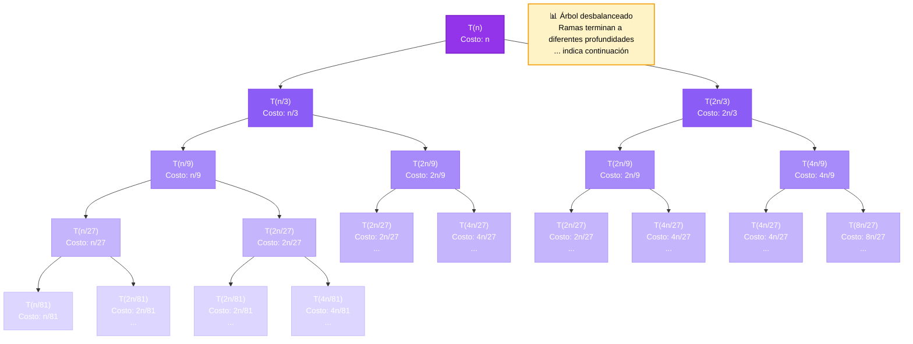

# Árbol de Recursión DESBALANCEADO

## Ecuación: T(n) = T(n/3) + T(2n/3) + n

Este es el caso típico de **QuickSort con partición desbalanceada**.

**Solución:** c·n·log(n)

---

## Resolución Paso a Paso

📝 Ecuación: T(n) = T(n/3) + T(2n/3) + n

🔹 MÉTODO DEL ÁRBOL DE RECURSIÓN (División Asimétrica)

   ⚠️  Esta ecuación NO puede resolverse con Teorema Maestro

   porque tiene divisores diferentes o coeficientes no estándar

🔹 PASO 1: Construir el árbol de recursión

   Nivel 0 (raíz):

      T(n)

      Costo: n

   Nivel 1:

      T(n/3)

      T(2n/3)

      Costo por nodo: n evaluado en cada tamaño

      Suma nivel 1: 0.667·n

   Nivel 2:

      Cada T(n/3) genera 2 llamadas

      Total: 2² = 4 nodos

      Suma nivel 2: 0.222·n

🔹 PASO 2: Determinar altura del árbol

   Camino más corto: divisor = 3 → altura ≈ log_3(n)

   Camino más largo: divisor = 3 → altura ≈ log_3(n)

   La altura del árbol está determinada por el camino más largo:

   h = log_3(n)

🔹 PASO 3: Sumar costo de todos los niveles

   Para f(n) = n:

   Nivel 0: n

   Nivel 1: n/3 + n/3 + ... = n

   Nivel 2: suma también ≈ n

   ...

   🔑 Observación: cada nivel suma aproximadamente n

   Total niveles: log_3(n)

   T(n) = n × log_3(n)

✅ SOLUCIÓN: T(n) = c·n·log(n)

---

## Visualización del Árbol

### Interpretación del Diagrama

- **Nodo morado oscuro**: Raíz T(n) con costo n
- **Nodos morados medios**: Nivel 1
  - Rama izquierda: T(n/3) - más profunda
  - Rama derecha: T(2n/3) - menos profunda
- **Nodos morados claros**: Nivel 2 con 4 nodos
- **Caja amarilla**: Observación clave sobre suma de niveles

---

## Explicación Teórica

╔══════════════════════════════════════════════════════════════╗
║           ÁRBOL DE RECURSIÓN - DIVISIÓN ASIMÉTRICA           ║
╚══════════════════════════════════════════════════════════════╝

Ecuación: T(n) = T(n/3) + T(n/3) + n

⚠️  NOTA IMPORTANTE:
Este tipo de recurrencia NO puede resolverse con el Teorema Maestro
porque tiene diferentes divisores en los términos recursivos.

El Árbol de Recursión es el método ideal para este caso.

SOLUCIÓN: T(n) = c·n·log(n)

El árbol de recursión muestra que aunque las ramas tienen diferentes
profundidades, el costo por nivel se mantiene balanceado.
