# Árbol de Recursión con 3 HIJOS

## Ecuación: T(n) = T(n/4) + T(n/4) + T(n/2) + n

Este algoritmo divide el problema en **3 partes**:

- Dos subproblemas pequeños: T(n/4) cada uno
- Un subproblema grande: T(n/2)

**Solución:** c·n

---

T(n)

  T(n/3)     T(2n/3)

## Resolución Paso a Paso

📝 Ecuación: T(n) = T(n/4) + T(n/4) + T(n/2) + n

🔹 MÉTODO DEL ÁRBOL DE RECURSIÓN (Múltiples Divisiones)

   Esta ecuación tiene 3 términos recursivos con divisores diferentes

🔹 PASO 1: Identificar estructura

   Término 1: T(n/4)

   Término 2: T(n/4)

   Término 3: T(n/2)

   Trabajo no recursivo: n

🔹 PASO 2: Analizar profundidades

   Camino más profundo: divisor 2 → log_2(n) niveles

   Camino más corto: divisor 4 → log_4(n) niveles

   ⚠️  El árbol es irregular: diferentes ramas tienen diferentes alturas

🔹 PASO 3: Sumar costo por nivel

   Para f(n) = n, el costo dominante viene del trabajo no recursivo

   en los primeros niveles del árbol.

   T(n) ≈ c·n

✅ SOLUCIÓN: T(n) = c·n

---

## Visualización del Árbol

```mermaid
graph TD
    N0["T(n)<br/>Costo: n"]
    N0_h0["T(n/4)<br/>Costo: n/4"]
    N0 --> N0_h0
    N0_h1["T(n/4)<br/>Costo: n/4"]
    N0 --> N0_h1
    N0_h2["T(n/2)<br/>Costo: n/2"]
    N0 --> N0_h2
    N0_h0_h0["T(n/16)<br/>Costo: n/16"]
    N0_h0 --> N0_h0_h0
    N0_h0_h1["T(n/16)<br/>Costo: n/16"]
    N0_h0 --> N0_h0_h1
    N0_h0_h2["T(n/8)<br/>Costo: n/8"]
    N0_h0 --> N0_h0_h2
    N0_h1_h0["T(n/16)<br/>Costo: n/16<br/>..."]
    N0_h1 --> N0_h1_h0
    N0_h1_h1["T(n/16)<br/>Costo: n/16<br/>..."]
    N0_h1 --> N0_h1_h1
    N0_h1_h2["T(n/8)<br/>Costo: n/8<br/>..."]
    N0_h1 --> N0_h1_h2
    N0_h2_h0["T(n/8)<br/>Costo: n/8<br/>..."]
    N0_h2 --> N0_h2_h0
    N0_h2_h1["T(n/8)<br/>Costo: n/8<br/>..."]
    N0_h2 --> N0_h2_h1
    N0_h2_h2["T(n/4)<br/>Costo: n/4<br/>..."]
    N0_h2 --> N0_h2_h2
    N0_h0_h0_h0["T(n/64)<br/>Costo: n/64<br/>..."]
    N0_h0_h0 --> N0_h0_h0_h0
    N0_h0_h0_h1["T(n/64)<br/>Costo: n/64<br/>..."]
    N0_h0_h0 --> N0_h0_h0_h1
    N0_h0_h0_h2["T(n/32)<br/>Costo: n/32<br/>..."]
    N0_h0_h0 --> N0_h0_h0_h2
    N0_h0_h1_h0["T(n/64)<br/>Costo: n/64<br/>..."]
    N0_h0_h1 --> N0_h0_h1_h0
    N0_h0_h1_h1["T(n/64)<br/>Costo: n/64<br/>..."]
    N0_h0_h1 --> N0_h0_h1_h1
    N0_h0_h1_h2["T(n/32)<br/>Costo: n/32<br/>..."]
    N0_h0_h1 --> N0_h0_h1_h2
    N0_h0_h2_h0["T(n/32)<br/>Costo: n/32<br/>..."]
    N0_h0_h2 --> N0_h0_h2_h0
    N0_h0_h2_h1["T(n/32)<br/>Costo: n/32<br/>..."]
    N0_h0_h2 --> N0_h0_h2_h1
    N0_h0_h2_h2["T(n/16)<br/>Costo: n/16<br/>..."]
    N0_h0_h2 --> N0_h0_h2_h2

    style N0 fill:#9333ea,stroke:#7e22ce,stroke-width:2px,color:#fff
    style N0_h0 fill:#8b5cf6,stroke:#7c3aed,stroke-width:1px,color:#fff
    style N0_h1 fill:#8b5cf6,stroke:#7c3aed,stroke-width:1px,color:#fff
    style N0_h2 fill:#8b5cf6,stroke:#7c3aed,stroke-width:1px,color:#fff
    style N0_h0_h0 fill:#a78bfa,stroke:#8b5cf6,stroke-width:1px,color:#fff
    style N0_h0_h1 fill:#a78bfa,stroke:#8b5cf6,stroke-width:1px,color:#fff
    style N0_h0_h2 fill:#a78bfa,stroke:#8b5cf6,stroke-width:1px,color:#fff
    style N0_h1_h0 fill:#a78bfa,stroke:#8b5cf6,stroke-width:1px,color:#fff
    style N0_h1_h1 fill:#a78bfa,stroke:#8b5cf6,stroke-width:1px,color:#fff
    style N0_h1_h2 fill:#a78bfa,stroke:#8b5cf6,stroke-width:1px,color:#fff
    style N0_h2_h0 fill:#a78bfa,stroke:#8b5cf6,stroke-width:1px,color:#fff
    style N0_h2_h1 fill:#a78bfa,stroke:#8b5cf6,stroke-width:1px,color:#fff
    style N0_h2_h2 fill:#a78bfa,stroke:#8b5cf6,stroke-width:1px,color:#fff
    style N0_h0_h0_h0 fill:#c4b5fd,stroke:#a78bfa,stroke-width:1px,color:#fff
    style N0_h0_h0_h1 fill:#c4b5fd,stroke:#a78bfa,stroke-width:1px,color:#fff
    style N0_h0_h0_h2 fill:#c4b5fd,stroke:#a78bfa,stroke-width:1px,color:#fff
    style N0_h0_h1_h0 fill:#c4b5fd,stroke:#a78bfa,stroke-width:1px,color:#fff
    style N0_h0_h1_h1 fill:#c4b5fd,stroke:#a78bfa,stroke-width:1px,color:#fff
    style N0_h0_h1_h2 fill:#c4b5fd,stroke:#a78bfa,stroke-width:1px,color:#fff
    style N0_h0_h2_h0 fill:#c4b5fd,stroke:#a78bfa,stroke-width:1px,color:#fff
    style N0_h0_h2_h1 fill:#c4b5fd,stroke:#a78bfa,stroke-width:1px,color:#fff
    style N0_h0_h2_h2 fill:#c4b5fd,stroke:#a78bfa,stroke-width:1px,color:#fff

    L["📊 Árbol desbalanceado<br/>Ramas terminan a diferentes profundidades<br/>... indica continuación"]
    style L fill:#fef3c7,stroke:#f59e0b,stroke-width:2px,color:#000
```

### Interpretación del Diagrama

- **Cada nodo tiene 3 hijos** (no 2 como en los ejemplos anteriores)
- **Rama izquierda**: T(n/4) - más profunda (divisor menor)
- **Rama central**: T(n/4) - misma profundidad que izquierda
- **Rama derecha**: T(n/2) - menos profunda (divisor mayor)
- **Nodos con `...`**: Ramas que terminan antes

---

## Explicación Teórica

╔══════════════════════════════════════════════════════════════╗
║        ÁRBOL DE RECURSIÓN - MÚLTIPLES DIVISIONES             ║
╚══════════════════════════════════════════════════════════════╝

Ecuación: T(n) = T(n/4) + T(n/4) + T(n/2) + n

Este tipo de recurrencia requiere análisis con árbol porque:

- Tiene múltiples términos con divisores diferentes
- Las ramas del árbol tienen profundidades diferentes
- El costo no se distribuye uniformemente

SOLUCIÓN: T(n) = c·n
