# Diagrama de Árbol de Recursión

## Ecuación: T(n) = T(n/3) + T(2n/3) + n

## Solución paso a paso

- 📝 Ecuación: T(n) = T(n/3) + T(n/3) + n
- 
- 🔹 MÉTODO DEL ÁRBOL DE RECURSIÓN (División Asimétrica)
-    ⚠️  Esta ecuación NO puede resolverse con Teorema Maestro
-    porque tiene divisores diferentes: 3, 3
- 
- 🔹 PASO 1: Construir el árbol de recursión
- 
-    Nivel 0 (raíz):
-       T(n)
-       Costo: n
- 
-    Nivel 1:
-       T(n/3)
-       T(n/3)
-       Costo por nodo: n evaluado en cada tamaño
-       Suma nivel 1: 0.667·n
- 
-    Nivel 2:
-       Cada T(n/3) genera 2 llamadas
-       Total: 2² = 4 nodos
-       Suma nivel 2: 0.222·n
- 
- 🔹 PASO 2: Determinar altura del árbol
-    Camino más corto: divisor = 3 → altura ≈ log_3(n)
-    Camino más largo: divisor = 3 → altura ≈ log_3(n)
- 
-    La altura del árbol está determinada por el camino más largo:
-    h = log_3(n)
- 
- 🔹 PASO 3: Sumar costo de todos los niveles
- 
-    Para f(n) = n:
-    Nivel 0: n
-    Nivel 1: n/3 + n/3 + ... = n
-    Nivel 2: suma también ≈ n
-    ...
- 
-    🔑 Observación: cada nivel suma aproximadamente n
-    Total niveles: log_3(n)
- 
-    T(n) = n × log_3(n)
- 
- ✅ SOLUCIÓN: T(n) = c·n·log(n)

**Solución:** c·n·log(n)

## Visualización del Árbol

```mermaid
graph TD
    N0["T(n)<br/>Costo: n"]
    style N0 fill:#9333ea,stroke:#7e22ce,stroke-width:2px,color:#fff

    N1_0["T(n/3)<br/>Costo: n/3"]
    N0 --> N1_0
    N1_1["T(n/3)<br/>Costo: n/3"]
    N0 --> N1_1
    style N1_0 fill:#8b5cf6,stroke:#7c3aed,stroke-width:2px,color:#fff
    style N1_1 fill:#8b5cf6,stroke:#7c3aed,stroke-width:2px,color:#fff

    N2_0_0["T(n/9)<br/>Costo: n/9"]
    N1_0 --> N2_0_0
    N2_0_1["T(n/9)<br/>Costo: n/9"]
    N1_0 --> N2_0_1
    N2_1_0["T(n/9)<br/>Costo: n/9"]
    N1_1 --> N2_1_0
    N2_1_1["T(n/9)<br/>Costo: n/9"]
    N1_1 --> N2_1_1
    style N2_0_0 fill:#a78bfa,stroke:#8b5cf6,stroke-width:1px,color:#fff
    style N2_0_1 fill:#a78bfa,stroke:#8b5cf6,stroke-width:1px,color:#fff
    style N2_1_0 fill:#a78bfa,stroke:#8b5cf6,stroke-width:1px,color:#fff
    style N2_1_1 fill:#a78bfa,stroke:#8b5cf6,stroke-width:1px,color:#fff

    L["📊 Cada nivel suma ≈ n<br/>Total niveles: log(n)"]
    style L fill:#fef3c7,stroke:#f59e0b,stroke-width:2px,color:#000
```

## Explicación

╔══════════════════════════════════════════════════════════════╗
║           ÁRBOL DE RECURSIÓN - DIVISIÓN ASIMÉTRICA           ║
╚══════════════════════════════════════════════════════════════╝

Ecuación: T(n) = T(n/3) + T(n/3) + n

⚠️  NOTA IMPORTANTE:
Este tipo de recurrencia NO puede resolverse con el Teorema Maestro
porque tiene diferentes divisores en los términos recursivos.

El Árbol de Recursión es el método ideal para este caso.

SOLUCIÓN: T(n) = c·n·log(n)

El árbol de recursión muestra que aunque las ramas tienen diferentes
profundidades, el costo por nivel se mantiene balanceado.
