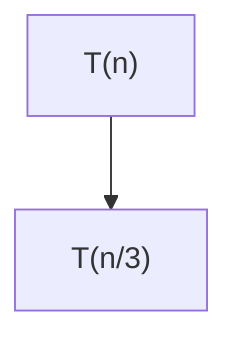

# 📊 Reporte de Análisis de Complejidad

**Fecha de generación:** 05/12/2025 01:24:02  
**Sistema:** Analizador de Complejidad v1.0

---

## 1. Resumen Ejecutivo

| Aspecto | Valor |
|---------|-------|
| **Estado** | ✅ Válido |
| **Tipo de Algoritmo** | No determinado |
| **Mejor Caso** | N/A |
| **Caso Promedio** | N/A |
| **Peor Caso** | O(n log n) |

## 2. Proceso de Análisis
### 2.1 Detección de Entrada
🔍 **Tipo detectado:** Pseudocódigo
➡️ Se procedió directamente a validación

### 2.2 Validación de Sintaxis

## 4. Resolución de Ecuaciones de Recurrencia

### 4.1 Método Utilizado: Árbol de Recursión

### 4.2 Ecuaciones Analizadas

**Peor Caso:**
```
T(n) = T(n/3) + T(2n/3) + n
```

### 4.3 Paso a Paso de la Resolución

#### Peor Caso

**Ecuación:** `T(n) = T(n/3) + T(2n/3) + n`
**Método:** Árbol de Recursión

**Pasos:**
1. Paso 1: Construir árbol
2. Paso 2: Calcular niveles
3. Paso 3: Sumar costos

**Explicación:** Se usa árbol porque es asimétrico

**Solución:** `O(n log n)`

**Visualización:**




### 4.4 Complejidades Finales

| Caso | Notación Ω (mejor) | Notación Θ (promedio) | Notación O (peor) |
|------|-------------------|---------------------|-------------------|
| Resultado | N/A | N/A | O(n log n) |

## 5. Pseudocódigo Final
```
funcion buscar(A, x) {...}
```

## 6. Conclusiones
✅ El análisis se completó exitosamente.