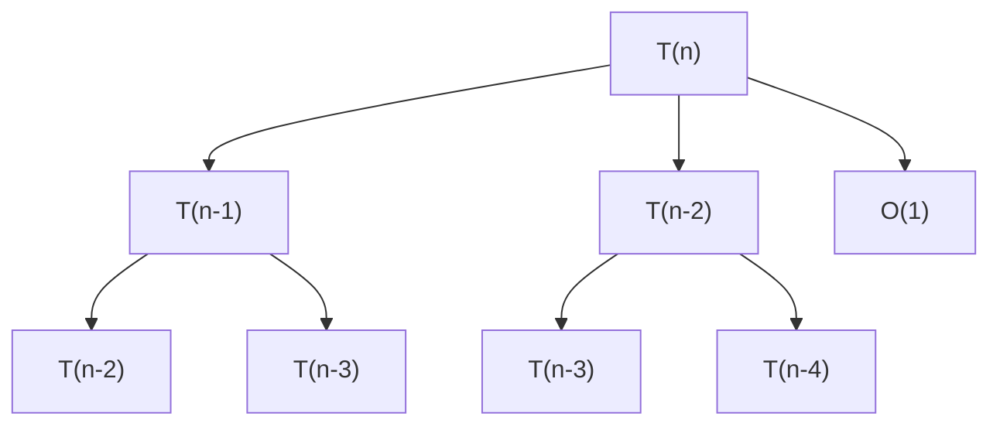

# 🎉 Sistema de Reportes con Árboles de Recursión - IMPLEMENTADO

## ✅ Cambios Realizados

### 1. **Actualización del API Router** (`Backend/core/analizador/router.py`)
   - ✅ Añadido campo `reporte_markdown` en `AnalisisResponse`
   - ✅ Añadido campo `ruta_reporte_guardado` en `AnalisisResponse`
   - ✅ Importado `datetime` para timestamps

### 2. **Actualización del Flujo de Análisis** (`Backend/tests/flujo_analisis.py`)
   - ✅ Importado `AgenteReportador` y `datetime`
   - ✅ Añadida instancia de `reportador` en `__init__`
   - ✅ Nueva **FASE 8: GENERACIÓN DE REPORTE FINAL**
     - Genera reporte completo con árboles y diagramas
     - Guarda automáticamente en archivo .md con timestamp
     - Incluye manejo de errores

### 3. **Nueva Carpeta de Reportes**
   - ✅ Creada: `Backend/reportes/`
   - ✅ Archivo `.gitkeep` para mantener en git

### 4. **Documentación Creada**
   - ✅ `Backend/GUIA_REPORTES.md` - Guía completa de uso
   - ✅ `Backend/test_reporte_md.py` - Script de prueba
   - ✅ `Backend/reportes/ejemplo_reporte_fibonacci.md` - Ejemplo completo

### 5. **README Actualizado** (`README.md`)
   - ✅ Nueva sección de "Reportes Automáticos" en entregables
   - ✅ Checklist actualizado con nuevas funcionalidades
   - ✅ Enlaces a guía de reportes

## 📊 Funcionalidades Implementadas

### Generación Automática de Reportes

El sistema ahora genera automáticamente archivos `.md` que incluyen:

1. **📋 Resumen Ejecutivo**
   - Estado del análisis
   - Tipo de algoritmo
   - Complejidades en todos los casos

2. **📊 Diagrama de Flujo (Flowchart)**
   - Visualización Mermaid del flujo del algoritmo
   - Leyenda de símbolos

3. **🔍 Proceso de Análisis**
   - Clasificación automática con ML
   - Validación detallada
   - Correcciones aplicadas

4. **🌳 Árboles de Recursión**
   - Visualización Mermaid de árboles de recursión
   - Detecta automáticamente el tipo:
     - Divide y Conquista (ej: `T(n) = 2T(n/2) + n`)
     - División Múltiple (ej: `T(n) = T(n/3) + T(2n/3) + n`)
     - Decrementación (ej: `T(n) = T(n-1) + n`)

5. **🔢 Resolución Paso a Paso**
   - Ecuaciones de recurrencia
   - Método utilizado
   - Pasos detallados
   - Explicaciones matemáticas

6. **📝 Conclusiones y Métricas**

## 🚀 Cómo Usar

### Opción 1: API REST

```bash
curl -X POST "http://localhost:8000/analisis/analizar" \
  -H "Content-Type: application/json" \
  -d '{
    "entrada": "fibonacci(n)\nbegin\n    if (n <= 1) then\n        return n\n    end\n    return fibonacci(n-1) + fibonacci(n-2)\nend",
    "tipo_entrada": "pseudocodigo",
    "auto_corregir": true
  }'
```

El response incluirá:
- `reporte_markdown`: String con el reporte completo
- `ruta_reporte_guardado`: Ruta donde se guardó el archivo .md

### Opción 2: Python Directo

```python
from tests.flujo_analisis import FlujoAnalisis

flujo = FlujoAnalisis(modo_verbose=True)
resultado = flujo.analizar(
    entrada="tu_pseudocodigo_aqui",
    tipo_entrada="pseudocodigo"
)

print(f"Reporte guardado en: {resultado['ruta_reporte_guardado']}")
```

### Opción 3: Script de Prueba

```bash
cd Backend
python test_reporte_md.py
```

## 📁 Ubicación de Archivos

Los reportes se guardan automáticamente en:
```
Backend/reportes/reporte_analisis_YYYYMMDD_HHMMSS.md
```

Formato del timestamp: `20251205_143000` (Año-Mes-Día_Hora-Minuto-Segundo)

## 🎨 Visualización de Diagramas

Los diagramas Mermaid se visualizan en:
- ✅ **GitHub**: Los .md muestran los diagramas automáticamente
- ✅ **VS Code**: Con extensión "Markdown Preview Mermaid Support"
- ✅ **Navegadores**: Con extensiones de Markdown + Mermaid
- ✅ **Online**: https://mermaid.live/

## 📝 Ejemplo de Árbol de Recursión

Para `T(n) = T(n-1) + T(n-2) + O(1)` (Fibonacci):



## 🔄 Integración con el Sistema Existente

El sistema se integra perfectamente con:
- ✅ **Validador**: Usa la validación existente
- ✅ **Corrector**: Aplica correcciones automáticas
- ✅ **Clasificador ML**: Usa las predicciones
- ✅ **AgenteResolver**: Extrae las soluciones y diagramas
- ✅ **AgenteFlowchart**: Genera flowcharts Mermaid
- ✅ **AgenteReportador**: Ya existía, ahora se usa automáticamente

## ⚡ Ventajas del Nuevo Sistema

1. **Automático**: No requiere pasos manuales
2. **Completo**: Incluye toda la información relevante
3. **Visual**: Diagramas y árboles fáciles de entender
4. **Portable**: Archivos .md universales
5. **Versionable**: Se pueden guardar en git
6. **Profesional**: Formato académico y técnico

## 🧪 Testing

Para probar el sistema:

```bash
# Test básico
python Backend/test_reporte_md.py

# Tests existentes que ya generan reportes
python Backend/tests/test_arbol_diagrama.py
python Backend/tests/test_arbol_tres_hijos.py
python Backend/tests/test_arbol_desbalanceado.py
python Backend/tests/test_clasificador_integrado.py
```

## 📚 Documentación Adicional

- **Guía Completa**: `Backend/GUIA_REPORTES.md`
- **Ejemplo Real**: `Backend/reportes/ejemplo_reporte_fibonacci.md`
- **README Principal**: `README.md` (actualizado)

## ✨ Próximos Pasos

El sistema ya está listo para usar. Sugerencias de mejora futuras:
- [ ] Exportar a PDF
- [ ] Exportar a LaTeX
- [ ] Gráficos de complejidad con matplotlib
- [ ] Comparación entre algoritmos
- [ ] Historial de análisis

---

**Estado:** ✅ COMPLETADO Y FUNCIONAL  
**Fecha de Implementación:** 05/12/2025  
**Versión:** 2.0
