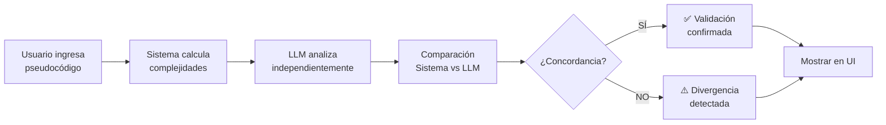

# Implementación: Comparación Sistema vs LLM

## 📋 Resumen de Cambios

Se ha implementado exitosamente la **comparación entre la solución del aplicativo y la del LLM** en todo el sistema (backend + frontend).

## ✅ Backend Implementado

### 1. **Agente Validador de Complejidades** (`Backend/agentes/agenteValidadorComplejidades.py`)
- ✅ Compara resultados del sistema con análisis independiente del LLM
- ✅ Detecta concordancias y divergencias
- ✅ Calcula nivel de confianza (0-100%)
- ✅ Clasifica severidad de diferencias (alta/baja)
- ✅ Genera recomendaciones basadas en la comparación

### 2. **Integración en Flujo de Análisis** (`Backend/flujo_analisis.py`)
- ✅ Nueva FASE 8.5: Validación de Complejidades con LLM
- ✅ Se ejecuta automáticamente después de calcular complejidades
- ✅ Resultado incluido en respuesta del análisis

### 3. **API Endpoints** (`Backend/core/analizador/router.py`)
- ✅ Actualizado `AnalisisConReporteResponse` con campo `validacion_complejidades`
- ✅ El endpoint `/analisis/analizar-con-reporte` retorna la validación

### 4. **Modelo de Respuesta**
```python
validacion_complejidades: {
    algorithm_name: str,
    complejidades_sistema: {
        mejor_caso: str,
        caso_promedio: str,
        peor_caso: str
    },
    complejidades_llm: {
        mejor_caso: str,
        caso_promedio: str,
        peor_caso: str
    },
    concordancia: bool,
    analisis_divergencias: [...],
    confianza: float,  # 0.0 a 1.0
    recomendacion: str
}
```

## ✅ Frontend Implementado

### 1. **Componente de Visualización** (`Frontend/src/components/ui/ComparisonTable.tsx`)
- ✅ Tabla comparativa con diseño profesional
- ✅ Indicadores visuales (✅ Igual, ≈ Equivalente, ❌ Diferente)
- ✅ Badge de confianza con colores semánticos
- ✅ Estado de concordancia destacado
- ✅ Sección expandible para divergencias detalladas
- ✅ Explicación del proceso de validación
- ✅ Iconos diferenciados para Sistema (💻) y LLM (🧠)

### 2. **Integración en Resultados** (`Frontend/src/pages/Results.tsx`)
- ✅ Sección "🔍 Validación con LLM" integrada
- ✅ Se muestra después de las complejidades principales
- ✅ Responsive y con buen diseño

### 3. **Tipos TypeScript** (`Frontend/src/api/analyzer.ts`)
- ✅ Interface `ValidacionComplejidadesResult` definida
- ✅ Integrada en `AnalisisResponse`

## 🎨 Características de Visualización

### Tabla Comparativa
| Caso | Sistema | LLM (IA) | Estado |
|------|---------|----------|--------|
| Mejor Caso (Ω) | O(1) | Ω(1) | ✅ Igual |
| Caso Promedio (Θ) | O(n) | Θ(n) | ✅ Igual |
| Peor Caso (O) | O(n) | O(n) | ✅ Igual |

### Indicadores Visuales
- **✅ Verde**: Concordancia total
- **⚠️ Amarillo**: Equivalencia (misma complejidad, diferente notación)
- **❌ Rojo**: Divergencia detectada
- **Badge de Confianza**: 
  - Verde ≥90%
  - Amarillo ≥70%
  - Rojo <70%

### Sección de Divergencias
- Expandible/colapsable
- Muestra caso afectado
- Compara valores del sistema vs LLM
- Indica tipo y severidad de la divergencia

## 📊 Ejemplo de Uso

### Backend (Prueba):
```bash
cd Backend
python test_comparacion_llm.py
```

### Frontend (En página de resultados):
1. Ir a `/validador`
2. Ingresar pseudocódigo
3. Hacer clic en "Analizar"
4. Ver sección "🔍 Validación con LLM: Comparación Sistema vs IA"

## 🔄 Flujo Completo



## 🎯 Beneficios

1. **Validación Cruzada**: Dos métodos independientes verifican el resultado
2. **Mayor Confianza**: El usuario ve que sistema y LLM concuerdan
3. **Detección de Errores**: Divergencias alertan sobre posibles problemas
4. **Educativo**: Muestra cómo diferentes enfoques llegan al mismo resultado
5. **Transparencia**: El usuario ve todo el proceso de validación

## 📝 Archivos Modificados

### Backend
- ✅ `Backend/agentes/agenteValidadorComplejidades.py` (API key fix + model config)
- ✅ `Backend/flujo_analisis.py` (integración de validación)
- ✅ `Backend/core/analizador/router.py` (response model actualizado)
- ✅ `Backend/config/settings.py` (conflicto de merge resuelto)

### Frontend
- ✅ `Frontend/src/api/analyzer.ts` (tipo `ValidacionComplejidadesResult`)
- ✅ `Frontend/src/components/ui/ComparisonTable.tsx` (componente nuevo)
- ✅ `Frontend/src/pages/Results.tsx` (integración del componente)

## ✨ Estado Final

**✅ IMPLEMENTACIÓN COMPLETA Y FUNCIONAL**

La comparación entre el aplicativo y el LLM está completamente integrada en el sistema y se muestra automáticamente en la página de resultados cuando se analiza un algoritmo.
