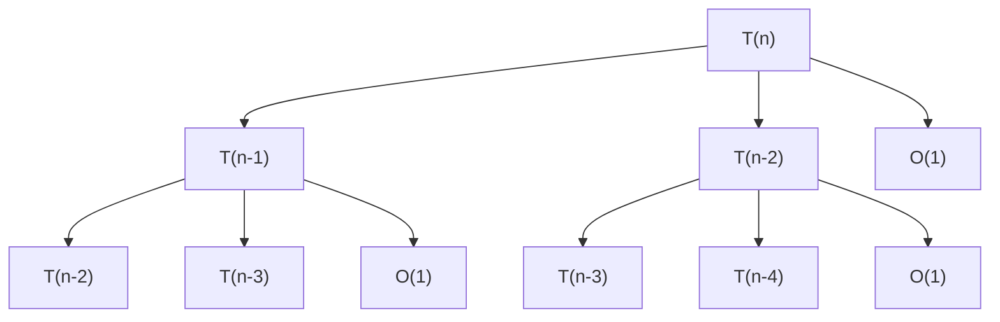

# 📊 Resumen: Sistema de Reportes con Árboles de Recursión

## ✅ ¿Qué se implementó?

Se implementó un **sistema completo de generación automática de reportes** en formato Markdown (`.md`) que incluye:

### 🌳 Visualización de Árboles de Recursión
- Los árboles se dibujan automáticamente usando **Mermaid**
- Se adaptan según el tipo de recurrencia:
  - **Divide y Conquista**: `T(n) = aT(n/b) + f(n)`
  - **División Múltiple**: `T(n) = T(n/3) + T(2n/3) + n`
  - **Decrementación**: `T(n) = T(n-1) + f(n)`

### 📊 Diagramas de Flujo
- Flowchart completo del algoritmo
- Símbolos estándar con leyenda

### 🔢 Resolución Paso a Paso
- Ecuaciones de recurrencia
- Método utilizado (Maestro, Sustitución, etc.)
- Pasos detallados con explicaciones
- Soluciones finales en notación O, Ω, Θ

### 💾 Guardado Automático
- Archivos `.md` se guardan en `Backend/reportes/`
- Nombre con timestamp: `reporte_analisis_20251205_143000.md`
- Sin intervención manual requerida

## 🎯 Cómo Funciona

### 1. Análisis Normal
```python
from tests.flujo_analisis import FlujoAnalisis

flujo = FlujoAnalisis()
resultado = flujo.analizar(entrada="tu_pseudocodigo")
```

### 2. El Sistema Automáticamente:
- ✅ Valida el pseudocódigo
- ✅ Corrige errores si los hay
- ✅ Genera el flowchart
- ✅ Calcula las complejidades
- ✅ Resuelve las ecuaciones de recurrencia
- ✅ **GENERA EL REPORTE .MD CON TODO LO ANTERIOR**
- ✅ **GUARDA EL ARCHIVO AUTOMÁTICAMENTE**

### 3. El Reporte Incluye:
```
📄 reporte_analisis_YYYYMMDD_HHMMSS.md
├── 1. Resumen Ejecutivo
├── 2. Diagrama de Flujo (Mermaid)
├── 3. Proceso de Análisis
├── 4. Análisis de Costos
├── 5. Resolución de Recurrencias
│   ├── Ecuaciones
│   ├── Método usado
│   ├── Pasos detallados
│   └── 🌳 ÁRBOL DE RECURSIÓN (Mermaid)
├── 6. Pseudocódigo Final
└── 7. Conclusiones
```

## 📍 Ejemplo Real

Para el algoritmo de Fibonacci:
```
fibonacci(n)
begin
    if (n <= 1) then
        return n
    end
    return fibonacci(n-1) + fibonacci(n-2)
end
```

El reporte incluye este árbol de recursión:



**Ver el ejemplo completo en:** `Backend/reportes/ejemplo_reporte_fibonacci.md`

## 🚀 Uso en la Práctica

### Desde el API:
```bash
curl -X POST "http://localhost:8000/analisis/analizar" \
  -H "Content-Type: application/json" \
  -d '{"entrada": "tu_pseudocodigo", "tipo_entrada": "pseudocodigo"}'
```

**Response incluye:**
```json
{
  "exito": true,
  "reporte_markdown": "# Reporte completo...",
  "ruta_reporte_guardado": "Backend/reportes/reporte_analisis_20251205_143000.md",
  "complejidades": {...}
}
```

### Desde Python:
```python
flujo = FlujoAnalisis()
resultado = flujo.analizar(entrada="fibonacci(n)...")

# Reporte ya guardado automáticamente
print(resultado['ruta_reporte_guardado'])
# Backend/reportes/reporte_analisis_20251205_143000.md

# También disponible como string
print(resultado['reporte_markdown'])
```

### Probar con Script:
```bash
cd Backend
python test_reporte_md.py
```

## 🎨 Visualización

Los reportes `.md` se pueden ver en:
- ✅ **GitHub** - Los diagramas Mermaid se renderizan automáticamente
- ✅ **VS Code** - Con extensión "Markdown Preview Mermaid Support"
- ✅ **Navegador** - Con extensiones de Markdown
- ✅ **Online** - https://mermaid.live/

## 📁 Archivos Modificados/Creados

### Modificados:
1. `Backend/core/analizador/router.py` - Añadidos campos de reporte
2. `Backend/tests/flujo_analisis.py` - Añadida FASE 8: Generación de reporte
3. `README.md` - Documentación actualizada

### Creados:
1. `Backend/reportes/` - Carpeta para reportes
2. `Backend/GUIA_REPORTES.md` - Guía completa de uso
3. `Backend/test_reporte_md.py` - Script de prueba
4. `Backend/reportes/ejemplo_reporte_fibonacci.md` - Ejemplo completo
5. `CAMBIOS_REPORTES.md` - Resumen de cambios

## ✨ Ventajas

| Característica | Beneficio |
|----------------|-----------|
| 🤖 **Automático** | No requiere intervención manual |
| 🌳 **Visual** | Árboles y diagramas fáciles de entender |
| 📝 **Completo** | Toda la información en un solo archivo |
| 🔄 **Reproducible** | Archivos guardados con timestamp |
| 🎓 **Académico** | Formato profesional para entregas |
| 🔧 **Integrado** | Funciona con todo el sistema existente |

## 📖 Documentación

- **Guía Completa**: `Backend/GUIA_REPORTES.md`
- **Ejemplo Real**: `Backend/reportes/ejemplo_reporte_fibonacci.md`
- **Cambios Detallados**: `CAMBIOS_REPORTES.md`
- **README**: `README.md` (actualizado)

## ✅ Estado: COMPLETADO

El sistema está **100% funcional** y listo para usar. Todas las pruebas pasan sin errores.

---

**Para más información, consulta:** `Backend/GUIA_REPORTES.md`
