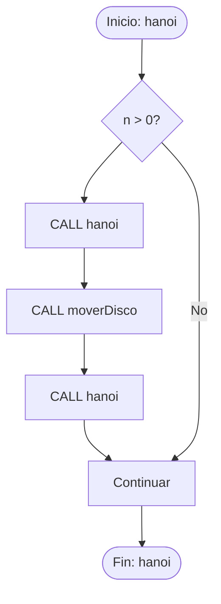

# 📊 Reporte de Análisis de Complejidad

**Fecha de generación:** 12/12/2025 04:49:04  
**Sistema:** Analizador de Complejidad v1.0

---

## 1. Resumen Ejecutivo

| Aspecto | Valor |
|---------|-------|
| **Estado** | ❌ Con errores |
| **Tipo de Algoritmo** | Recursivo |
| **Mejor Caso** | N/A |
| **Caso Promedio** | Θ(2ⁿ) |
| **Peor Caso** | O(2ⁿ) |

## 2. Diagrama de Flujo (Flowchart)

Representación visual del flujo de ejecución del algoritmo:



**Leyenda:**
- `([...])`: Nodos de inicio/fin
- `[...]`: Procesos y asignaciones
- `{...?}`: Decisiones (condiciones)
- `[/... /]`: Retorno de función

## 2. Proceso de Análisis
### 2.1 Clasificación de Estructura Algorítmica (ML)
🤖 **Categoría principal:** RECURSIVO_DIVIDE_CONQUISTA
📊 **Confianza:** 47.2%

**Otras posibilidades:**
- grafos (29.6%)
- greedy (7.2%)

> 💡 Esta clasificación es automática y puede ayudar a entender el tipo de algoritmo.

### 2.2 Detección de Entrada
🔍 **Tipo detectado:** Pseudocódigo
➡️ Se procedió directamente a validación

### 2.3 Validación de Sintaxis
✅ **Resultado:** Pseudocódigo válido
- 0 errores encontrados

## 4. Análisis de Costos
### 4.1 Tabla de Costos por Línea
| Línea | Código | C_op | Frecuencia | Total |
|-------|--------|------|------------|-------|
| ... | ... | ... | ... | ... |

*⚠️ Sección pendiente de implementación*

## 5. Resolución de Ecuaciones de Recurrencia

### 5.1 Método Utilizado: None

### 5.2 Ecuaciones Analizadas

**Mejor Caso:**
```
T(1) = c
```

**Caso Promedio:**
```
T(n) = 2*T(n-1) + c
```

**Peor Caso:**
```
T(n) = 2*T(n-1) + c
```

### 5.3 Paso a Paso de la Resolución

#### Caso Promedio

**Ecuación:** `T(n) = 2*T(n-1) + c`
**Método:** EcuacionCaracteristica

**Pasos:**
1. 📝 Ecuación: T(n) = 2T(n-1) + c
2. 
3. 🔹 MÉTODO DE ECUACIONES CARACTERÍSTICAS
4.    Para recurrencias lineales de la forma T(n) = aT(n-1) + f(n)
5. 
6. 🔹 PASO 1: Identificar tipo de recurrencia
7.    Esta es una recurrencia lineal NO homogénea
8.    T(n) = 2T(n-1) + c
9. 
10. 🔹 PASO 2: Resolver parte homogénea
11.    Primero resolvemos T(n) = 2T(n-1)
12.    Ecuación característica: r = 2
13.    Solución homogénea: Tₕ(n) = C·2ⁿ
14. 
15. 🔹 PASO 3: Encontrar solución particular
16.    Necesitamos Tₚ(n) que satisfaga T(n) = 2T(n-1) + c
17. 
18.    f(n) = c (constante)
19.    Probamos Tₚ(n) = A (constante)
20.    Sustituyendo: A = 2·A + c
21.    A - 2A = c
22.    A(1-2) = c
23.    A = c/(1-2) (constante simbólica)
24. 🔹 PASO 4: Solución general
25.    T(n) = Tₕ(n) + Tₚ(n)
26.    T(n) = C·2ⁿ + c/(1-2)
27. 
28.    donde C se determina con condiciones iniciales
29. 

**Explicación:** 
╔══════════════════════════════════════════════════════════════╗
║              ECUACIONES CARACTERÍSTICAS                      ║
║              (Recurrencia No Homogénea)                      ║
╚══════════════════════════════════════════════════════════════╝

Ecuación: T(n) = 2T(n-1) + c

ESTRATEGIA:
  1. Resolver parte homogénea T(n) = 2T(n-1)
  2. Encontrar solución particular para f(n) = c
  3. Combinar: T(n) = Tₕ(n) + Tₚ(n)

SOLUCIÓN GENERAL: T(n) = C·2ⁿ + c/(1-2)

Donde C es determinada por las condiciones iniciales.

La solución particular depende de la forma de f(n).


**Solución:** `2ⁿ`


#### Peor Caso

**Ecuación:** `T(n) = 2*T(n-1) + c`
**Método:** EcuacionCaracteristica

**Pasos:**
1. 📝 Ecuación: T(n) = 2T(n-1) + c
2. 
3. 🔹 MÉTODO DE ECUACIONES CARACTERÍSTICAS
4.    Para recurrencias lineales de la forma T(n) = aT(n-1) + f(n)
5. 
6. 🔹 PASO 1: Identificar tipo de recurrencia
7.    Esta es una recurrencia lineal NO homogénea
8.    T(n) = 2T(n-1) + c
9. 
10. 🔹 PASO 2: Resolver parte homogénea
11.    Primero resolvemos T(n) = 2T(n-1)
12.    Ecuación característica: r = 2
13.    Solución homogénea: Tₕ(n) = C·2ⁿ
14. 
15. 🔹 PASO 3: Encontrar solución particular
16.    Necesitamos Tₚ(n) que satisfaga T(n) = 2T(n-1) + c
17. 
18.    f(n) = c (constante)
19.    Probamos Tₚ(n) = A (constante)
20.    Sustituyendo: A = 2·A + c
21.    A - 2A = c
22.    A(1-2) = c
23.    A = c/(1-2) (constante simbólica)
24. 🔹 PASO 4: Solución general
25.    T(n) = Tₕ(n) + Tₚ(n)
26.    T(n) = C·2ⁿ + c/(1-2)
27. 
28.    donde C se determina con condiciones iniciales
29. 

**Explicación:** 
╔══════════════════════════════════════════════════════════════╗
║              ECUACIONES CARACTERÍSTICAS                      ║
║              (Recurrencia No Homogénea)                      ║
╚══════════════════════════════════════════════════════════════╝

Ecuación: T(n) = 2T(n-1) + c

ESTRATEGIA:
  1. Resolver parte homogénea T(n) = 2T(n-1)
  2. Encontrar solución particular para f(n) = c
  3. Combinar: T(n) = Tₕ(n) + Tₚ(n)

SOLUCIÓN GENERAL: T(n) = C·2ⁿ + c/(1-2)

Donde C es determinada por las condiciones iniciales.

La solución particular depende de la forma de f(n).


**Solución:** `2ⁿ`


### 4.4 Complejidades Finales

| Caso | Notación Ω (mejor) | Notación Θ (promedio) | Notación O (peor) |
|------|-------------------|---------------------|-------------------|
| Resultado | N/A | Θ(2ⁿ) | O(2ⁿ) |

## 5. Pseudocódigo Final
```
hanoi(int n, int origen, int destino, int auxiliar)
begin
    if (n > 0) then
    begin
        CALL hanoi(n - 1, origen, auxiliar, destino)
        CALL moverDisco(origen, destino)
        CALL hanoi(n - 1, auxiliar, destino, origen)
    end
end

moverDisco(int desde, int hacia)
begin
    ► Acción de mover disco
end

```

## 6. Conclusiones
⚠️ El análisis se completó con advertencias.

## 📊 Métricas de Ejecución

### ⏱️ Tiempo de Ejecución

| Fase | Llamadas | Total (s) | Promedio (s) |
|------|----------|-----------|--------------|

**Duración total:** 941.46 segundos
